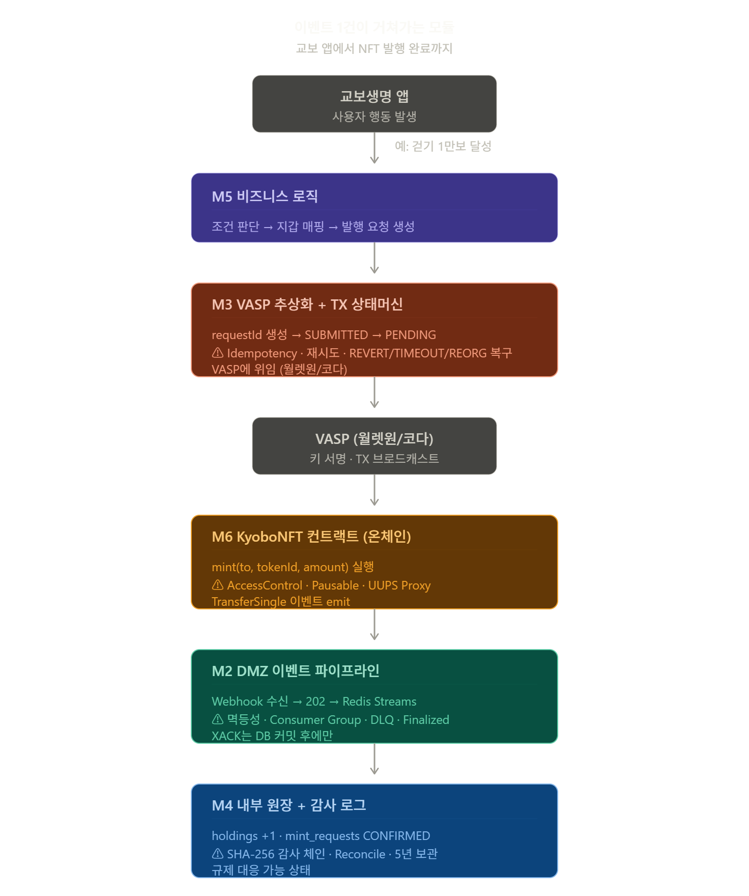

# M1 — 전체 아키텍처 프리뷰 + 개발 환경 셋업
## 기술 레퍼런스

> S1~S4 · 4시간 · Day 01 (5/6)

> **[Phase 1 — 현재 구현]** 이 모듈은 VASP(월렛원) 위탁 아키텍처를 기반으로 합니다.

---

## Phase 구현 범위 로드맵

이 커리큘럼 전체에서 다루는 코드는 3단계 Phase 로드맵을 기준으로 설계되어 있다.  
**현재 프로덕션 구현 범위는 Phase 1이다.** Phase 2·3은 향후 전환 시 활성화된다.

| Phase | 시기 | 핵심 변경 | TX 실행 주체 |
|---|---|---|---|
| **Phase 1 (현재)** | 2026년 | NFT 인프라 구축. 온체인 작업(TX 서명·브로드캐스트·NFT 발행) 전체를 외부 VASP(월렛원)에 위탁 | **월렛원 REST API** |
| **Phase 2 (검토 중)** | 중기 | Circle Arc + USDC/KRW1 결제 추가. ChainEventListener가 직접 이벤트 구독 시작 | 월렛원 + 직접 구독 |
| **Phase 3 (미확정)** | ~2028년 | 교보생명 직접 VASP 인가 취득. 자체 Custody(HSM/MPC) 운영. `chainAdapter.sendTransaction()` 직접 호출, `KyoboVASPAdapter`로 교체, 스마트 컨트랙트 직접 배포·운영 | **교보 자체 서명** |

### Phase 1 아키텍처 요약

```
Write Path:
  내부망 → DMZ IssuerService
         → vaspAdapter.submitTransaction()   ← ExternalVASPAdapter 구현체
         → 월렛원 REST API
         → 블록체인

Read Path:
  블록체인 → 월렛원 감지
           → Webhook → DMZ WebhookReceiver (202)
           → Redis Streams → Consumer
           → 내부망 원장

IBlockchainAdapter: Phase 1에서 read-only (FINALIZED 확인 전용)
                    sendTransaction / mintNFT → Phase 3에서 활성화
IVASPAdapter:       ExternalVASPAdapter 구현체 사용
                    submitTransaction() 메서드가 Phase 1 write 핵심
```

---

# 과정 배경 — 왜 이 시스템을 만드는가

## 교보생명의 디지털 자산 전략

교보생명은 국내 1위 생명보험사다. 자산 규모 기준 국내 최대 생보사 중 하나이며, 전국 가입자 수백만 명의 계약 데이터와 보험금 흐름을 관리한다. 이 회사가 2026년부터 디지털 자산 인프라를 직접 구축하기로 결정했다.

배경은 규제 환경 변화다. 2023년 이후 국내 가상자산 규제 체계가 정비되면서(가상자산이용자보호법, 특금법 개정), 금융 회사들이 디지털 자산을 제도권 안에서 다룰 수 있는 법적 기반이 만들어졌다. 신한은행이 NFT 기반 디지털 증명서를 발행하고, 하나은행이 토큰증권 파일럿을 운영하기 시작했다. 교보생명도 이 흐름에서 내부 역량을 확보하지 않으면 외부 업체에 전적으로 의존해야 하는 구조가 된다.

교보생명이 설정한 3단계 디지털 자산 로드맵:

| 단계 | 시기 | 내용 |
|---|---|---|
| Phase 1 | 2026년 | NFT 인프라 구축 — 행동 보상 쿠폰 발행·소각·관리 |
| 향후 Phase | 중기 | 스테이블코인 인프라 확장 |
| 향후 Phase | ~2028년 | 디지털 자산 인프라 자체 구축 |

이 과정은 **Phase 1 구현**을 위한 기술 내재화 교육이다.

---

## Phase 1이 만들 것 — 행동 보상 NFT 시스템

Phase 1의 핵심 서비스는 **행동 보상 NFT**다. 교보생명 앱 사용자가 특정 행동(걷기 달성, 건강검진 수검, 가입기념 등)을 완료하면 NFT 형태의 쿠폰을 발급한다. 이 쿠폰은 블록체인에 기록되고, 보험료 할인이나 제휴 혜택으로 사용된다.

왜 NFT인가? 기존 쿠폰 시스템은 자사 DB에만 존재한다. 위변조가 가능하고, 발행 이력을 제3자가 검증할 수 없으며, 이전·양도가 어렵다. NFT 기반 쿠폰은:
- 발행 이력이 블록체인에 영구 기록 (위변조 불가)
- 소유권이 사용자 지갑 주소에 귀속 (회사 DB 문제와 무관), 내부 원장이 있긴 하지만 결국 블록체인과 동기화가 되도록 설계
- 제3자 검증 가능 (보험 심사, 감독 기관 확인)- 스마트 컨트랙트의 특징
- 향후 타 금융사와의 쿠폰 상호운용 기반

이 과정에서 만드는 시스템의 전체 범위:

```
[교보생명 앱 사용자]
  │ 걷기 달성 / 건강검진 등 특정 이벤트 기반 참여
  ▼
[내부 비즈니스 로직 레이어]     ← M4·M5 구현 영역
  │ 조건 판단 → NFT 발행 요청
  ▼
[VASP (월렛원 / 코다)]          ← 외부 위탁 (키 관리·TX 서명)
  │
  ▼
[KyoboNFT 스마트컨트랙트]       ← M2·M3 구현 영역
  │ (Phase 1: Ethereum Mainnet — WalletOne 확정, 교육용 실습은 Ethereum Sepolia 테스트넷)
  ▼
[내부 원장 + 감사 로그]         ← M6 구현 영역
[DMZ 이벤트 파이프라인]         ← M7 구현 영역
[키 거버넌스 (Gnosis Safe)]     ← M8 구현 영역
```

**Phase 1 프로덕션 vs 이 커리큘럼의 범위**

여기서 반드시 짚고 가야 할 사항이 있다.

Phase 1 프로덕션에서 교보생명이 직접 하는 것과 하지 않는 것:

| 역할 | Phase 1 프로덕션 | 담당 |
|---|---|---|
| 발행 조건 판단, 대상 결정 | ✅ 직접 구축 | 교보 (M4·M5) |
| 사용자-지갑 매핑, 내부 원장 | ✅ 직접 구축 | 교보 (M5·M6) |
| 컨트랙트 오너십·Pause·업그레이드 권한 | ✅ 직접 보유 | 교보 (M2·M3) |
| **키 서명 · TX 브로드캐스트** | **❌ 직접 수행 안 함** | VASP 외부 위탁 |
| **지갑 생성 · MPC/HSM 관리** | **❌ 직접 수행 안 함** | VASP 외부 위탁 |

즉, **Phase 1에서 교보는 컨트랙트를 직접 배포하고 오너십은 갖지만, 실제 TX 실행(키 서명·브로드캐스트)은 외부 인가 VASP(월렛원 — Phase 1 내부 확정)에 API로 위탁한다.** 스켈레톤 코드에서 이 구조는 `ExternalVASPAdapter`가 담당한다.

그렇다면 왜 이 커리큘럼은 스마트 컨트랙트 직접 구현(M2·M3)부터 키 거버넌스(M8)까지 전 레이어를 직접 구현하는가?

세 가지 이유:

1. **향후 확장이 요구하는 역량**: 교보생명의 디지털 자산 전략이 확장되면 스테이블코인, 토큰증권, VASP 내재화 등 훨씬 복잡한 컨트랙트 로직이 필요하다. 그 시점에 역량이 없으면 다시 외부 의존으로 돌아간다.

2. **자사 시스템을 운영하려면 내부를 알아야 한다**: VASP가 TX를 실행하더라도, 컨트랙트의 AccessControl 구조, UUPS Proxy의 스토리지 레이아웃, 이벤트 시그니처를 모르면 — 장애 발생 시 VASP와 책임 소재를 구분할 수 없고, 감사 대응이 불가능하다.

3. **스켈레톤이 이미 확장 구조를 반영하고 있다**: `ExternalVASPAdapter` (Phase 1, 외부 API 호출)와 `KyoboVASPAdapter` (향후 내재화 시 구현할 stub)는 동일한 `IVASPAdapter` 인터페이스를 구현한다. 이 전체 구조를 직접 구현하면서, 향후 내재화 전환이 코드 어디를 건드리는 것인지 직접 확인하게 된다.

**블록체인 선택 — Phase별로 의사결정 시점이 다르다**

Phase 1에서 사용할 블록체인은 교보생명과 VASP 파트너사 간 협의를 통해 결정된다. 중요한 것은 Phase 1에서 TX 실행을 VASP에 위탁하기 때문에, 체인 선택의 실질적 주도권도 일부 VASP에 있다는 점이다. 교보생명이 컨트랙트 오너십을 갖더라도, VASP가 지원하지 않는 체인은 선택지에서 제외된다.

**체인 선택이 진정한 자사 결정이 되는 시점은 향후 직접 운영 단계부터다.** 교보생명이 컨트랙트 오너십·키 관리·TX 실행을 모두 직접 책임지는 시점이 오면 — 이더리움 메인넷 vs L2 vs 사이드체인 선택은 되돌릴 수 없는 결정이 된다.

이 과정에서 이 비교를 미리 다루는 이유: 여러분 중 누군가가 향후 확장 아키텍처 설계에 참여하게 될 때, 각 선택지의 트레이드오프를 이미 알고 있어야 한다. 그 결정을 벤더 영업 자료가 아니라 기술적 이해를 바탕으로 내려야 한다.

**이더리움 메인넷 — 고가치 자산의 정산 레이어**

NFT 단건 발행(`mint`) 비용: 약 50,000 gas. 가스 가격 20 gwei(평시 기준) 기준 약 $1~3. 교보생명 월 수십만 건 발행 시 가스비만 수십억 원이다. 어떤 금융 서비스도 이 구조로는 대량 발행 운영을 할 수 없다. 이더리움 메인넷은 **고가치 자산의 최종 정산 레이어**로는 적합하지만, 수십만 건 대량 발행이 일어나는 애플리케이션 레이어로는 맞지 않는다. 향후 고가치 자산 토큰화처럼 건당 금액이 크고 발행 빈도가 낮은 자산이라면 메인넷도 선택지가 된다.

**이더리움 L2 vs 사이드체인(Polygon PoS) — 보안 모델이 다르다**

이더리움 생태계는 "레이어 2(L2)" 확장 솔루션들을 발전시켜왔다. L2는 이더리움 메인넷(L1)의 보안을 그대로 상속하면서 거래 처리를 오프체인에서 수행하고 결과만 L1에 기록하는 구조다. 이더리움 L2와 사이드체인은 보안 모델이 근본적으로 다르다.

| | 이더리움 메인넷 | 이더리움 L2 (Arbitrum / Base 등) | Polygon PoS |
|---|---|---|---|
| 분류 | L1 | L2 | 사이드체인 |
| 보안 | 자체 PoS (~100만 검증자) | 이더리움 L1 직접 상속 | 자체 검증자 (~100명) + 이더리움 체크포인트 |
| 발행 비용 | $1~3/건 | $0.01~0.1/건 | $0.001 미만/건 |
| 블록 생성 | ~12초 | ~1~2초 | ~2초 |
| EVM 호환 | 기준 | 100% 호환 | 100% 호환 |
| 기관 신뢰도 | 최고 | 높음 (이더리움 보안 상속) | 중간 (사이드체인 구조) |
| 국내 금융 사례 | 거의 없음 | 일부 | 일부 (신한, 하나) |
| 향후 확장 적합성 | 고가치 자산 토큰화 | 대량 발행·결제 | 비용 우선 시 |

이더리움 L2는 트랜잭션 데이터나 증명(proof)을 이더리움 L1에 직접 게시한다. 이더리움 L1이 L2 상태의 유효성을 검증한다. 이더리움이 공격받지 않는 한 L2 자산도 안전하다.

Polygon PoS는 사이드체인이다. 자체 검증자 집합이 합의를 담당하고, 주기적으로 체크포인트 해시만 이더리움에 기록한다. 이더리움 L1이 Polygon의 개별 트랜잭션 유효성을 검증하지 않는다. Polygon 검증자 집합이 공모하면 이론적으로 자산을 위협할 수 있다. **금융기관이 "왜 사이드체인인가"라고 물을 때 답하기 어려운 이유**가 여기에 있다. Phase 2·3에서 교보생명이 금융감독원 심사를 받는 시점에 이 질문은 반드시 나온다.

**이 과정에서의 입장**

이 과정에서 배우는 스마트컨트랙트, VASP 연동, 원장 구조는 체인과 무관하다. 이 모든 것이 `IBlockchainAdapter` 뒤에 있기 때문이다. 체인이 어디로 결정되든 M2~M8에서 구현한 코드는 그대로 쓸 수 있다.

교육 실습에서 Ethereum Sepolia 테스트넷을 사용하는 이유는 단순하다: 이더리움 공식 테스트넷이고, 테스트 토큰이 무료이며, 이더리움 생태계 도구(Hardhat, ethers.js, Etherscan)가 동일하게 동작한다. Sepolia 배포 경험이 메인넷·L2 어디서든 그대로 적용된다.

Phase 1 목표 수치: 월간 활성 사용자 수십만 명, 쿠폰 종류 수십 가지, 일일 발행 건수 수천~수만 건. 이 규모에서 단순한 "컨트랙트 하나 배포"는 의미가 없다. 운영, 감사, 장애 복구, 규제 대응을 모두 고려한 시스템이어야 한다.

---

## 이 과정의 위치

여러분은 교보생명 IT지원담당에서 아키텍처, 보험 레거시 시스템, 퇴직연금, 자산관리 등 영역별로 선발된 실무 개발자들이다. 이 과정을 마친 후 Phase 1 시스템 오픈(2026년 9월 예정)의 실제 구현을 담당하게 된다.

이 과정이 전체 흐름에서 어디에 위치하는지:

```
선행 과정 (패스트캠퍼스 B-Harvest, 37h 온라인)
  → 블록체인 기초·Solidity·ERC-20·ERC-721·DeFi 개념
        ↓
이 과정 (50h 오프사이트 실습)
  → Phase 1 시스템 직접 구현
        ↓
2026년 9월 시스템 오픈
  → 여러분이 직접 운영·유지보수
```

"블록체인을 이해하는 팀"에서 "블록체인 시스템을 운영하는 팀"으로 전환하는 것이 이 과정의 목표다.

---

## 50시간 커리큘럼 전체 구조

50세션 × 1시간. 8개 모듈, 4개 챕터로 구성된다.

| 모듈 | 주제 | 세션 | 핵심 산출물 |
|---|---|---|---|
| M1 | 전체 아키텍처 프리뷰 + 환경 셋업 | S1~S4 | 개발 환경 완성 · 컨트랙트 인터페이스 프리뷰 |
| M2 | DMZ 이벤트 파이프라인 | S5~S12 | 202 패턴 · Consumer Group · DLQ |
| M3 | VASP 추상화 + TX 상태머신 | S13~S22 | VASP 연동 · TX 상태머신 · 복구 로직 |
| M4 | 내부 원장 + 감사 로그 | S23~S26 | 원장 · SHA-256 감사 체인 |
| M5 | 비즈니스 로직 레이어 | S27~S34 | 지갑 매핑 · 조건 판단 · 벌크 오케스트레이션 |
| M6 | ERC-1155 NFT 컨트랙트 완전 구현 | S35~S40 | KyoboNFT.sol · Sepolia 배포 |
| M7 | 보안 감사 + 업그레이드 운영 | S41~S44 | Slither 감사 통과 · v2 업그레이드 |
| M8 | 키 거버넌스 + Phase 1 통합 | S45~S50 | EIP-712 SafeTx · E2E 통합 · 장애 주입 |

**온체인과 오프체인**

커리큘럼의 유일하게 의미 있는 구분은 **오프체인(M2~M5)과 온체인(M6~M7)** 이다.

*M2~M5 — 오프체인 서비스*: Phase 1 운영의 핵심. DMZ 이벤트 파이프라인, VASP 연동, 원장, 비즈니스 로직. 이 네 모듈이 교보 시스템이 실제로 돌아가게 하는 전부다. M1에서 컨트랙트 인터페이스(메서드·이벤트 목록)를 미리 보여주기 때문에 컨트랙트 구현 없이도 흐름이 끊기지 않는다.

*M6~M7 — 온체인*: 블록체인 위에 올라가는 컨트랙트 구현과 보안 감사. 이 시점에는 서비스 레이어가 컨트랙트에서 무엇을 필요로 하는지 이미 알고 있기 때문에, "왜 이렇게 설계해야 하는가"가 명확한 상태에서 구현하게 된다.

M1은 이 전체 구조를 먼저 보여주는 시간이다. M8은 모든 것을 연결해서 실제로 돌려보는 시간이다.

---

## 이 과정의 진행 방식

**이 과정은 강의 + 실습의 단순 반복이 아니다.**

일반적인 기술 교육은 이렇게 진행된다: 개념 설명 → 예제 코드 실습 → 다음 개념으로 이동. 각 실습은 독립적인 예제 프로젝트이고, 과정이 끝나면 예제들만 남는다.

이 과정은 다르다. 모든 세션의 실습이 **하나의 레포지토리 위에 누적된다.** 첫 날 클론한 스켈레톤 코드가 50시간 동안 점점 채워지면서, 과정이 끝날 때 그것이 Phase 1 시스템의 실제 구현체가 된다.

```
Day 1  클론한 스켈레톤:     TODO 수십 개 / 테스트 전부 skip
  ↓
M2 완료:                   DMZ 파이프라인 동작 · 이벤트 수신·재처리
  ↓
M3 완료:                   TX 상태머신 · VASP 연동 동작
  ↓
M5 완료:                   비즈니스 조건 판단 · 지갑 매핑 · 원장 기록
  ↓
M6 완료:                   KyoboNFT.sol 구현 완료 / Sepolia 배포
  ↓
M8 완료:                   E2E 파이프라인 동작 · 장애 주입 통과
  = Phase 1 Prototype
```

스켈레톤의 각 `TODO` 주석이 해당 모듈의 실습 과제다. 구현이 완료되면 `TODO`가 사라지고 실제 로직이 들어간다. 단위 테스트가 `skip`에서 `pass`로 바뀐다. 이것이 진도 지표다.

**실제 Phase 1에 맞춰 학습한다**

각 모듈에서 배우는 기술이 해당 모듈의 구현에 즉시 쓰인다. 순서가 뒤집히지 않는다.

- Redis Streams 구조를 배우는 이유 → 그 날 바로 DMZ 파이프라인에 연결
- TX 상태머신 이론을 배우는 이유 → 그 날 바로 `TxStateMachineService.ts`에 구현
- ERC-1155 구조를 배우는 이유 → 그 날 바로 `KyoboNFT.sol`에 적용

"이 개념이 나중에 어디에 쓰이는가"를 기억할 필요가 없다. 배우고 바로 쓴다.

**어떤 모듈을 담당하게 될지 모른다**

Phase 1 시스템 오픈 후, 각 컴포넌트는 담당자가 생긴다. 누가 컨트랙트를 맡고, 누가 VASP 연동을 맡고, 누가 원장 서비스를 맡을지는 지금 결정되지 않았다.

그 말은 이렇다: 지금 이 자리에서 "나는 스마트컨트랙트 개발자가 아니니 M2는 건성으로 들어도 된다"는 판단은 틀렸다. M6 원장 담당이 된 사람이 M4 VASP 연동 구조를 모르면, 원장과 VASP 상태 불일치 문제가 생겼을 때 디버깅이 불가능하다. 시스템은 레이어가 연결되어 있다. 한 레이어를 깊이 이해하려면 인접 레이어도 알아야 한다.

실무 현실: 초기 개발이 끝난 후 시스템에 문제가 생기면, 그 문제는 레이어 경계에서 나온다. 컨트랙트 이벤트가 원장에 반영되지 않는 문제는 M2(컨트랙트) + M7(DMZ) + M6(원장) 세 모듈이 교차하는 지점에 있다. 그 자리에 있는 사람이 세 모듈을 모두 이해하고 있어야 한다.

**매 모듈이 최선이어야 하는 이유**

이 과정이 끝나면 각자가 작성한 코드가 교보생명 Phase 1 시스템의 기반이 된다. 그 시스템은 실제 고객의 NFT를 다룬다. 완성도가 떨어지는 코드가 운영에 들어가면 — 쿠폰이 중복 발행되거나, 발행은 됐는데 원장에 기록이 없거나, 감사 로그 체인이 끊기거나 — 고객 자산에 직접 영향을 준다.

50시간 안에 모든 것을 완벽하게 이해할 수는 없다. 하지만 각 모듈의 핵심 개념과 자신의 구현이 시스템 전체에서 어디에 위치하는지는 반드시 알고 가야 한다. 이것이 이 과정이 요구하는 수준이다.

---

## 이 과정을 마치면 할 수 있어야 하는 것

이 과정의 목표는 하나다: **외부 도움 없이 이 시스템을 스스로 운영할 수 있게 되는 것.**

구체적으로 말하면:

- Phase 1 시스템의 어떤 컴포넌트에 버그가 생겼을 때 원인을 스스로 찾을 수 있다
- 새로운 쿠폰 종류가 추가될 때 어느 파일을 수정해야 하는지 안다
- VASP 파트너사가 교체될 때 어디까지가 자사 코드이고 어디부터가 VASP 영역인지 구분한다
- 금감원 감사 요청이 왔을 때 어떤 로그를 어디서 꺼내야 하는지 안다
- 향후 시스템이 확장될 때 현재 아키텍처의 어느 레이어를 건드려야 하는지 판단한다

외부 컨설턴트나 벤더에 의존하지 않고, 자사 시스템을 자사 팀이 소유하고 운영하는 것. 그것이 기술 내재화의 실제 의미다.

이 과정에서 다루는 범위는 기술 구조, 설계 결정, 구현 패턴이다. 교보생명의 실제 레거시 시스템 연동, 내부 IT 거버넌스 프로세스, 실제 VASP 계약 후 API 세부 사항은 여러분이 직접 풀어야 한다. 이 과정은 그것을 풀 수 있는 기반을 만드는 시간이다.

---

## 이 시스템이 일반 블록체인 앱과 다른 점

개인 개발자가 만드는 NFT 프로젝트와 이 시스템의 차이:

| 항목 | 일반 NFT 프로젝트 | 이 시스템 |
|---|---|---|
| 자산 주체 | 개인 | 금융 기관 (수탁 의무) |
| 버그 허용 | "다음 버전에서 수정" | 허용 불가 — 자산 소실 |
| 감사 | 선택 | 금감원 검사 의무 |
| 키 관리 | MetaMask | HSM + Gnosis Safe 멀티시그 |
| 장애 대응 | 서비스 중단 가능 | 24/7 운영, RTO 정의 필요 |
| 규제 | 없음 | 전자금융거래법, 특금법, ISMS-P |
| 사용자 | 자발적 참여 | 보험 가입자 (데이터 보호 의무) |

이 차이가 커리큘럼의 기술 선택 하나하나를 설명한다. UUPS Proxy를 쓰는 이유, Gnosis Safe를 쓰는 이유, Redis Streams와 DLQ를 쓰는 이유 — 모두 이 맥락에서 나온다.

---

# S1 — 선행 과정과 이 과정의 연결 구조

## 이 과정의 출발점

여러분은 패스트캠퍼스 B-Harvest 블록체인 개발 과정(37h, 온라인)을 수료했다. 이 과정은 그 과정이 끝나는 지점에서 시작된다. 선행 과정에서 다룬 개념은 여기서 다시 설명하지 않는다 — 이미 아는 것을 전제로 진행한다.

선행 과정과 이 과정의 차이는 단순히 "심화"가 아니다. **운영 맥락**이 완전히 다르다. 선행 과정은 단일 컨트랙트를 Remix/테스트넷에서 동작시키는 것이 목표였다. 이 과정은 교보생명 IT 거버넌스 안에서, 실제 고객 자산을 다루는 시스템을 설계하고 운영하는 것이 목표다. 그 차이가 아래 8개 연결 지점 각각에서 어떻게 드러나는지 정리한다.

**왜 이 연결 구조를 먼저 보는가**

전통적인 소프트웨어 시스템과 블록체인 기반 금융 시스템의 핵심 차이는 **배포 불변성(immutability)**과 **자산 직접 조작 가능성**이다. 일반 웹 서비스는 버그가 있으면 서버를 재배포하면 된다. 블록체인에 배포된 컨트랙트는 수정이 불가능하다. 일반 DB는 실수로 잘못 입력해도 롤백이 가능하다. 컨트랙트에서 NFT를 잘못된 주소로 발행하면 되돌릴 수 없다. 이 불가역성이 선행 과정에서 배운 모든 기술을 다른 방식으로 접근하게 만든다.

---

## 선행 → 이 과정 연결 8개 지점

### 1. Solidity 개발환경: Remix → Hardhat 프로젝트

**선행 과정에서 배운 것**

B-Harvest 과정에서는 Remix IDE를 사용했다. 브라우저에서 `.sol` 파일 작성 → 컴파일 버튼 → Deploy 버튼 → MetaMask 팝업에서 서명 → 테스트넷 배포 완료. 환경 설정 없이 즉시 시작할 수 있다는 장점이 있다.

Remix가 내부적으로 처리하는 것들:
- solc(Solidity 컴파일러) 버전 선택 및 실행
- ABI, bytecode 생성
- 배포 트랜잭션 구성 + MetaMask 전달
- 배포된 컨트랙트의 함수 호출 UI 제공

Remix는 학습 도구로 이상적이지만, 팀 협업·자동화 테스트·CI/CD 파이프라인 연동이 불가하다. 파일이 브라우저 로컬에 저장되고, git과 연동이 안 되며, 배포 스크립트를 재현하기 어렵다.

**이론적 배경 — ABI와 bytecode의 본질**

Solidity 소스코드를 컴파일하면 두 가지 산출물이 나온다: **bytecode**와 **ABI**.

*bytecode*는 EVM(Ethereum Virtual Machine)이 실행하는 저수준 명령어 집합이다. EVM은 스택 기반 가상머신으로, 256비트 단어(word)를 기본 연산 단위로 쓴다. `ADD`, `MUL`, `SSTORE`(스토리지 저장), `SLOAD`(스토리지 읽기), `CALL`(외부 호출) 같은 opcode들이 순서대로 나열된 것이 bytecode다. 이 bytecode가 컨트랙트 배포 TX의 `data` 필드에 담겨 전송되고, 블록에 포함되면 그 주소에 영구히 저장된다. 이후 해당 주소로 TX를 보내면 EVM이 저장된 bytecode를 실행한다.

bytecode의 두 단계

컨트랙트 배포 시 bytecode는 두 부분으로 나뉜다:

```
[creation bytecode] + [runtime bytecode] + [constructor args]
```

- **creation bytecode**: 배포 시점에 한 번만 실행된다. constructor 로직을 실행하고, 최종적으로 runtime bytecode를 반환한다.
- **runtime bytecode**: EVM이 컨트랙트 주소에 영구 저장하는 부분. 이후 모든 호출은 이걸 실행한다.

`eth_getCode(address)`로 조회하면 runtime bytecode만 나온다. constructor 로직은 체인에 남지 않는다.

스택 기반 실행 예시

`a + b`를 계산하는 최소 bytecode:

```
PUSH1 0x03    ← 스택: [3]
PUSH1 0x05    ← 스택: [3, 5]
ADD           ← 스택: [8]
```

EVM은 레지스터가 없다. 모든 연산이 스택에서 일어나고, 최대 깊이는 1024다.

Gas 비용

opcode마다 gas 비용이 다르다:

```
ADD        = 3 gas
MUL        = 5 gas
SLOAD      = 2100 gas (cold) / 100 gas (warm)
SSTORE     = 20000 gas (신규) / 5000 gas (수정) / -15000 gas refund (삭제)
CALL       = 2600 gas (cold) + 실행 비용
CREATE2    = 32000 gas + 코드 크기 비용
```

스토리지 I/O가 압도적으로 비싸다. 가스 최적화의 80%는 `SSTORE`/`SLOAD`를 줄이는 일이다.

bytecode → opcode 디컴파일

```bash
# 배포된 컨트랙트의 runtime bytecode 조회
cast code 0xContractAddress --rpc-url $RPC

# opcode로 디스어셈블
cast disassemble 0x6080604052...
```

소스코드 없이도 이 수준까지는 누구나 볼 수 있다. **소스코드는 숨겨도 로직은 숨길 수 없다** — Etherscan verify가 없어도 bytecode는 공개된다.

함수 셀렉터와의 연결

runtime bytecode 시작부는 거의 항상 **function dispatcher**다:

```
PUSH1 0x00
CALLDATALOAD       ← calldata 첫 32바이트 로드
PUSH1 0xe0
SHR                ← 상위 4바이트만 추출 = function selector
DUP1
PUSH4 0x156e29f6   ← mint(address,uint256,uint256) 셀렉터
EQ
PUSH2 0x0042       ← 일치하면 이 주소로 점프
JUMPI
...
```

calldata의 첫 4바이트를 셀렉터와 비교해서 JUMPI로 분기한다. 앞서 설명한 ABI 셀렉터가 **런타임에 실제로 어떻게 작동하는지**가 여기서 드러난다.

Custody 설계 관점 체크포인트

- **CREATE2 주소 예측**: `keccak256(0xff ++ deployer ++ salt ++ keccak256(init_code))[12:]` — 배포 전에 주소 계산 가능. 카운터팩추얼 지갑의 핵심.
- **EXTCODEHASH**: 컨트랙트 bytecode 해시 조회. 프록시가 예상한 구현을 가리키는지 검증할 때 쓴다.
- **SELFDESTRUCT**: Cancun 업그레이드(2024.3) 이후 같은 TX 내 CREATE2 배포분만 삭제 가능. 기존 컨트랙트는 잔액 이전만 되고 bytecode는 유지된다.


**ABI(Application Binary Interface)**는 컨트랙트의 함수 시그니처와 인자 타입을 JSON으로 기술한 명세서다. `contract.mint(userAddress, tokenId, 1)` 같은 호출을 EVM이 이해할 수 있는 바이너리 형태로 인코딩하는 데 사용된다. 함수 셀렉터(function selector)는 함수 시그니처의 keccak256 해시 앞 4바이트다:

함수 셀렉터 계산

```
mint(address,uint256,uint256)
  → keccak256("mint(address,uint256,uint256)")
  → 0x156e29f6...
  → 앞 4바이트: 0x156e29f6
```

EVM은 함수 이름을 모른다. calldata 첫 4바이트로 "어떤 함수 호출인지" 구분한다.

calldata 구조

```
0x156e29f6                                                         ← selector (4 bytes)
000000000000000000000000aBcDeF1234567890aBcDeF1234567890aBcDeF12   ← address (32 bytes)
0000000000000000000000000000000000000000000000000000000000000001   ← tokenId (32 bytes)
0000000000000000000000000000000000000000000000000000000000000001   ← amount (32 bytes)
```

모든 인자는 32바이트로 패딩된다 (`address`는 왼쪽 0 패딩, `uint256`은 자연스럽게 32바이트).

ABI의 실제 모습

```json
{
  "inputs": [
    { "name": "to",      "type": "address" },
    { "name": "tokenId", "type": "uint256" },
    { "name": "amount",  "type": "uint256" }
  ],
  "name": "mint",
  "outputs": [],
  "stateMutability": "nonpayable",
  "type": "function"
}
```

ethers.js / web3.js / viem은 이 JSON을 보고 calldata 인코딩/디코딩을 자동 처리한다.

ERC-1155 mint 실전 예시

```solidity
function mint(address to, uint256 id, uint256 amount, bytes memory data) external;
```

셀렉터: `keccak256("mint(address,uint256,uint256,bytes)")[0:4]` = `0x731133e9`

`bytes` 같은 **동적 타입**이 포함되면 인코딩이 복잡해진다 — 동적 타입은 head 영역에 offset만 쓰고, 실제 데이터는 tail 영역에 저장된다. 이 부분이 calldata 디코딩 버그의 주요 원인이고, Slither가 잡아주는 영역이기도 하다.

셀렉터 충돌 (Selector Collision)

4바이트밖에 안 되므로 이론상 다른 함수 시그니처가 같은 셀렉터를 가질 수 있다. 프록시 패턴에서 구현 컨트랙트와 프록시 컨트랙트 함수가 같은 셀렉터를 가지면 의도치 않은 함수가 호출된다 — Transparent Proxy 패턴이 이걸 막기 위해 admin만 프록시 함수에 접근하게 하는 이유다.

호출 데이터(calldata)의 첫 4바이트가 이 셀렉터이고, EVM은 이것으로 어느 함수를 실행할지 결정한다. ABI 없이는 외부에서 컨트랙트 함수를 호출할 방법이 없다.

금융 시스템에서 ABI가 중요한 이유: 컨트랙트가 업그레이드될 때 함수 시그니처(이름, 파라미터 타입)가 바뀌면 기존 클라이언트 코드가 모두 깨진다. ABI를 일종의 공개 API 계약(contract)으로 관리해야 한다.

**bytecode와 ABI의 관계**  

bytecode는 EVM이 실행하는 것, ABI는 외부가 bytecode를 호출하기 위한 설명서다.

둘은 같은 컨트랙트를 다른 관점에서 기술한다. bytecode가 없으면 컨트랙트가 존재하지 않고, ABI가 없으면 아무도 그 컨트랙트를 호출할 수 없다 (정확히는, 호출하려면 셀렉터와 인코딩 규칙을 수동으로 맞춰야 한다).

생성 흐름

```
Solidity 소스코드
    │
    │  solc 컴파일
    │
    ├──────────────► bytecode (체인에 배포됨)
    │                └─ EVM이 실행
    │
    └──────────────► ABI (JSON, 오프체인 보관)
                     └─ 클라이언트가 호출 인코딩에 사용
```

`solc Contract.sol --bin --abi` 한 번에 둘 다 나온다. **같은 소스에서 나온 쌍둥이**다.

호출 시점에 둘이 만나는 지점

```
[오프체인: 클라이언트]                    [온체인: EVM]
                                          
ethers.Contract(addr, ABI)                
    │                                     
    │ contract.mint(to, id, 1)            
    │                                     
    ▼                                     
ABI 참조                                  
    → 함수 시그니처 조립                     
    → keccak256 → selector                
    → 인자 ABI 인코딩                       
    │                                     
    ▼                                     
calldata: 0x156e29f6 + 인코딩된 인자       
    │                                     
    │ eth_sendTransaction                 
    │                                     
    ├─────────────────────────────────►  bytecode 실행
                                          ├─ dispatcher가 selector 비교
                                          ├─ 해당 함수로 JUMPI
                                          └─ 로직 실행
```

ABI는 **calldata를 만드는 쪽**, bytecode는 **calldata를 해석하는 쪽**이다. 둘이 selector(4바이트)로 악수한다.

비대칭성: bytecode는 ABI를 모른다

중요한 포인트 — **bytecode 안에 ABI는 없다.** bytecode는 "이 selector면 이 주소로 점프" 정도만 안다. 함수 이름(`mint`), 인자 이름(`to`, `tokenId`), 인자 타입 주석(`address`, `uint256`)은 bytecode에 없다.

그래서:
- Etherscan "Verify Contract" = 소스를 올려서 **컴파일 결과가 배포된 bytecode와 일치하는지 증명** → ABI가 복원되어 공개됨
- Unverified 컨트랙트는 bytecode만 있고 ABI가 없음 → 호출하려면 selector를 역추적하거나 `cast 4byte-decode` 같은 도구로 추측

역방향: bytecode에서 ABI 복원

완벽하진 않지만 부분 복원은 가능하다:

```bash
# selector 목록 추출
cast selectors 0x6080604052...

# 각 selector를 공개 DB에서 역조회
# (4byte.directory에 수집된 시그니처만 매칭)
cast 4byte 0x156e29f6
# → mint(address,uint256,uint256)
```

한계:
- **public 함수만** 복원 가능 (internal/private는 bytecode에 selector가 없음)
- **인자 이름은 복원 불가** (ABI JSON의 `"name": "to"` 같은 정보)
- **커스텀 함수**는 4byte.directory에 등록 안 돼 있으면 역조회 실패

Dedaub, Panoramix 같은 디컴파일러가 bytecode에서 ABI를 추론하지만, 이름은 `func_0x156e29f6` 식으로 찍힌다.

실무 체크포인트

1. ABI/bytecode 버전 불일치
배포된 bytecode는 v1.2인데 프론트엔드가 v1.3 ABI로 호출 → selector 달라서 revert. Custody 시스템에서 **프록시 업그레이드 시 가장 흔한 사고**.

2. ABI만 보고 컨트랙트 신뢰 금지
Etherscan에 올라온 ABI는 verify된 것이라면 신뢰 가능하지만, unverified 컨트랙트에 대해 커뮤니티가 올린 ABI는 **bytecode 동작과 다를 수 있다**. 반드시 `EXTCODEHASH`로 bytecode 해시 검증.

3. 프록시 패턴에서의 분리
```
Proxy 컨트랙트 (bytecode A, ABI 거의 없음)
  └─ delegatecall → Implementation (bytecode B, 실제 ABI)
```
사용자는 Proxy 주소를 호출하지만 ABI는 Implementation 것을 사용한다. Etherscan이 "Read as Proxy" 버튼을 제공하는 이유.

4. 인코딩 최적화 (교보 ERC-1155 관점)
`mintBatch(address, uint256[], uint256[], bytes)` 같은 동적 배열 인자는 calldata가 커진다 → L2에서 calldata gas가 곧 수수료이므로 ABI 설계 단계에서 이미 비용이 결정된다. ABI는 단순한 "설명서"가 아니라 **가스 비용 설계도**이기도 하다.

관계 요약표

| 항목         | bytecode                  | ABI                        |
|--------------|---------------------------|----------------------------|
| 형태         | hex 바이너리               | JSON                       |
| 위치         | 온체인 (주소에 저장)        | 오프체인 (깃허브/NPM/DB)    |
| 목적         | EVM 실행                  | 클라이언트 호출 인코딩       |
| 크기         | 수 KB ~ 24KB (EIP-170 상한) | 수백 바이트 ~ 수 KB         |
| 불변성       | 불변 (업그레이드는 프록시로) | 가변 (소스 변경 시 재생성)  |
| 함수 이름    | 없음 (selector만)          | 있음                        |
| 검증 방법    | `EXTCODEHASH`             | verify된 소스와 대조        |


*재현 가능성(reproducibility)*: 같은 Solidity 소스코드라도 컴파일러 버전, optimizer 설정, viaIR 옵션이 다르면 다른 bytecode가 나온다. 다른 bytecode = 다른 컨트랙트 주소(CREATE 방식의 경우). 금융 시스템에서 "배포된 컨트랙트가 감사받은 소스코드와 동일하다"는 것을 증명하려면 컴파일 환경을 완전히 고정해야 한다. Hardhat이 이를 `hardhat.config.ts` 한 파일로 관리한다.

**이 과정에서의 확장**

Hardhat은 Node.js 기반 개발 프레임워크다. 프로젝트 구조:

```
blockchain/
├── hardhat.config.ts       ← 컴파일러 버전, 네트워크, 플러그인 설정
├── src/                    ← .sol 파일 (git 추적)
│   ├── phase1/
│   ├── phase2/
│   ├── phase3/
│   ├── base/
│   ├── compliance/
│   └── interfaces/
├── scripts/deploy/         ← 배포 스크립트 (재현 가능, git 추적)
├── test/                   ← TypeScript 테스트 (Mocha + Chai)
└── .openzeppelin/          ← UUPS storage layout 기록 (hardhat-upgrades)
```

Remix 대비 핵심 차이:

| | Remix | Hardhat |
|---|---|---|
| 환경 | 브라우저 | Node.js |
| git 추적 | 불가 | 가능 |
| 자동화 테스트 | UI에서 수동 | `npx hardhat test` |
| 배포 재현 | 수동 클릭 | `npx hardhat run scripts/deploy/deploy-phase1.ts` |
| mainnet fork | 불가 | `hardhat node --fork https://...` |
| CI/CD 연동 | 불가 | GitHub Actions 등 |

**mainnet fork**가 이 과정에서 중요한 이유: 실제 메인넷 상태(배포된 VASP 컨트랙트, 실제 토큰 잔액 등)를 로컬 EVM에서 그대로 복제해서 테스트한다. 테스트넷에는 없는 실제 컨트랙트와 상호작용할 수 있다.

핵심 원리

```
[실제 메인넷]                    [로컬 포크]
- 블록 #19,234,567               ← 이 블록 상태를 복제
- 모든 컨트랙트 배포 상태          ← 그대로 사용
- 모든 토큰 잔액/스토리지          ← 그대로 읽음
- gas price, timestamp           ← 그대로 시작
                                 
                                 이후부터는 로컬에서만 TX 실행
                                 (실제 체인에는 영향 없음)
```

RPC 호출이 오면 **로컬에 변경된 상태는 로컬에서**, 나머지는 **실제 RPC에서 lazy fetch**한다. 전체 상태를 다운로드하지 않는다.

왜 테스트넷으로 부족한가

| 항목 | 테스트넷 (Sepolia) | Mainnet Fork |
|------|---------------------|---------------|
| VASP 컨트랙트 | 배포 안 됨 (또는 다른 주소) | 실제 주소 그대로 |
| Uniswap/Aave 등 | 일부만, 유동성 거의 없음 | 실제 유동성 |
| 토큰 보유자 | 의미 있는 whale 없음 | 실제 whale 계정 impersonate 가능 |
| Oracle 가격 | 스텁이거나 멈춤 | 실제 Chainlink 피드 |
| Gas 패턴 | 비현실적 | 실제 경쟁 환경 재현 |
| 리셋 | 불가 | 테스트마다 초기화 가능 |

교보/헥토월렛원 같은 VASP 연동 테스트는 **상대방 컨트랙트가 테스트넷에 없다**는 문제가 항상 걸린다. Fork가 유일한 해결책.

실전 사용 (Foundry 기준)

```bash
# 최신 메인넷 상태로 포크
anvil --fork-url $MAINNET_RPC

# 특정 블록 고정 (재현 가능한 테스트)
anvil --fork-url $MAINNET_RPC --fork-block-number 19234567
```

Foundry 테스트 코드:

```solidity
contract CustodyIntegrationTest is Test {
    address constant USDT = 0xdAC17F958D2ee523a2206206994597C13D831ec7;
    address constant WHALE = 0xF977814e90dA44bFA03b6295A0616a897441aceC; // Binance hot wallet

    function setUp() public {
        vm.createSelectFork(vm.envString("MAINNET_RPC"), 19234567);
    }

    function test_custodyDepositUSDT() public {
        // whale 지갑을 탈취 (impersonate)
        vm.startPrank(WHALE);
        IERC20(USDT).transfer(address(custody), 1_000_000e6);
        vm.stopPrank();

        // 실제 USDT로 custody 로직 검증
        assertEq(custody.balanceOf(user, USDT), 1_000_000e6);
    }
}
```

`vm.prank` / `vm.deal` / `vm.warp`로 누구든 되고, 얼마든 만들고, 시간도 조작 가능 — **로컬 포크라서 허용되는 치트**다.

Custody 설계 관점의 활용

1. **실제 ERC-20 quirk 테스트**
   - USDT: `transfer`가 bool 반환 안 함 (비표준)
   - USDC: blacklist 기능 있음
   - stETH: rebasing으로 잔액이 블록마다 변함
   - 이런 걸 Mock으로 흉내내면 실전에서 터진다. 실제 컨트랙트를 포크로 가져와야 한다.

2. **프록시 업그레이드 시뮬레이션**
   - 현재 메인넷 프록시를 포크
   - 새 구현 배포 → `upgradeTo()` 호출
   - 기존 스토리지가 깨지는지 검증 (Storage collision 테스트)

3. **VASP 컨트랙트 상호작용**
   - 헥토월렛원 컨트랙트 주소를 포크에서 그대로 호출
   - Travel Rule 이벤트 발행 패턴 확인
   - 실제 Admin 계정을 `vm.prank`로 탈취해서 권한 흐름 테스트

4. **재진입/MEV 공격 재현**
   - 과거 해킹 블록 번호로 포크
   - 공격자 TX를 그대로 replay
   - 우리 컨트랙트도 당했을지 검증

주의점

- **RPC rate limit**: Alchemy/Infura 무료 티어로는 광범위한 포크 테스트 못 돌린다. 유료 또는 로컬 Erigon/Reth 노드 권장.
- **상태 drift**: `--fork-block-number` 고정 안 하면 테스트 재실행 때마다 결과 달라진다. CI에서는 반드시 블록 고정.
- **포크는 보안 감사가 아니다**: 정상 상태에서의 통합 테스트지, 미지의 공격 벡터를 찾지는 못한다. Slither/fuzzing과 병행.

```typescript
// hardhat.config.ts — mainnet fork 설정
networks: {
  hardhat: {
    forking: {
      url: process.env.MAINNET_RPC_URL!,   // Alchemy/Infura RPC
      blockNumber: 65000000,              // 블록 번호 고정 (재현 가능)
    }
  }
}
```

블록 번호를 고정하는 이유: 고정하지 않으면 최신 블록에서 fork되어 실행할 때마다 체인 상태가 달라진다 → 테스트 결과가 달라진다. 고정하면 6개월 후 실행해도 동일 결과.

**mainnet fork의 내부 동작 이론**

Hardhat이 mainnet fork를 할 때 실제로 메인넷 전체 상태(수백 GB)를 복사하는 것이 아니다. **레이지 로딩(lazy loading)** 방식으로 동작한다. 처음에는 로컬 상태가 비어 있다. 테스트 중 특정 주소의 잔액이나 컨트랙트 코드를 읽으려 하면, 그 때 RPC를 통해 지정된 블록 번호 시점의 값을 가져온다. 한 번 가져온 값은 로컬에 캐싱되어 이후 요청은 RPC를 쓰지 않는다. 로컬에서 상태를 변경하면(TX 실행 등) 그 변경은 메인넷에는 전혀 영향을 주지 않고, 로컬 오버레이 레이어에만 기록된다.

이 구조 덕분에 mainnet fork는 두 레이어의 상태를 관리한다:
- **베이스 레이어**: 지정 블록 번호 시점의 메인넷 상태 (RPC로 조회, 캐시됨)
- **오버레이 레이어**: 로컬 테스트 중 변경된 상태 (메모리에만 존재)

읽기 요청이 오면 오버레이 레이어를 먼저 확인하고, 없으면 베이스 레이어(RPC)를 조회한다.

---

### 2. ERC-20 단순 구현 → UUPS Proxy + AccessControl + Pausable

**선행 과정에서 배운 것**

선행 온라인 코스에서 ERC-20 토큰을 작성했다. 핵심 구조:

```solidity
// 선행 과정 수준 ERC-20
contract MyToken {
    mapping(address => uint256) public balanceOf;
    uint256 public totalSupply;
    address public owner;

    constructor() { owner = msg.sender; }

    function mint(address to, uint256 amount) external {
        require(msg.sender == owner, "not owner");
        balanceOf[to] += amount;
        totalSupply += amount;
    }

    function transfer(address to, uint256 amount) external {
        require(balanceOf[msg.sender] >= amount, "insufficient");
        balanceOf[msg.sender] -= amount;
        balanceOf[to] += amount;
    }
}
```

이 컨트랙트의 구조적 문제:
1. **업그레이드 불가** — 블록체인에 배포된 코드는 수정 불가. 버그 발생 시 새 컨트랙트 재배포 + 기존 토큰 이전(migration) 필요
2. **단일 owner** — `owner` 키 하나가 탈취되면 모든 mint 권한 탈취
3. **긴급 정지 없음** — 보안 사고 발생 시 시스템을 즉시 멈출 방법이 없음
4. **constructor 패턴** — 프록시 패턴과 호환 불가 (constructor는 프록시 경유 호출 불가)

**이 과정에서의 확장**

`KyoboNFT.sol`은 4개 OpenZeppelin 상속 조합으로 위 문제를 전부 해결한다:

```solidity
contract KyoboNFT is
    Initializable,           // constructor 대신 initialize() — 프록시 호환
    ERC1155Upgradeable,      // 다중 토큰 (ERC-20 → ERC-1155, M2에서 상세)
    AccessControlUpgradeable, // MINTER_ROLE / PAUSER_ROLE / UPGRADER_ROLE
    PausableUpgradeable,     // 긴급 정지
    UUPSUpgradeable          // 업그레이드 가능
```

각 상속이 해결하는 문제:

**`UUPSUpgradeable` — 업그레이드 가능**

UUPS(Universal Upgradeable Proxy Standard): 프록시 컨트랙트가 실제 로직 컨트랙트를 가리키는 구조.

```
사용자 → 프록시 주소 호출
           │
           ▼ delegatecall
      구현체(Implementation) 컨트랙트
      (실제 로직이 있는 컨트랙트)
```

`delegatecall`이 핵심: 구현체의 코드를 실행하되, 상태(storage)는 프록시에 저장된다. 구현체를 새 버전으로 교체해도 프록시 주소는 그대로, 저장된 데이터는 그대로.

**delegatecall의 EVM 레벨 동작**

일반 `call`과 `delegatecall`의 차이를 EVM 실행 컨텍스트로 설명한다.

`call`을 사용하면: 구현체 컨트랙트의 `msg.sender`, `msg.value`가 *프록시 주소*로 설정되고, 상태 변경도 *구현체의 storage*에 기록된다.

`delegatecall`을 사용하면: 구현체 코드가 실행되지만, `msg.sender`와 `msg.value`는 원래 호출자 그대로 유지되고, 상태 변경은 *프록시의 storage*에 기록된다. 구현체는 자신의 storage를 사용하는 것처럼 코드를 쓰지만, 실제 데이터는 프록시에 저장된다.

이 때문에 **Storage Collision(슬롯 충돌)** 문제가 생긴다. EVM storage는 0번 슬롯부터 순서대로 변수를 배치한다. 프록시가 슬롯 0에 `implementation address`를 저장하면, 구현체도 첫 번째 변수를 슬롯 0에 저장한다 — 이 두 값이 충돌한다.

**call vs delegatecall vs Storage Collision 완전 해부**

(1) 비유부터: "누구의 집에서, 누구의 도구로, 누구의 명의로"

세 가지 호출 방식을 집/도구/명의로 비유하면:

```
A.call(B):    B의 집에 가서, B의 도구로, A의 이름으로 작업
              → 작업 결과물은 B의 집에 남음

A.delegatecall(B): B의 도구를 A의 집으로 가져와서, A의 이름으로 작업
              → 작업 결과물은 A의 집에 남음

A.staticcall(B):   B의 집에 가서 구경만 함 (읽기 전용)
```

여기서:
- **집** = storage (상태 저장소)
- **도구** = code (bytecode)
- **이름** = msg.sender
- **작업 결과물** = 상태 변경 (SSTORE)

#### EVM 컨텍스트 기준 정확한 정의

EVM은 호출마다 다음 **실행 컨텍스트**를 갖는다:

```
┌─────────────────────────────────────┐
│ Execution Context                   │
├─────────────────────────────────────┤
│ code     ← 어떤 bytecode를 실행?    │
│ storage  ← 어떤 주소의 storage 사용?│
│ msg.sender ← 누가 호출했다고 할까?  │
│ msg.value  ← 얼마 보냈다고 할까?    │
│ address(this) ← 나는 누구?          │
└─────────────────────────────────────┘
```

A가 B를 호출할 때 이 5개가 어떻게 바뀌는지가 핵심이다.

#### call

```
A.call(B):
  code         = B의 code
  storage      = B의 storage
  msg.sender   = A
  msg.value    = A가 보낸 값
  address(this) = B
```

→ **완전히 B의 세계로 진입한다.** B의 코드가 B의 storage를 수정한다. A는 외부 호출자로 보일 뿐.

#### delegatecall

```
A.delegatecall(B):
  code         = B의 code          ← 빌려옴
  storage      = A의 storage       ← 유지
  msg.sender   = (A를 호출한 원래 사용자) ← 유지
  msg.value    = (원래 값)         ← 유지
  address(this) = A                ← 유지
```

→ **B의 코드를 A의 몸으로 실행한다.** B의 로직이 실행되지만, 모든 상태 변경은 A에 기록된다. B 입장에선 "나는 B인 줄 알고 코드 실행했는데, 실제로는 A의 storage에 쓰고 있었음".

#### 코드로 직접 비교

```solidity
contract Logic {
    uint256 public number;  // slot 0
    
    function setNumber(uint256 x) external {
        number = x;
    }
}

contract Caller {
    uint256 public number;  // slot 0
    address public logic;
    
    // ── call 버전 ──
    function callSet(uint256 x) external {
        logic.call(
            abi.encodeWithSignature("setNumber(uint256)", x)
        );
        // 결과: Logic.number 가 x 로 바뀜
        //       Caller.number 는 그대로 0
    }
    
    // ── delegatecall 버전 ──
    function delegateSet(uint256 x) external {
        logic.delegatecall(
            abi.encodeWithSignature("setNumber(uint256)", x)
        );
        // 결과: Caller.number 가 x 로 바뀜
        //       Logic.number 는 그대로 0
    }
}
```

#### 실행 흐름 다이어그램

**call 케이스:**

```
User ──call──> Caller.callSet(42)
                   │
                   │ logic.call(setNumber, 42)
                   ▼
              Logic.setNumber(42)
                   │
                   │ SSTORE slot 0
                   ▼
              Logic의 storage[0] = 42  ← 여기에 씀

Caller의 storage[0]: 그대로 0
Logic의 storage[0]: 42로 변경
```

**delegatecall 케이스:**

```
User ──call──> Caller.delegateSet(42)
                   │
                   │ logic.delegatecall(setNumber, 42)
                   ▼
         (Logic의 코드를 Caller의 컨텍스트로 가져옴)
              setNumber(42) 로직 실행
                   │
                   │ SSTORE slot 0
                   ▼
              Caller의 storage[0] = 42  ← 여기에 씀

Caller의 storage[0]: 42로 변경
Logic의 storage[0]: 그대로 0
```

**핵심 혼동 지점**: Logic 컨트랙트의 코드는 `number = x`라고 써 있다. 이 코드는 "내 storage slot 0에 x를 써라"라는 뜻이다. 그런데 delegatecall로 실행하면 "내"가 누구인지가 바뀐다 — 실행 주체가 Caller이므로 Caller의 slot 0에 쓴다.

**Logic 코드를 작성한 개발자의 의도**와 **실제 실행 결과**가 다를 수 있다는 게 delegatecall의 본질적 위험이다.

4. 프록시에서 왜 delegatecall인가

프록시 패턴의 요구사항:
1. 사용자는 **프록시 주소**만 알면 됨 (영구불변)
2. 로직은 **교체 가능**해야 함
3. 데이터는 **프록시에 영구 저장**돼야 함 (업그레이드해도 안 사라짐)

만약 프록시가 `call`을 쓴다면:

```
User → Proxy.transfer(...)
         │ call
         ▼
       Impl.transfer(...)
         │
         ▼
       Impl의 storage에 기록 ← 잔액이 Impl에 저장됨
```

→ Impl을 V2로 교체하는 순간 **잔액이 전부 사라진다.** (V1 Impl에 남아있지만 프록시는 이제 V2만 바라봄)

delegatecall을 쓰면:

```
User → Proxy.transfer(...)
         │ delegatecall
         ▼
       Impl.transfer 코드만 빌려옴
         │
         ▼
       Proxy의 storage에 기록 ← 잔액이 Proxy에 저장됨

Impl을 V2로 교체해도 Proxy의 잔액은 그대로
```

→ 코드만 교체되고 데이터는 보존된다. **이것이 업그레이드 가능 컨트랙트의 원리.**

5. Storage Collision — 이제 진짜 핵심

EVM Storage의 구조

EVM storage는 **거대한 256비트 슬롯 배열**이다:

```
slot 0:  [32 bytes]
slot 1:  [32 bytes]
slot 2:  [32 bytes]
...
slot 2^256 - 1: [32 bytes]
```

Solidity 컴파일러는 **state variable을 선언 순서대로 slot 0, 1, 2...에 배치**한다 (packing 규칙 제외하고 단순화).

충돌이 발생하는 순간

```solidity
// Proxy 컨트랙트
contract Proxy {
    address public implementation;  // slot 0
    address public admin;           // slot 1
    
    fallback() external {
        implementation.delegatecall(msg.data);
    }
}

// Implementation 컨트랙트
contract Impl {
    uint256 public totalSupply;     // slot 0
    mapping(address => uint256) balances;  // slot 1
}
```

사용자가 Proxy를 호출 → delegatecall → Impl 코드 실행 → `totalSupply = 1000` 실행:

```
Impl 코드는 "slot 0에 1000을 써라"라고 명령
  ↓ delegatecall
Proxy의 storage slot 0에 1000이 기록됨
  ↓
그런데 Proxy의 slot 0은 implementation 주소였음
  ↓
implementation 주소가 0x00000...000003E8 (=1000)로 덮어쓰여짐
  ↓
이후 모든 호출이 주소 0x...3E8로 delegatecall
  ↓
그 주소에 코드가 없으면 모든 기능 먹통
있으면 공격자 코드가 Proxy의 storage를 마음대로 조작
```

**치명적 결과:** 단 한 번의 호출로 프록시 전체가 무너진다.

시각화

```
          BEFORE                              AFTER totalSupply = 1000
┌──────────────────────┐              ┌──────────────────────┐
│ Proxy storage        │              │ Proxy storage        │
├──────────────────────┤              ├──────────────────────┤
│ slot 0:              │              │ slot 0:              │
│   0x1234...Impl주소  │  ─── 충돌 ──> │   0x0000...0000 1000 │  ← 망가짐
├──────────────────────┤              ├──────────────────────┤
│ slot 1:              │              │ slot 1:              │
│   0xAAAA...Admin     │              │   0xAAAA...Admin     │
└──────────────────────┘              └──────────────────────┘

Impl 코드는 "내 totalSupply(slot 0)에 1000 쓴다"라고 믿었지만
실제로는 Proxy의 implementation 주소를 덮어씀
```

6. ERC-1967의 해결책: "아무도 안 쓸 슬롯"에 저장

해결 아이디어: **Proxy의 메타데이터(구현체 주소 등)를 slot 0이 아니라, 일반 Solidity 변수가 절대 도달할 수 없는 슬롯에 저장하자.**

Solidity는 slot 0, 1, 2... 순차적으로 배정한다. 컨트랙트에 state variable이 1억 개 있어도 slot 10^8 정도까지만 쓴다. 그런데:

```
keccak256("eip1967.proxy.implementation") - 1
= 0x360894a13ba1a3210667c828492db98dca3e2076cc3735a920a3ca505d382bbc
```

이 슬롯 번호는 **약 2^255 근처**다. Solidity가 순차 배정으로는 **우주 끝날 때까지 도달 불가능**한 위치.

### ERC-1967 적용 후 구조

```
┌────────────────────────────────────────────────────────────┐
│ Proxy storage                                              │
├────────────────────────────────────────────────────────────┤
│ slot 0:  (Impl이 사용할 totalSupply)                       │
│ slot 1:  (Impl이 사용할 balances mapping base)             │
│ slot 2:  (Impl이 사용할 다음 변수)                          │
│ ...                                                        │
│                                                            │
│ slot 0x360894...382bbc:  Implementation 주소               │
│ slot 0xb53127...103    :  Admin 주소                       │
│ slot 0xa3f0ad...143    :  Beacon 주소                      │
└────────────────────────────────────────────────────────────┘
   ↑                        ↑
   일반 변수 영역            ERC-1967 예약 슬롯 (도달 불가)
```

Proxy는 구현체 주소를 읽을 때 **assembly로 직접 그 슬롯을 지정**한다:

```solidity
bytes32 private constant _IMPLEMENTATION_SLOT = 
    0x360894a13ba1a3210667c828492db98dca3e2076cc3735a920a3ca505d382bbc;

function _getImplementation() internal view returns (address impl) {
    assembly {
        impl := sload(_IMPLEMENTATION_SLOT)
    }
}

function _setImplementation(address newImpl) internal {
    assembly {
        sstore(_IMPLEMENTATION_SLOT, newImpl)
    }
}
```

Solidity가 관리하는 slot 0, 1, 2... 와 완전히 분리된 영역.

`- 1`을 하는 진짜 이유

```
keccak256("eip1967.proxy.implementation") - 1
```

이건 **preimage 저항성 확보**를 위한 표준 패턴이다.

Solidity의 mapping은 슬롯을 `keccak256(key, baseSlot)`으로 계산한다. 만약 예약 슬롯 값이 순수 `keccak256(something)`이면, 이론적으로 어떤 mapping의 어떤 key가 그 슬롯과 겹칠 수 있다 (preimage를 찾아야 하므로 사실상 불가능하지만 표준은 안전 마진을 둠).

`- 1`을 하면 그 값은 **어떤 keccak256 결과와도 같을 수 없다** (keccak256의 preimage를 알아내야 하므로). 즉 "이 슬롯 번호를 만들어낼 방법은 표준 문서를 보는 것뿐"이라는 보증.

실무적으로는 단순히 "OpenZeppelin이 그렇게 쓰니까 따른다" 수준으로 외워도 충분하다. 중요한 건 **명시적으로 예약된 슬롯이라는 계약**.

7. 실제 공격 시나리오: Parity Wallet 사고 (2017)

```solidity
// 단순화된 Parity Multisig Library (구현체 역할)
contract WalletLibrary {
    address[] owners;  // slot 0부터
    
    function initWallet(address[] _owners) public {
        owners = _owners;  // 초기화
    }
    
    function kill() public {
        require(isOwner(msg.sender));
        selfdestruct(msg.sender);
    }
}

// 실제 지갑 (프록시 역할)
contract Wallet {
    // WalletLibrary를 delegatecall로 사용
}
```

**사고 흐름:**

1. 공격자가 **WalletLibrary 자체**(프록시가 아님)에 `initWallet([attacker])` 호출
2. `call`이므로 **WalletLibrary의 storage**에 attacker가 owner로 기록
3. 공격자가 `kill()` 호출 → `msg.sender == attacker == owner` 통과
4. `selfdestruct` 실행 → **WalletLibrary bytecode 삭제**
5. 이 Library를 delegatecall로 참조하던 **모든 Parity 지갑이 한순간에 벽돌화**
6. **$150M 동결** (해킹이 아니라 동결 — 돈은 있는데 꺼낼 코드가 사라짐)

교훈: **구현체 컨트랙트 자체를 초기화되지 않은 상태로 두지 말 것.** 앞서 본 `_disableInitializers()`가 이걸 막기 위해 존재한다.

8. Storage Collision의 또 다른 형태: 업그레이드 간 충돌

프록시-구현체 간 충돌(ERC-1967로 해결) 말고, **V1 → V2 업그레이드 시 구현체끼리 충돌**도 있다:

```solidity
// V1
contract CustodyV1 {
    address public admin;           // slot 0
    uint256 public totalLocked;     // slot 1
    mapping(address => uint256) balances;  // slot 2
}

// V2 — ❌ 잘못된 업그레이드
contract CustodyV2 {
    address public admin;           // slot 0
    address public feeRecipient;    // slot 1  ← 원래 totalLocked 자리
    uint256 public totalLocked;     // slot 2  ← 원래 balances 자리
    mapping(address => uint256) balances;  // slot 3
}
```

V1 → V2 업그레이드 후:

```
Proxy storage slot 1:
  V1 시절: 총 락업된 양 (예: 10,000 ETH)
  V2 코드: "이건 feeRecipient 주소다"라고 해석
  → feeRecipient = 0x0000...00002710 (=10000)
  → 수수료가 이상한 주소로 전송되기 시작

Proxy storage slot 2:
  V1 시절: balances mapping의 base
  V2 코드: "이건 totalLocked 값이다"라고 해석
  → totalLocked 값이 의미 없는 숫자가 됨
  → balances mapping은 이제 slot 3부터 시작한다고 믿음
  → 기존 사용자 잔액이 전부 "사라진 것처럼" 보임
```

데이터는 그대로 있는데 **해석이 어긋나서** 시스템이 완전히 망가진다. 이게 가장 악랄한 이유는:
- 배포 직후에는 멀쩡해 보임
- 사용자가 입금/출금하면서 점진적으로 손상이 누적
- 원인 추적이 극도로 어려움
- 롤백해도 이미 오염된 데이터는 복구 불가

**방어:**
```solidity
contract CustodyV1 {
    address public admin;
    uint256 public totalLocked;
    mapping(address => uint256) balances;
    
    uint256[47] private __gap;  // 미래 확장용
}

contract CustodyV2 {
    address public admin;
    uint256 public totalLocked;
    mapping(address => uint256) balances;
    
    address public feeRecipient;  // gap 공간에 append
    uint256[46] private __gap;    // gap 크기 감소
}
```

OpenZeppelin Upgrades Plugin이 `npx hardhat validate-upgrade`로 자동 검증해준다.

9. 정리 — 한눈에 보기

| 구분 | call | delegatecall |
|------|------|--------------|
| 실행 코드 | 대상 컨트랙트 | 대상 컨트랙트 |
| Storage | 대상 컨트랙트 | **호출 컨트랙트** |
| msg.sender | 호출 컨트랙트 | **원래 호출자** |
| msg.value | 호출 컨트랙트가 보낸 값 | **원래 값** |
| address(this) | 대상 컨트랙트 | **호출 컨트랙트** |
| 용도 | 일반 외부 호출 | 프록시 패턴, 라이브러리 |
| 위험 | 낮음 | **매우 높음** (storage 조작 가능) |

**Storage Collision 발생 조건:**
- delegatecall 사용 + 두 컨트랙트의 storage layout이 겹침

**해결:**
- 프록시-구현체 간: **ERC-1967** (예약 슬롯)
- 구현체 버전 간: **`__gap` 배열** + OZ Upgrades Plugin 검증

**가장 흔한 실수 Top 3:**
1. 구현체 `_disableInitializers()` 누락 → Parity 사고
2. `_authorizeUpgrade` 권한 누락 → Audius 사고
3. 업그레이드 시 slot 중간 삽입 → 잔액 유실

ERC-1967 표준이 이 문제를 해결한다: 구현체 주소를 랜덤처럼 보이는 특수 슬롯에 저장해서 일반 변수와 충돌하지 않게 한다.

```
ERC-1967 구현체 주소 슬롯:
keccak256("eip1967.proxy.implementation") - 1
= 0x360894a13ba1a3210667c828492db98dca3e2076cc3735a920a3ca505d382bbc
```

왜 `-1`을 하는가: 순수한 keccak256 해시값이 어떤 정해진 값의 충돌을 피하게 하기 위해서다. 일반 매핑의 슬롯 계산에 쓰이는 keccak256 결과와 의도치 않게 겹칠 가능성을 없앤다.

UUPS vs 투명 프록시(Transparent Proxy):
- 투명 프록시: 업그레이드 함수가 프록시에 있음 → 프록시가 무거워짐, admin vs user 함수 분리 로직 필요
- UUPS: 업그레이드 함수(`_authorizeUpgrade`)가 구현체에 있음 → 프록시가 단순, 가스 절약, 대신 구현체에서 권한 검사를 빠뜨리면 업그레이드 권한이 누구에게나 열림 (이것이 UUPS의 주요 위험)

**다중 상속과 C3 선형화**

`KyoboNFT`는 5개를 동시에 상속한다. Solidity는 다이아몬드 문제(diamond problem)를 C3 선형화 알고리즘으로 해결한다. 상속 선언 순서가 함수 호출 우선순위를 결정한다. `super.functionName()`은 선형화된 순서에서 다음 컨트랙트의 함수를 호출한다.

OpenZeppelin Upgradeable 컨트랙트의 `__init()` 함수들(예: `__ERC1155_init()`, `__AccessControl_init()`)이 `initialize()` 안에서 명시적으로 호출되어야 하는 이유가 여기 있다: constructor가 없으므로 각 부모 컨트랙트의 초기화 로직을 수동으로 체인해야 한다.

**`AccessControlUpgradeable` — 역할 기반 권한**

`owner` 단일 키 대신 역할(role) 분리:

```solidity
bytes32 public constant MINTER_ROLE   = keccak256("MINTER_ROLE");
bytes32 public constant PAUSER_ROLE   = keccak256("PAUSER_ROLE");
bytes32 public constant UPGRADER_ROLE = keccak256("UPGRADER_ROLE");
```

역할마다 다른 키 할당 가능. MINTER_ROLE 키가 탈취되어도 UPGRADER_ROLE로는 컨트랙트 업그레이드 불가. 최소 권한 원칙(principle of least privilege) 적용.

역할 식별자를 `keccak256("MINTER_ROLE")`로 정의하는 이유: 단순 숫자(0, 1, 2...)로 쓰면 다른 컨트랙트와 역할 ID가 충돌할 수 있다. 문자열의 해시는 사실상 충돌이 불가능하며(SHA-3 계열의 32바이트 출력), 동시에 역할의 의미를 사람이 읽을 수 있는 이름으로 표현한다.

`DEFAULT_ADMIN_ROLE`(= `bytes32(0)`)은 특수 역할로, 다른 역할의 관리자(role admin)다. 기본적으로 `DEFAULT_ADMIN_ROLE`을 가진 주소만 다른 역할을 `grantRole`/`revokeRole` 할 수 있다. 이 역할 자체의 관리자도 `DEFAULT_ADMIN_ROLE`이다 — 즉, 이 역할을 가진 주소 하나가 분실되면 역할 체계 전체가 동결될 수 있어 별도 키 관리 정책이 필요하다.


다중 상속 · AccessControl · Pausable 심화

(1) C3 선형화 — 상속 순서가 왜 중요한가

다이아몬드 문제

```
       A
      / \
     B   C
      \ /
       D
```

D가 B와 C를 상속받는데, 둘 다 A의 같은 함수를 오버라이드했다면, D.func() 호출 시 어느 쪽이 실행되는가?

C3 선형화 알고리즘

Solidity(Python과 동일)는 C3 알고리즘으로 상속 그래프를 **선형 리스트**로 평탄화한다. 이 리스트가 **MRO(Method Resolution Order)** 다.

규칙:

① 자기 자신 먼저
② 직접 부모들의 MRO를 순서대로 병합
③ 병합 시 **자식은 부모보다 앞에**, **먼저 선언된 부모는 나중 선언된 부모보다 앞에**

**규칙 1: 자식이 부모보다 앞**

```
B는 A를 상속받는다  →  B가 A의 자식
```

줄 세우면: `[B, A]` (자식이 앞, 부모가 뒤)

자식이 부모를 오버라이드하니까, 함수 찾을 때 자식부터 봐야 한다.

**규칙 2: 형제 부모는 선언 순서대로**

```solidity
contract D is B, C { }
//          ↑  ↑
//      먼저  나중
```

D가 B, C를 둘 다 상속받을 때, **B를 먼저 썼으니 B가 C보다 앞에 선다**.

줄 세우면: `[D, B, C, ...]`

**실제 다이아몬드로 보면**

```
       A
      / \
     B   C    ← B와 C는 둘 다 A의 자식 (형제)
      \ /
       D
```

```solidity
contract A {}
contract B is A {}
contract C is A {}
contract D is B, C {}  // B 먼저, C 나중
```

C3 선형화 결과:

```
[D, B, C, A]
 │  │  │  │
 │  │  │  └─ 모두의 조상이니까 맨 뒤
 │  │  └─ B 다음 (규칙 2: 선언 순서)
 │  └─ D 다음 (규칙 1: 자식 먼저, 그리고 규칙 2: 먼저 선언됨)
 └─ 자기 자신이 맨 앞
```

**순서를 바꾸면?**

```solidity
contract D is C, B { }  // C 먼저, B 나중
```

선형화 결과: `[D, C, B, A]`

→ `super.func()` 호출 시 **C가 먼저 실행**된다. 같은 다이아몬드인데 결과가 달라짐.

**KyoboNFT에 적용**

```solidity
contract KyoboNFT is 
    ERC1155Upgradeable,        // 먼저
    AccessControlUpgradeable,  
    PausableUpgradeable,       
    UUPSUpgradeable            // 나중
{ }
```

규칙 적용:
- **규칙 1**: KyoboNFT가 가장 앞 (자식)
- **규칙 2**: 나머지는 선언 순서대로 — ERC1155, AccessControl, Pausable, UUPS

대략적 결과: `[KyoboNFT, ERC1155, AccessControl, Pausable, UUPS, ..., 공통조상들]`

(실제로는 각 부모도 자기 부모를 가지고 있어서 더 복잡하지만, 핵심 원리는 이 두 규칙)

**한 줄 요약**

```
"자식이 먼저, 형제는 선언 순서대로"
```

`super`를 호출하면 이 줄에서 **자기 다음 사람**이 실행된다.

KyoboNFT 예시 선형화

```solidity
contract KyoboNFT is 
    Initializable,
    ERC1155Upgradeable,
    AccessControlUpgradeable,
    PausableUpgradeable,
    UUPSUpgradeable
{ ... }
```

선형화 결과 (단순화):

```
KyoboNFT
  → UUPSUpgradeable
  → PausableUpgradeable
  → AccessControlUpgradeable
  → ERC1155Upgradeable
  → ERC165Upgradeable
  → ContextUpgradeable
  → Initializable
```

**역순**이라는 점이 핵심. 선언 순서는 왼쪽→오른쪽이지만, 선형화된 실행 순서는 **오른쪽부터** 된다고 흔히 설명한다 (정확히는 "가장 나중에 선언된 것이 가장 먼저 실행되는 체인의 끝단"에 위치).

super.func() 의 동작

```solidity
function _update(address from, address to, uint256[] memory ids, uint256[] memory values)
    internal
    override(ERC1155Upgradeable, ERC1155PausableUpgradeable, ERC1155SupplyUpgradeable)
{
    super._update(from, to, ids, values);
}
```

`super._update(...)`는 **선형화 리스트에서 현재 컨트랙트의 바로 다음**을 호출한다. 각 부모가 자기 로직 실행 후 `super`를 호출하면, 체인 전체가 순차 실행된다.

```
KyoboNFT._update
  └─ super → ERC1155SupplyUpgradeable._update (공급량 추적)
       └─ super → ERC1155PausableUpgradeable._update (paused 체크)
            └─ super → ERC1155Upgradeable._update (실제 잔액 변경)
```

**어느 하나라도 `super._update`를 빠뜨리면 체인이 끊어진다.** 공급량 추적이 안 되거나, pause가 무시되거나, 최악의 경우 잔액 변경 자체가 안 된다.

상속 순서가 바뀌면 무엇이 달라지는가

```solidity
// 버전 A
contract X is ERC1155Upgradeable, PausableUpgradeable { ... }

// 버전 B  
contract X is PausableUpgradeable, ERC1155Upgradeable { ... }
```

C3 선형화 결과가 다르다. 대부분 기능은 같이 작동하지만:
- `override(A, B)` 선언 순서를 맞춰야 함
- storage layout 순서가 다를 수 있음 (업그레이드 시 치명적)
- 드물게 함수 resolution이 달라져서 엉뚱한 부모 함수 호출

**실무 규칙:** OpenZeppelin 공식 예제의 상속 순서를 그대로 복사. 임의 변경 금지.

(2) Initializer 체이닝 — 빠뜨리면 터진다

constructor가 없는 Upgradeable 컨트랙트에서 **모든 부모의 초기화를 수동으로 호출해야 한다**:

```solidity
function initialize(address admin, string memory uri) external initializer {
    __ERC1155_init(uri);
    __AccessControl_init();
    __Pausable_init();
    __UUPSUpgradeable_init();
    
    _grantRole(DEFAULT_ADMIN_ROLE, admin);
    _grantRole(MINTER_ROLE, admin);
    _grantRole(PAUSER_ROLE, admin);
    _grantRole(UPGRADER_ROLE, admin);
}
```

빠뜨리면 생기는 일

**`__AccessControl_init()` 누락:**
- OpenZeppelin v5 기준 `__AccessControl_init`은 빈 함수 (내부 상태 초기화 없음)
- 누락해도 당장은 문제없지만, **v6/v7 업그레이드 시 초기화 로직이 추가되면 기존 프록시는 망가짐**
- → 관례상 항상 호출

**`__Pausable_init()` 누락:**
- `_paused` 상태 변수가 default(false)로 시작 — 기능상 문제 없음
- 하지만 미래 버전에서 초기화 로직 추가될 가능성

**`__ERC1155_init(uri)` 누락:**
- `_uri` 저장 안 됨 → NFT 메타데이터 URI가 빈 문자열
- **즉시 발현되는 버그** (마켓플레이스에서 이미지 안 보임)

`initializer` vs `onlyInitializing`

```solidity
// 외부에서 한 번만 호출 가능
function initialize(...) external initializer { ... }

// 부모 컨트랙트의 __init 함수 내부에서만 호출 가능
function __ERC1155_init_unchained(string memory uri) internal onlyInitializing { ... }
```

- `initializer`: 가장 바깥 초기화 함수에 붙임. 재호출 방지.
- `onlyInitializing`: 부모 초기화 함수에 붙임. initializer가 진행 중일 때만 호출 허용.

**중복 호출 방어 패턴:**

```solidity
function __ERC1155_init(string memory uri) internal onlyInitializing {
    __ERC1155_init_unchained(uri);
}

function __ERC1155_init_unchained(string memory uri) internal onlyInitializing {
    _uri = uri;
}
```

`_init`은 자기와 부모 모두 초기화, `_init_unchained`는 자기만 초기화. 다중 상속 시 **같은 조상이 두 번 초기화되는 것을 방지**하기 위함 (예: ContextUpgradeable은 여러 컨트랙트의 공통 부모).

(3) AccessControl 심화 — RBAC 관리 설계

**AccessControl 심화 — RBAC 관리 설계가 뭐에 대한 얘기인가**

**한 줄 답**

"누구한테 어떤 권한 주고, 그 권한 키를 어떻게 보관/관리할 것인가"에 대한 설계 이야기.

**왜 이게 별도 주제인가**

AccessControl이라는 OpenZeppelin 라이브러리는 단순히 "역할 만들고 부여하는 기능"만 제공한다. 근데 실제 운영에서 터지는 사고는 **기능 자체가 아니라 키를 어떻게 관리했느냐**에서 나온다.

```
라이브러리: "MINTER_ROLE을 누구한테 줄 수 있다"  ← 기술
키 관리:    "근데 그 키를 어디다 보관하지?"      ← 정책
```

이 "정책" 부분이 키 관리 설계.

**구체적으로 뭘 결정하는가**

① **각 역할을 어떤 형태의 주소에 부여할 것인가**
   - EOA (개인 키 1개) — 빠름, 위험
   - Multisig (Safe 같은 거, 키 N개 중 M개) — 느림, 안전
   - Multisig + Timelock (변경 후 N시간 대기) — 더 느림, 더 안전
   
② **역할별 보안 수준 차등**
```
   PAUSER_ROLE       → EOA 가능 (빠른 대응 필요)
   MINTER_ROLE       → Multisig 2/3
   UPGRADER_ROLE     → Multisig 3/5 + 48시간 Timelock
   DEFAULT_ADMIN     → Multisig 4/7 + 7일 Timelock
```
   왜? 사고 났을 때 손실 규모가 다르니까.
   - 누가 잠깐 mint 잘못함 → 회수 가능
   - 누가 컨트랙트 통째로 업그레이드함 → 자산 전부 날아감

③ **키 분실/탈취 시나리오 대응**
   - DEFAULT_ADMIN 키 분실하면 어떻게 할 것인가? (복구 불가)
   - MINTER 키가 탈취된 게 감지되면 어떻게 회수할 것인가?
   - Pauser가 악의적으로 시스템을 멈추면?

④ **키 보관 물리적 환경**
   - 하드웨어 지갑 (Ledger, Trezor)
   - HSM (Hardware Security Module, 기관급)
   - MPC (Multi-Party Computation, Fireblocks 같은 솔루션)
   - 종이 백업 (cold storage)

**왜 Custody에서 특히 중요한가**

일반 NFT 프로젝트: 운영자 1명이 자기 지갑에 MINTER_ROLE 들고 있어도 큰 문제 안 됨.

기관 Custody (교보생명/헥토월렛원): 
- 고객 자산을 보관하는 책임
- 키 1개 탈취 = 신문 1면
- 금융감독원 보고 의무
- VASP 라이센스 박탈 가능성

→ "코드는 안전한데 키를 EOA에 뒀다" = **법적/규제적 책임 발생**

**기관 Custody 표준 패턴**

```
DEFAULT_ADMIN_ROLE
└─ Gnosis Safe 4/7
   ├─ CEO
   ├─ CTO
   ├─ CISO (보안 책임자)
   ├─ 법무 담당
   ├─ 외부 감사인
   ├─ 백업 키 (HSM)
   └─ 백업 키 (지리적 분리)
   + Timelock 7일

UPGRADER_ROLE  
└─ Gnosis Safe 3/5
   + Timelock 48시간

MINTER_ROLE
└─ Gnosis Safe 2/3 (운영팀)
   + Timelock 없음 (운영 효율)

PAUSER_ROLE
└─ EOA 3개 (보안 모니터링 팀)
   + Timelock 없음 (즉시 대응)
```

**핵심**

"AccessControl 심화 — 키 관리 설계"는 **코드 작성 후의 운영 정책**에 대한 얘기다. 

코드는 `_grantRole(MINTER_ROLE, address)` 한 줄이면 끝나지만, 그 `address`가 무엇이어야 하는가, 그 주소의 키를 누가 어떻게 보관하는가, 잃어버리면 어떻게 하는가 — 이게 진짜 설계 작업.

기술이 아니라 **거버넌스와 운영 보안**의 영역이고, Custody 사업의 핵심 차별화 포인트이기도 함.


역할 계층 구조

```
DEFAULT_ADMIN_ROLE (0x00)
  ├─ 관리자: DEFAULT_ADMIN_ROLE (자기 자신)
  ├─ MINTER_ROLE 부여/회수 가능
  ├─ PAUSER_ROLE 부여/회수 가능
  └─ UPGRADER_ROLE 부여/회수 가능

MINTER_ROLE
  └─ 관리자: DEFAULT_ADMIN_ROLE

PAUSER_ROLE  
  └─ 관리자: DEFAULT_ADMIN_ROLE

UPGRADER_ROLE
  └─ 관리자: DEFAULT_ADMIN_ROLE
```

DEFAULT_ADMIN_ROLE의 치명성

이 역할을 가진 주소가:
- 어떤 역할이든 누구에게든 부여 가능
- 자기 자신에게 MINTER/UPGRADER 다 부여해서 전권 장악 가능
- **분실 시 복구 불가**: 이 역할을 복구할 수 있는 역할은 자기 자신뿐

실무 대책: **DEFAULT_ADMIN_ROLE은 Multisig(Safe)에만 부여**. EOA에 절대 금지.

역할별 관리자 분리 (고급 패턴)

기본 구조로는 모든 역할을 DEFAULT_ADMIN이 관리한다. 이걸 세분화할 수 있다:

```solidity
bytes32 public constant MINTER_ADMIN_ROLE = keccak256("MINTER_ADMIN_ROLE");

function initialize(...) external initializer {
    // ...
    _setRoleAdmin(MINTER_ROLE, MINTER_ADMIN_ROLE);
    _grantRole(MINTER_ADMIN_ROLE, mintOpsMultisig);
    _grantRole(DEFAULT_ADMIN_ROLE, governanceMultisig);
}
```

결과:
- `governanceMultisig`: 구조적 권한 (업그레이드, 역할 체계 변경)
- `mintOpsMultisig`: 운영 권한 (민터 추가/제거만)
- 운영팀 키가 탈취돼도 업그레이드 권한은 안 넘어감

**교보급 기관 Custody에서는 이 수준의 분리가 표준.**

DEFAULT_ADMIN_ROLE 개선: `AccessControlDefaultAdminRulesUpgradeable`

OZ 4.9+ 부터 제공되는 확장. `DEFAULT_ADMIN_ROLE` 전송에 **Timelock + 단일 admin 강제**:

```solidity
function initialize(uint48 delay, address initialAdmin) external initializer {
    __AccessControlDefaultAdminRules_init(delay, initialAdmin);
}
```

효과:
- DEFAULT_ADMIN은 **항상 1명**으로 제한 (다중 admin 금지)
- 변경 시 `beginDefaultAdminTransfer(newAdmin)` → `delay` 경과 후 `acceptDefaultAdminTransfer()`
- 키 탈취 발견 시 `cancelDefaultAdminTransfer()`로 긴급 중단 가능

Custody에서는 **이 확장을 쓰는 것이 현재 표준**. 원본 `AccessControlUpgradeable`은 legacy.

Role 식별자 해시의 실전 의미

```solidity
bytes32 public constant MINTER_ROLE = keccak256("MINTER_ROLE");
// = 0x9f2df0fed2c77648de5860a4cc508cd0818c85b8b8a1ab4ceeef8d981c8956a6
```

컴파일 타임 상수이므로 **bytecode에 박힌다**. 이 해시값을 안다고 해서 역할을 얻는 건 아니고, `hasRole(MINTER_ROLE, msg.sender)`로 **해당 해시에 대한 권한이 msg.sender에게 매핑**돼 있는지 검사.

다른 컨트랙트에서 같은 문자열 `"MINTER_ROLE"`을 쓰면 같은 해시가 나오지만, **각 컨트랙트의 `_roles` mapping은 독립**이므로 권한이 공유되지 않는다. 해시는 식별자일 뿐, 권한 저장소가 아님.

(4) Pausable의 함정

`_update` 훅에 Pause 걸기 (ERC-1155 기준)

```solidity
function _update(address from, address to, uint256[] memory ids, uint256[] memory values)
    internal
    override(ERC1155Upgradeable, ERC1155PausableUpgradeable)
    whenNotPaused  // ❌ 이렇게 쓰면 안 됨
{
    super._update(from, to, ids, values);
}
```

이미 `ERC1155PausableUpgradeable`이 내부에서 `whenNotPaused`를 체크한다. 중복 modifier는 gas만 낭비. **`super._update`만 제대로 호출**하면 pause 체크가 체인에 포함됨.

긴급 출금은 Pause 걸리면 안 된다

```solidity
function emergencyWithdraw() external onlyRole(EMERGENCY_ROLE) {
    // whenNotPaused 절대 금지
    // paused 상태에서도 호출 가능해야 함
}
```

Pause의 목적은 "공격 중단"이지 "자산 동결"이 아니다. 사용자/관리자의 긴급 인출 경로는 항상 열려 있어야 한다. Custody 감사에서 지적 단골 항목.

Pause 권한 분리

```solidity
bytes32 public constant PAUSER_ROLE   = keccak256("PAUSER_ROLE");
bytes32 public constant UNPAUSER_ROLE = keccak256("UNPAUSER_ROLE");

function pause() external onlyRole(PAUSER_ROLE) { _pause(); }
function unpause() external onlyRole(UNPAUSER_ROLE) { _unpause(); }
```

**Pause는 빠르게, Unpause는 신중하게.**

- `PAUSER_ROLE`: 보안 모니터링 팀 EOA도 가능 (빠른 대응)
- `UNPAUSER_ROLE`: Multisig + Timelock 필수 (공격이 완전히 해결됐는지 검증 후)

비대칭 설계. 사고 시 **1분 안에 멈추고, 멈춘 상태는 유지**가 기본 원칙.

Pause 가능 범위 세분화

단일 Pause는 전체 마비. ERC-1155에서는 **token id별 pause**가 필요할 수 있다:

```solidity
mapping(uint256 => bool) private _tokenPaused;

modifier whenTokenNotPaused(uint256 id) {
    require(!_tokenPaused[id], "Token paused");
    _;
}

function pauseToken(uint256 id) external onlyRole(PAUSER_ROLE) {
    _tokenPaused[id] = true;
    emit TokenPaused(id);
}
```

교보 NFT 보상 시스템에서 특정 상품 NFT에 문제가 생겨도 **다른 상품은 정상 유통**되게 해야 한다. Global pause는 최후의 수단.

(5) 실전 Initializer 완성 예시

교보 ERC-1155 스켈레톤에 들어갈 초기화 함수:

```solidity
function initialize(
    string memory uri_,
    address governance,       // Multisig
    address operations,       // Multisig
    address pauser            // EOA (빠른 대응용)
) external initializer {
    // 1. 부모 초기화 체이닝 (순서는 선형화 역순 권장)
    __ERC1155_init(uri_);
    __ERC1155Supply_init();
    __ERC1155Pausable_init();
    __AccessControl_init();
    __AccessControlDefaultAdminRules_init(2 days, governance);
    __Pausable_init();
    __UUPSUpgradeable_init();
    
    // 2. 역할 부여 (최소 권한)
    _grantRole(MINTER_ROLE, operations);
    _grantRole(PAUSER_ROLE, pauser);
    _grantRole(UPGRADER_ROLE, governance);  // 업그레이드는 거버넌스만
    
    // 3. Role Admin 분리 (선택적)
    _setRoleAdmin(MINTER_ROLE, OPERATIONS_ADMIN_ROLE);
    _grantRole(OPERATIONS_ADMIN_ROLE, operations);
}

constructor() {
    _disableInitializers();  // 구현체 자체는 초기화 불가
}
```

초기화 후 상태 체크

배포 스크립트에 반드시 포함:

```typescript
// 배포 직후 검증
const admin = await contract.hasRole(DEFAULT_ADMIN_ROLE, governance);
const minter = await contract.hasRole(MINTER_ROLE, operations);
const pauser = await contract.hasRole(PAUSER_ROLE, pauserEOA);
const deployerHasNothing = !(
  await contract.hasRole(DEFAULT_ADMIN_ROLE, deployer) ||
  await contract.hasRole(MINTER_ROLE, deployer)
);

assert(admin && minter && pauser && deployerHasNothing);
```

**배포자(deployer)에게 아무 역할도 남아있지 않은지**가 가장 중요한 체크. 배포 스크립트가 초기 설정 후 자기 권한을 회수하지 않으면 **배포자 키가 곧 마스터 키**가 된다.

(6) 정리 — 다중 상속 감사 체크리스트

```
□ 상속 순서가 OZ 공식 예제와 일치하는가
□ override(A, B, C) 선언에 모든 부모가 들어가 있는가
□ 오버라이드된 훅 함수가 super.func()를 호출하는가
□ 모든 __init() 함수가 initialize()에서 호출되는가
□ initialize()에 initializer modifier가 붙어 있는가
□ constructor()에 _disableInitializers()가 있는가
□ DEFAULT_ADMIN_ROLE이 EOA가 아닌 Multisig에 부여됐는가
□ UPGRADER_ROLE이 Multisig + Timelock에 부여됐는가
□ 배포자(deployer)의 모든 역할이 회수됐는가
□ emergencyWithdraw류 함수가 whenNotPaused에 막히지 않는가
□ Pause/Unpause 권한이 비대칭 분리됐는가
```

이 체크리스트를 통과하지 못하면 **기관 Custody로는 배포 불가**. 교보/헥토월렛원 같은 상대는 이 수준을 요구한다.


**`PausableUpgradeable` — 긴급 정지**

```solidity
function mint(...) external onlyRole(MINTER_ROLE) whenNotPaused { ... }
```

`whenNotPaused` modifier: pause 상태에서 호출하면 즉시 revert. 보안 사고 감지 시 PAUSER_ROLE이 `pause()` 호출 → 모든 mint/burn 즉시 중단. 원인 분석 후 `unpause()`로 재개.

**`Initializable` — constructor 대신 initialize()**

프록시 패턴에서 constructor를 쓸 수 없는 이유: constructor는 배포 시 단 한 번 실행되고, 그 결과가 **구현체 컨트랙트의 storage에 저장**된다. 하지만 실제 사용되는 storage는 프록시의 것이다. 즉, constructor로 설정한 값은 프록시를 통해서는 접근할 수 없다.

해결: constructor에서 `_disableInitializers()` 호출 (구현체 직접 초기화 시도 차단), 프록시 배포 후 `initialize()` 호출 (프록시 storage에 초기값 기록).

```solidity
constructor() {
    _disableInitializers(); // 구현체 직접 배포 후 initialize() 호출 공격 방지
}

function initialize(address admin) public initializer {
    __ERC1155_init("");
    __AccessControl_init();
    __Pausable_init();
    __UUPSUpgradeable_init();
    _grantRole(DEFAULT_ADMIN_ROLE, admin);
    _grantRole(MINTER_ROLE, admin);
    _grantRole(PAUSER_ROLE, admin);
    _grantRole(UPGRADER_ROLE, admin);
}
```

`initializer` modifier: 두 번 호출되면 revert. 초기화 재공격(재호출로 owner 탈취) 방지.

---

### 3. ERC-721 기초 → ERC-1155 다중 토큰 + tokenId 설계

**선행 과정에서 배운 것**

B-Harvest 과정에서 ERC-721 NFT를 실습했다. 핵심:
- 토큰마다 고유 ID (`tokenId`), 소유자는 한 명 (`ownerOf(tokenId)`)
- 메타데이터 URI (`tokenURI(tokenId)`)
- 발행: `mint(to, tokenId)` — 단건만 가능

교보생명 서비스에 ERC-721을 적용한다고 가정하면:
- 걷기달성 쿠폰 → `WalkingNFT` 컨트랙트 배포
- 건강검진 쿠폰 → `HealthCheckNFT` 컨트랙트 배포
- 가입기념 쿠폰 → `JoinNFT` 컨트랙트 배포
- ...쿠폰 종류마다 컨트랙트 하나

관리 비용이 선형적으로 증가하고, 100명에게 발행 시 100건 TX가 필요하다.

**이 과정에서의 확장**

ERC-1155: 하나의 컨트랙트에서 여러 토큰 타입을 관리.

```solidity
// ERC-721
balanceOf(address owner) → uint256 (NFT 보유 개수)
ownerOf(uint256 tokenId) → address (해당 NFT의 소유자)

// ERC-1155
balanceOf(address account, uint256 id) → uint256 (특정 tokenId 보유 수량)
balanceOfBatch(address[] accounts, uint256[] ids) → uint256[] (배치 조회)
```

ERC-1155에는 `ownerOf`가 없다. ERC-721은 각 토큰이 단 한 명의 소유자를 갖는다 (소유 수량 = 항상 1). ERC-1155는 같은 tokenId를 여러 명이, 각각 여러 개 보유할 수 있다.

교보생명 케이스에서는 같은 "걷기달성" 쿠폰을 10만 명이 각각 1개씩 보유한다. ERC-1155의 `balanceOf(user, walkingTokenId) == 1`로 보유 확인.

**이론적 배경 — ERC-1155의 탄생 배경**

**ERC 표준 제안 프로세스**

ERC(Ethereum Request for Comment)는 이더리움 커뮤니티의 표준 제안 프로세스다. EIP(Ethereum Improvement Proposal) 중 스마트컨트랙트 인터페이스에 관한 것들이 ERC로 분류된다. 누구나 EIP를 제안할 수 있고, 커뮤니티 검토와 핵심 개발자 승인을 거쳐 "Final" 상태가 되면 사실상 표준이 된다. 표준화의 핵심 가치는 **상호운용성(interoperability)**이다: 어떤 지갑이든, 어떤 마켓플레이스든 ERC-721 컨트랙트라면 동일한 인터페이스로 다룰 수 있다.

**ERC-721의 문제 — 게임 산업이 먼저 부딪혔다**

2017~2018년, 블록체인 게임이 등장하면서 ERC-721의 한계가 구체적으로 드러났다. 대표적 사례가 크립토키티(CryptoKitties)다. 크립토키티는 ERC-721 NFT로 고양이를 거래하는 게임이었는데, 2017년 12월 이더리움 네트워크를 마비시킬 정도로 트래픽을 유발했다. 이유는 간단하다: 고양이 한 마리 이전 = TX 1건, 100마리 이전 = TX 100건. 게임 아이템 시스템에서 이는 치명적이다.

게임 아이템 구조를 생각해보면 문제가 더 명확해진다:
- "금화" — 개수가 있고 서로 교환 가능 (fungible) → ERC-20 필요
- "일반 철 갑옷" — 수량은 여러 개지만 각각 동일 (semi-fungible) → ERC-20으로는 부족, ERC-721은 낭비
- "전설 검 #42" — 세상에 하나뿐인 고유 아이템 (non-fungible) → ERC-721 필요
- "마을 귀환 스크롤 ×10" — 소모성 아이템, 수량 있음 (semi-fungible)

ERC-20과 ERC-721만 쓴다면 게임 하나에 아이템 종류 수만큼 컨트랙트가 필요하다. 컨트랙트가 50개면 "칼+갑옷+포션" 일괄 거래 시 TX 3건을 따로 보내야 한다. 각 TX는 독립적으로 실패할 수 있다 — 칼 전송은 성공했는데 갑옷 전송이 실패하면? 자산이 의도치 않게 쪼개진다. 이것이 **원자적 교환(atomic swap) 문제**다.

**Enjin과 Witek Radomski — EIP-1155 제안자**

ERC-1155는 Enjin의 CTO **Witek Radomski**가 주도해 제안했다. 공동 제안자: Andrew Cooke, Philippe Castonguay, James Therien, Eric Binet, Ronan Sandford.

Enjin은 게임 개발자들이 블록체인 아이템을 쉽게 발행하고 거래할 수 있게 해주는 플랫폼이었다. 2018년 당시 Enjin은 이미 수십 개의 파트너 게임을 운영 중이었고, 게임마다 수백 종의 아이템을 다루면서 ERC-20/ERC-721의 한계를 실제 운영 데이터로 경험했다.

EIP-1155는 2018년 6월 제안, 2019년 6월 Final 상태로 확정되었다. 제안서 원문에 명시된 동기:

> "Tokens standards like ERC-20 and ERC-721 require a separate contract to be deployed for each token type or collection. This places a lot of redundant bytecode on the Ethereum blockchain and separates each token contract into its own permissioned address which limits certain blockchain capabilities."

— EIP-1155 Abstract 중

핵심 동기를 세 가지로 요약하면:
1. **컨트랙트 수 폭증 방지** — 종류마다 컨트랙트 배포하는 비효율 제거
2. **가스 절감** — `safeBatchTransferFrom`으로 여러 아이템 일괄 이전
3. **원자적 교환** — 여러 토큰 타입을 단일 TX로 교환, 부분 실패 없음

**Semi-fungible의 개념적 의미**

ERC-1155는 fungible과 non-fungible을 이분법으로 나누지 않는다. **같은 tokenId 내에서는 fungible, 다른 tokenId끼리는 구별된다**는 원리다.

- tokenId `1` → "금화". 총 발행량 100만 개, 각각 동일. 보유자 수만 명.
- tokenId `2` → "전설 검". 총 발행량 1개, 보유자 1명.
- tokenId `3` → "일반 갑옷". 총 발행량 5만 개, 각각 동일.

tokenId `2`는 사실상 ERC-721과 동일하게 동작한다. 발행량이 1이면 비대칭성이 없다. tokenId `1`은 ERC-20처럼 동작한다. 즉 ERC-1155는 **ERC-20과 ERC-721을 모두 포함하는 상위 집합**이다.

교보생명 케이스에서의 semi-fungible: "걷기달성 1분기 캠페인 쿠폰"은 10만 명이 각각 1개씩 보유한다. 이 쿠폰들은 서로 동일하므로 교환할 필요가 없다 — 어차피 같은 것이다. 하지만 "걷기달성 1분기"와 "건강검진 2분기"는 서로 다른 tokenId로 구별되고, 혼용되면 안 된다. 이 구조가 semi-fungible의 실용적 의미다.

**`setApprovalForAll` — 위임 모델**

ERC-1155는 개별 토큰 단위 approve 대신 `setApprovalForAll(operator, approved)` 방식을 쓴다. operator 주소에게 보유한 모든 tokenId에 대한 전송 권한을 일괄 위임한다. NFTIssuer가 사용자 대신 소각하거나 이전해야 할 때 이 구조가 필요하다.

ERC-721의 `approve(to, tokenId)`와 비교: ERC-721은 토큰 하나하나에 approve를 설정할 수 있어 세밀하지만, 토큰이 많으면 approve TX를 수십 번 보내야 한다. ERC-1155의 `setApprovalForAll`은 한 번으로 전체를 위임한다.

**가스 절감 — mintBatch**

```solidity
// ERC-721 방식: N명에게 발행 = N건 TX
for (uint i = 0; i < N; i++) {
    nft.mint(users[i], tokenId);   // 건당 ~50K gas
}
// 1,000명 발행 = 약 50M gas → block gas limit(30M) 초과, 여러 블록 필요

// ERC-1155 방식: N명에게 발행 = 1건 TX
nft.mintBatch(users, tokenIds, amounts);
// 1,000명 = ~100K + N×3K gas → 훨씬 저렴, 단일 TX 가능 (500건/배치 권장)
```

500건/배치 권장의 근거: 건당 ~50K gas × 500 = 25M < 이더리움 블록 가스 한도 30M. 500건 초과 시 트랜잭션이 블록에 포함되지 않고 revert.

**가스 경제학 이론 — 왜 단일 TX가 더 싼가**

EVM의 가스는 두 가지 비용 범주로 나뉜다: **고정 비용(fixed cost)**과 **변동 비용(variable cost)**. TX 하나를 처리하는 데는 고정 비용 21,000 gas가 기본으로 든다. 이것은 TX 검증, 서명 확인, 논스 체크 등의 비용이다. `SSTORE`(스토리지 새 값 기록)는 20,000 gas, `SLOAD`(읽기)는 2,100 gas.

100명에게 ERC-721 방식으로 개별 TX를 보내면: 100 × (21,000 고정 + 실행 비용) = 100번의 고정 비용 납부. ERC-1155 mintBatch 단일 TX: 21,000 고정 비용 1번 + 100명분 SSTORE 비용. 고정 비용 절감이 핵심이다.

추가로, ERC-1155는 내부적으로 `mapping(address => mapping(uint256 => uint256))` 구조를 쓴다. 한 주소가 여러 tokenId를 보유할 때 storage 접근 패턴이 최적화되어 있다. ERC-721의 `mapping(uint256 => address) ownerOf`는 tokenId별 별도 슬롯이 필요하다.

**tokenId 공간 설계**

ERC-721은 발행 시 자동 증가 ID를 쓰면 됐다. ERC-1155는 "같은 종류"를 같은 tokenId로 다루므로, 종류를 구분할 수 있는 체계적 ID 설계가 필요하다.

이 프로젝트의 비트 인코딩:

```
uint256 tokenId (256비트):
[비트 255 ~ 64]  productCode (상위 64비트): 쿠폰 종류
                  예) 0x01 = 걷기달성, 0x02 = 건강검진, 0x10 = 가입기념
[비트  63 ~  0]  eventCode  (하위 64비트): 세부 이벤트/시즌 번호
                  예) 1 = 2025년 1분기 캠페인, 2 = 2025년 2분기 캠페인

encodeTokenId(0x01, 1) = 걷기달성 1분기 = 0x0000000000000001_0000000000000001
encodeTokenId(0x01, 2) = 걷기달성 2분기 = 0x0000000000000001_0000000000000002
encodeTokenId(0x02, 1) = 건강검진 1분기 = 0x0000000000000002_0000000000000001
```

비트 시프트 구현:
```solidity
function encodeTokenId(uint64 productCode, uint64 eventCode)
    public pure returns (uint256)
{
    return (uint256(productCode) << 64) | uint256(eventCode);
}

function decodeTokenId(uint256 tokenId)
    public pure returns (uint64 productCode, uint64 eventCode)
{
    productCode = uint64(tokenId >> 64);          // 상위 64비트 추출
    eventCode   = uint64(tokenId & type(uint64).max); // 하위 64비트 추출 (마스킹)
}
```

`uint64(tokenId)` 캐스팅이 마스킹과 동일하게 동작하는 이유: `uint64`로 강제 캐스팅하면 하위 64비트만 유지되고 상위는 버려진다. `& 0xFFFFFFFFFFFFFFFF`와 동일.

---

### 4. ethers.js 기초 RPC → VASP 추상화 + TX 상태머신

**선행 과정에서 배운 것**

선행 온라인 과정에서 ethers.js로 컨트랙트와 직접 통신했다:

```typescript
// 선행 과정 수준 ethers.js 사용
const provider = new ethers.JsonRpcProvider(RPC_URL);
const signer = new ethers.Wallet(PRIVATE_KEY, provider);
const contract = new ethers.Contract(CONTRACT_ADDRESS, ABI, signer);

// 컨트랙트 함수 호출
const tx = await contract.mint(userAddress, tokenId, 1);
await tx.wait();  // 채굴 완료까지 대기
console.log("발행 완료");
```

이 코드의 구조적 문제:

1. **PRIVATE_KEY 노출**: 서버 코드에 개인키가 직접 있다. 탈취 시 전체 자산 위험.
2. **`tx.wait()` 블로킹**: 블록이 채굴될 때까지(~15초) 서버 스레드가 대기. 1,000명 동시 요청 시 타임아웃 폭발.
3. **에러 처리 없음**: TX가 revert되거나 dropped되면 어떻게 되는가? 코드가 없다.
4. **재시도 로직 없음**: 네트워크 장애로 TX 전송 실패 시 재시도하면 중복 발행.
5. **EVM 가정**: 다른 블록체인(XRPL 등)으로 전환하면 코드 전체를 교체해야 한다.

**이 과정에서의 확장**

금융 시스템에서 블록체인 TX는 직접 호출하지 않는다. VASP(Virtual Asset Service Provider)에 위임한다. VASP가 키 관리, TX 서명, 가스비 관리를 담당한다.

비즈니스 로직 레이어 → VASP 어댑터 → VASP → 블록체인

```typescript
// IVASPAdapter 인터페이스 — 이 과정의 핵심 추상화
interface IVASPAdapter {
  createWallet(userId: string): Promise<Wallet>;
  mintNFT(params: MintParams): Promise<TxRequest>;
  getTransferStatus(txId: string): Promise<TransferStatus>;
  // ...
}
```

비즈니스 로직은 `IVASPAdapter`만 안다. 월렛원인지 코다인지 모른다. VASP 교체 시 어댑터 구현체만 바꾸면 된다.

**TX 상태머신 — `tx.wait()` 대신 비동기 처리**

`tx.wait()`는 동기 대기다. 블록체인 TX는 비동기다. 금융 시스템에서는 TX를 DB에 기록하고 비동기로 상태를 추적한다:

```
REQUESTED  — 발행 요청 DB 기록 (requestId 발급)
    ↓
SUBMITTED  — VASP에 TX 제출 완료 (txHash 획득)
    ↓
PENDING    — mempool 대기 중 (블록 미포함)
    ↓
MINED      — 블록에 포함됨 (confirmations = 1)
    ↓
CONFIRMED  — N개 블록 추가 확인 완료 (재조직 위험 없음)
    ↓
FINALIZED  — 이더리움 Finalized checkpoint 통과 (되돌릴 수 없음)
       ↘ FAILED    — TX revert 또는 가스 부족
       ↘ REORGED   — 체인 재조직으로 TX 무효화
```

각 상태 전이는 단방향이고, 허용되지 않은 전이는 예외 처리된다. 예: `CONFIRMED → SUBMITTED`는 불가능.

**Idempotency — 중복 발행 방지**

재시도 시나리오:
1. REQUESTED 생성 → requestId = `uuid-001`
2. VASP에 TX 제출 → 응답 수신 실패 (네트워크 장애)
3. 재시도: 같은 requestId `uuid-001`로 다시 제출

VASP가 `requestId`를 tracking하면: "이미 처리한 요청" → 두 번째 요청 무시, 첫 번째 결과 반환.

컨트랙트 레벨에서도 이중 방어:
```solidity
mapping(bytes32 => bool) public issued;

function issueNFT(..., bytes32 requestId, ...) external {
    require(!issued[requestId], "NFTIssuer: already issued");
    issued[requestId] = true;
    nft.mint(to, tokenId, amount);
}
```

DB unique 제약 + 컨트랙트 mapping = 이중 방어선.

**이론적 배경 — mempool, EIP-1559, Nonce 순서 보장**

TX가 블록체인 네트워크에 전송된 후 블록에 포함되기 전까지 머무는 곳이 **mempool(memory pool)**이다. 이더리움 노드마다 자체 mempool을 유지한다. 사용자가 TX를 전송하면 해당 노드의 mempool에 들어가고, p2p 네트워크를 통해 다른 노드들의 mempool로 전파된다.

**EIP-1559 가스 경매 메커니즘**: 이전 방식(단순 gasPrice 경쟁)에서 이더리움은 EIP-1559로 가스 가격 구조를 바꿨다.
- `baseFee`: 프로토콜이 자동 결정하는 기본 수수료. 이전 블록이 가스 한도 50% 이상 사용되면 baseFee 증가, 50% 미만이면 감소. 이 금액은 소각(burn)된다.
- `maxPriorityFeePerGas`: 채굴자(검증자)에게 주는 팁. 우선순위를 높이고 싶을 때 올린다.
- `maxFeePerGas`: 지불할 의향이 있는 최대 가스 가격. `baseFee + maxPriorityFee`가 실제 지불액. `maxFeePerGas`가 `baseFee`보다 낮으면 TX는 mempool에서 대기 또는 드랍된다.

TX가 **dropped** 되는 상황: baseFee가 급등해서 TX의 maxFeePerGas가 현재 baseFee보다 낮아진 경우. 또는 더 높은 가스 가격의 같은 Nonce TX가 먼저 확정된 경우(Replace-by-Fee). 이때 원래 TX는 mempool에서 사라지고 FAILED도 아닌 상태가 된다 — 즉, 추적이 불가능해진다. TX 상태머신에서 SUBMITTED 후 장시간 PENDING 상태인 TX를 주기적으로 폴링하는 이유가 여기 있다.

**Nonce**: 이더리움에서 각 주소는 전송한 TX 수를 추적하는 Nonce를 갖는다. TX는 반드시 Nonce 순서대로 처리된다. Nonce 2 TX가 확정되려면 반드시 Nonce 0, 1이 먼저 확정되어야 한다. VASP가 Nonce 관리를 담당하는 이유: 동시 다발적 발행 요청이 들어올 때 Nonce 충돌 없이 순서를 보장하는 것은 복잡한 동시성 문제다. 이것도 "직접 ethers.js로 쓰지 않고 VASP에 위임"하는 이유 중 하나다.

---

### 5. EVM 단일 체인 가정 → IBlockchainAdapter 멀티체인 추상화

**선행 과정에서 배운 것**

선행 온라인 과정은 이더리움(EVM) 단일 체인을 가정했다. ethers.js, ABI, gas, Nonce, event log — 이 모두가 EVM 특유의 개념이다.

**이 과정에서의 확장**

Phase 1은 EVM 기반이다. 향후 다른 체인으로 확장이 필요해지는 시점이 오면 — EVM 가정이 코드 전체에 박혀 있으면 체인 교체 시 비즈니스 로직 전체를 다시 써야 한다. `IBlockchainAdapter`는 그 상황을 막는 완충재다.

`IBlockchainAdapter`가 그 경계를 만든다:

```typescript
interface IBlockchainAdapter {
  readonly chainId: number;
  readonly chainType: 'EVM' | 'XRPL' | 'UTXO' | 'BFT';

  mintNFT(params: MintParams): Promise<TxResult>;
  mintNFTBatch(params: MintBatchParams): Promise<TxResult>;
  burnNFT(params: BurnParams): Promise<TxResult>;
  getBalance(address: string, tokenId: string): Promise<bigint>;

  subscribeEvents(filter: EventFilter, handler: EventHandler): Promise<void>;
  queryEvents(filter: EventFilter, fromBlock: number): Promise<OnchainEvent[]>;
}
```

EVM, XRPL, Circle ARC 모두 이 인터페이스를 구현한다. 비즈니스 로직은 `IBlockchainAdapter`만 호출한다.

체인별 패러다임 차이 — 왜 추상화가 어려운가:

| | EVM (Polygon) | XRPL | Circle ARC |
|---|---|---|---|
| 스마트컨트랙트 | Solidity | XLS-20 (NFT Offer 기반) | 없음 |
| 수수료 | gas (wei) | reserve + fee (XRP) | 없음 (서비스 요금) |
| TX 서명 | ECDSA secp256k1 | ECDSA secp256k1 | 서버 측 관리 |
| 이벤트 | EVM event log | Transaction metadata | Webhook |
| NFT 전송 | `safeTransferFrom` | Offer create/accept | API call |
| Finality | ~12분 (checkpoint) | ~4초 | 즉시 |

1:1 매핑이 안 되는 개념들이 있다. `IBlockchainAdapter`는 최소 공통 집합만 노출하고, 체인별 특수 기능은 구현체 내부에 캡슐화한다.

**이론적 배경 — 각 체인의 합의 메커니즘과 Finality 차이**

체인마다 Finality 시간이 다른 이유는 합의 알고리즘이 다르기 때문이다. 이것이 TX 확정 판단 로직에 직접 영향을 준다.

**이더리움(Proof of Stake + Casper FFG)**: 이더리움은 2022년 The Merge 이후 Proof of Stake로 전환했다. 블록이 생성되면 즉시 확정되는 것이 아니라 **Casper FFG(Friendly Finality Gadget)** 투표 과정을 거친다. 32개 슬롯(약 6.4분)이 모이면 epoch가 되고, 두 epoch 연속으로 검증자 2/3 이상이 투표해야 블록이 **Finalized** 상태가 된다. Finalized = 이론적으로 되돌릴 수 없음. 이 과정에 약 12~15분 걸린다. Finalized 이전 블록은 이론적으로 재조직(reorg) 가능성이 있다.

**XRPL(Federated Byzantine Agreement, FBA)**: XRPL은 채굴도, stake도 없다. 신뢰하는 검증자 집합(UNL, Unique Node List) 간의 투표로 합의한다. 각 검증자는 자신이 신뢰하는 검증자 목록을 유지하고, 이 목록들이 충분히 겹칠 때 전체 네트워크가 합의에 도달한다. 결과: **약 3~5초 만에 Finality**. 재조직이 거의 없다.

**Circle ARC(Account Abstraction + 프로그래머블 월렛)**: Circle의 ARC(Automated Risk Control)는 서버 측에서 키를 관리하는 모델이다. Circle 인프라가 TX를 처리하고 확인해주므로, 클라이언트 입장에서는 API 응답이 오는 즉시 확정이다. 온체인 합의를 직접 기다릴 필요가 없다 — Circle이 그것을 추상화해준다.

Finality 시간의 비즈니스 임팩트: 교보생명 쿠폰 발행 요청이 들어왔을 때 "발행 완료"를 사용자에게 언제 보여줄 수 있는가? XRPL이면 5초 후, 이더리움이면 12분 후. 이 차이가 UX 설계와 TX 상태머신 설계 모두에 영향을 준다.

**이론적 배경 — Strategy Pattern (GoF)**

`IBlockchainAdapter`와 `IVASPAdapter`의 설계는 GoF(Gang of Four) 디자인 패턴 중 **Strategy Pattern**을 따른다.

Strategy Pattern의 핵심: 알고리즘(또는 동작)을 인터페이스로 정의하고, 구체적인 구현을 런타임에 교체 가능하게 만든다. 클라이언트(비즈니스 로직)는 인터페이스에만 의존하고 구현체를 모른다.

```
Context (비즈니스 로직)
    │ depends on
    ▼
Strategy Interface (IBlockchainAdapter)
    │ implements
    ├── ConcreteStrategyA (EVMAdapter)
    ├── ConcreteStrategyB (XRPLAdapter)
    └── ConcreteStrategyC (CircleARCAdapter)
```

왜 Strategy Pattern인가: 체인 교체는 비즈니스 로직 변경이 아니라 인프라 교체다. 비즈니스 로직이 인프라 세부 사항을 알면 안 된다는 원칙(Dependency Inversion Principle, SOLID의 D)을 구현하는 것이 Strategy Pattern이다.

VASP vs 블록체인 어댑터 분리 이유:

```
비즈니스 로직
    │
    ├── IVASPAdapter (VASP 교체 — 월렛원 → 코다)
    │       │
    │       └── IBlockchainAdapter (체인 교체 — EVM → XRPL)
    │               │
    │               └── 실제 체인 (블록체인 노드)
```

VASP는 키 관리와 TX 서명을 담당한다. 블록체인 어댑터는 체인별 프로토콜 차이를 추상화한다. 두 관심사는 다르므로 인터페이스를 분리한다. VASP를 바꿔도 체인 어댑터를 바꿀 필요 없고, 체인을 바꿔도 VASP 어댑터를 바꿀 필요 없다.

---

### 6. 이벤트 리스너 기초 → DMZ 파이프라인 (202 패턴·Redis Streams·DLQ)

**선행 과정에서 배운 것**

선행 온라인 과정에서 ethers.js 이벤트 리스너를 사용했다:

```typescript
// 선행 과정 수준 이벤트 처리
contract.on('Transfer', (from, to, tokenId) => {
    console.log(`토큰 ${tokenId} 전송: ${from} → ${to}`);
    // DB 업데이트...
});
```

이 방식의 구조적 문제:

1. **유실**: 서버가 재시작되는 동안 발생한 이벤트는 영구 유실.
2. **순서 보장 없음**: 이벤트가 순서대로 처리된다는 보장 없음.
3. **재처리 불가**: 처리 실패 시 이벤트가 사라짐.
4. **REORG 미처리**: 체인 재조직으로 이벤트가 무효화될 수 있음.
5. **동기 처리**: 이벤트 핸들러가 느리면 리스너 전체가 블로킹.

외부 블록체인 이벤트를 내부 시스템이 직접 수신하는 것은 금융 시스템에서 허용되지 않는다. DMZ(비무장지대) 역할을 하는 레이어가 중간에 있어야 한다.

**이 과정에서의 확장**

DMZ 파이프라인의 전체 구조:

```
블록체인 노드
    │ Webhook (HTTP POST)
    ▼
DMZ 게이트웨이 (외부 노출)
    │ 즉시 202 Accepted 반환
    │
    ▼ Redis Streams 발행
Redis Stream: "blockchain-events"
    │
    ▼ Consumer Group 소비
이벤트 프로세서 (내부망)
    │
    ├── 정상 처리 → 내부 원장 업데이트
    └── 실패 → DLQ(Dead Letter Queue) 이관
```

**202 패턴** — 왜 즉시 응답하는가

블록체인 노드가 webhook을 보냈는데 응답이 오래 걸리면 타임아웃 후 재전송한다. DMZ는 수신 즉시 `202 Accepted`를 반환하고, 실제 처리는 비동기로 한다.

```
블록체인 노드 → DMZ: POST /webhook/tx-confirmed
DMZ → 블록체인 노드: 202 Accepted  ← 즉시 (처리 전)
DMZ → Redis Streams: XADD blockchain-events * txHash 0x... ← 비동기 발행
```

**Redis Streams + Consumer Group**

Redis Streams는 메시지 큐 역할을 한다. Consumer Group은 여러 프로세서가 같은 스트림을 분담 소비하는 구조:

```
Stream: "blockchain-events"
├── msg-1: {txHash: "0xabc", event: "Transfer", blockNum: 12345}
├── msg-2: {txHash: "0xdef", event: "Mint", blockNum: 12346}
└── msg-3: {txHash: "0xghi", event: "Burn", blockNum: 12347}

Consumer Group: "tx-processors"
├── consumer-1: msg-1 처리 중
├── consumer-2: msg-2 처리 완료 (ACK)
└── consumer-3: msg-3 처리 중
```

`XACK`: 처리 완료 확인 명령. ACK 없이 일정 시간이 지나면 다른 consumer가 재처리.

**DLQ (Dead Letter Queue)**

처리 N회 실패한 메시지는 DLQ로 이관된다. DLQ는 별도 모니터링 대상이다. 자동 재처리 루프를 방지하고 (무한 재시도로 시스템 과부하), 운영자가 원인 파악 후 수동 또는 선택적 재처리.

**REORG 처리**

이더리움에서 체인 재조직(reorg)이 발생하면: 이전에 CONFIRMED로 처리했던 이벤트가 무효화될 수 있다. `finalized` checkpoint를 통과한 블록만 FINALIZED로 처리하는 이유가 여기 있다. FINALIZED 이전 상태에서는 내부 원장을 최종 확정하지 않는다.

**이론적 배경 — 이벤트 로그, Bloom Filter, at-least-once vs exactly-once**

EVM 컨트랙트의 `emit` 이벤트는 블록의 **receipt** 안에 저장된다. TX receipt는 가스 사용량, 상태(성공/실패), 그리고 이벤트 로그 배열을 포함한다. 이벤트 로그는 블록 헤더의 `logsBloom`에 압축 인덱싱된다.

**Bloom Filter**: 특정 주소나 특정 토픽의 이벤트가 해당 블록에 존재하는지를 O(1)로 빠르게 판별하는 확률적 자료구조다. False positive는 가능하지만 false negative는 없다 — 즉 "없다"고 하면 진짜 없는 것이고, "있다"고 하면 확인이 필요하다. 이더리움 RPC 노드가 `eth_getLogs` 요청을 처리할 때 Bloom Filter를 먼저 체크해서 관련 없는 블록을 빠르게 건너뛴다.

**at-least-once vs exactly-once 전달 보장**

분산 시스템에서 메시지 전달 보장 수준은 세 가지다:
- **at-most-once**: 전달 실패 시 재시도 안 함. 유실 가능. 빠르다.
- **at-least-once**: 전달 실패 시 재시도. 중복 가능. **Redis Streams Consumer Group의 기본 동작**.
- **exactly-once**: 중복 없이 정확히 한 번. 구현이 매우 어렵고 비싸다.

Redis Streams는 at-least-once를 보장한다. 즉, 이벤트가 중복 처리될 수 있다. 이를 허용하는 방법: **처리 로직을 멱등(idempotent)하게** 만든다. 같은 이벤트를 두 번 처리해도 결과가 달라지지 않도록 설계한다. `requestId` 기반 중복 방지가 이벤트 처리 레이어에도 적용되어야 하는 이유다.

**REORG의 발생 원인**: 이더리움 네트워크에서 거의 동시에 두 개의 유효한 블록이 생성될 수 있다. 두 블록이 동시에 전파되면 네트워크 일부는 블록 A를, 다른 일부는 블록 B를 최신 블록으로 인식한다. 이후 더 긴 체인(또는 PoS에서는 더 많은 투표를 받은 체인)이 canonical chain이 되고, 짧은 쪽 블록이 **uncle block** 또는 **orphaned block**이 된다. 그 블록에 포함됐던 TX들은 다음 블록에서 다시 처리되거나 mempool로 돌아간다. 이미 CONFIRMED로 처리한 이벤트가 orphaned 블록에 있었다면 무효화된다.

---

### 7. 개인키·지갑 → Gnosis Safe 2-of-3 + EIP-712 SafeTx

**선행 과정에서 배운 것**

선행 온라인 과정에서 MetaMask 개인키로 서명했다:
- 개인키(256비트 랜덤값) → ECDSA secp256k1 → 서명
- 지갑 주소 = keccak256(공개키)의 하위 20바이트
- MetaMask: 개인키를 암호화해서 브라우저에 저장, 서명 시 팝업

이 구조에서 개인키 하나가 모든 권한을 갖는다. 개인키 분실 = 자산 영구 손실, 개인키 탈취 = 자산 전량 탈취.

**이 과정에서의 확장**

금융 시스템에서 단일 개인키는 절대 사용 불가다. 내부 통제(internal control) 규정상 단일 담당자가 혼자 자산을 이동시킬 수 없어야 한다.

**Gnosis Safe 멀티시그 구조**

Gnosis Safe는 스마트컨트랙트 지갑이다. 지갑 자체가 컨트랙트이고, TX 실행 조건을 코드로 정의한다.

2-of-3 구성:
```
키 홀더 3명:
  [K1] 당사 보조키  — 교보생명 내부 보관
  [K2] VASP 주키 1 — 월렛원/코다 HSM 보관
  [K3] VASP 주키 2 — 월렛원/코다 HSM 보관 (별도 HSM)

실행 조건: 3개 중 2개 서명

시나리오별 동작:
  K1 + K2 서명 → 실행 가능 (일반 운영)
  K1 + K3 서명 → 실행 가능 (일반 운영)
  K2 + K3 서명 → 실행 가능 (당사 폐업/장애 시 VASP 주도 복구)
  K1 단독     → 실행 불가 (당사 단독 결정 불가)
  K2 단독     → 실행 불가 (VASP 단독 이동 불가)
  K1만 탈취됨 → 실행 불가 (공격자가 나머지 1개 없음)
```

왜 2-of-3인가: 1-of-1은 단일 장애점, 3-of-3은 한 키 분실 시 영구 동결. 2-of-3은 내부 통제 요건(단독 결정 불가)을 충족하면서 키 1개 분실에도 복구 가능.

**EIP-712 구조화된 서명**

Gnosis Safe가 TX를 실행하기 전, 각 키 홀더는 **SafeTx** 구조체에 서명한다. EIP-712는 이 서명 내용을 사람이 읽을 수 있는 형태로 표시하는 표준이다.

MetaMask가 서명 요청을 표시하는 방식:

```
일반 서명 (EIP-712 없음):
  서명할 데이터: 0x1901abc123def456... (알 수 없음)

EIP-712 적용:
  Kyobo NFT 컨트랙트 업그레이드 승인
  ─────────────────────────────────
  to:       0xKyoboNFTProxy
  value:    0 ETH
  data:     upgradeToAndCall(0xNewImplementation)
  operation: CALL
  safeTxGas: 200000
  nonce:    42
  ─────────────────────────────────
  위 내용에 서명하시겠습니까?
```

서명자가 무엇에 서명하는지 정확히 알 수 있다. 내용 불명확한 서명 요청을 방지한다.

**이론적 배경 — ECDSA secp256k1, HSM, MPC**

**ECDSA secp256k1 — 서명의 수학적 기반**

이더리움 지갑이 사용하는 서명 알고리즘이다. `secp256k1`은 타원 곡선의 파라미터 세트 이름이다. 타원 곡선 위의 점 연산을 기반으로 한다.

핵심 특성: 개인키(256비트 정수 `k`)로부터 공개키(`k × G`, G는 생성점)를 계산하는 것은 쉽지만, 공개키에서 개인키를 역산하는 것은 이산 로그 문제로 현재 컴퓨팅으로는 사실상 불가능하다. 이더리움 주소는 공개키의 keccak256 해시 하위 20바이트다.

서명 과정: 메시지 해시 + 개인키 + 랜덤 논스 → (r, s, v) 서명값. 이 서명값과 메시지 해시만으로 서명자의 공개키(=주소)를 복원할 수 있다 (`ecrecover`). 실제 개인키는 전혀 드러나지 않는다.

**HSM (Hardware Security Module)**

VASP가 키를 "HSM에 보관"한다는 것의 의미: HSM은 암호키를 물리적으로 격리된 하드웨어 안에 보관하는 장치다. 키는 HSM 외부로 절대 나가지 않는다. 서명 요청이 오면 HSM 내부에서 서명을 수행하고 서명 결과만 반환한다. 물리적으로 장치를 탈취해도 키 추출이 극히 어렵도록 설계된다(탬퍼-레지스턴트). AWS CloudHSM, Thales Luna 등이 대표적이다.

**MPC (Multi-Party Computation) vs 멀티시그**

Gnosis Safe 2-of-3은 **멀티시그(multisig)**: 각 키 홀더가 별도 키를 갖고, 각자의 서명을 모아서 컨트랙트가 검증한다. 서명 과정이 온체인에서 이루어진다 → 가스 비용 발생, 모든 서명이 온체인에 기록됨.

**MPC**는 다르다: 하나의 개인키를 수학적으로 분산된 "키 샤드(shard)"로 나눈다. 어떤 샤드도 단독으로는 원래 키를 복원할 수 없다. 서명 시 각 샤드 보유자가 부분 서명을 수행하고, 이 부분 서명들을 수학적으로 합산하면 원래 키로 서명한 것과 동일한 서명이 만들어진다. 블록체인 입장에서는 일반 단일 서명 TX처럼 보인다 → 멀티시그 대비 가스 절약, 프라이버시.

코다(Coda) 같은 고급 VASP가 MPC를 쓰는 이유: 서명 과정이 오프체인이고, 온체인에 멀티시그 흔적이 남지 않으며, 가스도 절약된다. 단점: MPC 라이브러리가 복잡하고, 샤드 보관·분배 프로세스가 자체적으로 복잡한 거버넌스를 요구한다.

**Travel Rule (FATF 권고사항)**

국제자금세탁방지기구(FATF)의 Travel Rule: 가상자산 전송 시 송신인과 수신인의 신원 정보를 VASP 간에 전달해야 한다. 법정 한도(국내 기준 100만원 이상)를 초과하는 가상자산 이전은 이 규칙이 적용된다.

교보생명 맥락에서: 고객이 쿠폰(NFT)을 외부 지갑으로 이전하거나, 외부에서 내부로 자산을 이전할 때 Travel Rule 데이터를 기록하고 상대방 VASP에 전달해야 한다. `IVASPAdapter.transfer()`의 `TravelRuleData` 파라미터가 이를 위한 것이다.

**이 과정에서의 적용 범위**

2-of-3 멀티시그는 M8(키 거버넌스)에서 상세히 다룬다. S1에서는 "개인키 하나"에서 "다중 서명 구조"로의 전환이 왜 필요한지, 그리고 MPC와 멀티시그의 개념적 차이가 무엇인지 이해하는 것으로 충분하다.

---

### 8. 블록체인 데이터 구조 → 내부 원장 + SHA-256 감사 체인

**선행 과정에서 배운 것**

B-Harvest 과정에서 블록체인 데이터 구조를 배웠다:
- 블록 헤더: `parentHash`, `stateRoot`, `transactionsRoot`, `receiptsRoot`, `timestamp`, `number`
- 블록 헤더의 `parentHash`가 이전 블록의 해시 → 체인 구조 → 중간 블록 변조 시 이후 모든 해시가 깨짐
- Merkle Tree: 블록 내 모든 TX를 해시로 요약 → 단일 txHash로 포함 증명 가능

**이 과정에서의 확장**

블록체인 데이터 무결성 원리를 내부 DB 감사 로그에 그대로 적용한다.

금융 규제 요건 (전자금융거래법, ISMS-P):
- 모든 자산 이동 이력 보관 (최소 5년)
- 이력이 변조되지 않았음을 증명할 수 있어야 함
- 감사 시 특정 시점의 잔액을 재현할 수 있어야 함

온체인에 모든 것을 기록하면 이 요건을 자동으로 충족하지만, 가스 비용이 prohibitive하다. 실용적 방법: 내부 DB에 로그를 저장하되, 블록체인의 해시 체인 구조를 적용해 변조를 감지할 수 있게 한다.

**SHA-256 감사 체인 구조**

```
감사 로그 1: {
    id: 1,
    timestamp: "2025-01-01T09:00:00Z",
    event: "NFT_MINT",
    userId: "user_001",
    tokenId: "0x000...001",
    amount: 1,
    prev_hash: "0x0000000000000000",   ← 체인 시작
    hash: SHA256(전체 데이터 직렬화 + prev_hash)
}

감사 로그 2: {
    id: 2,
    ...
    event: "NFT_BURN",
    prev_hash: 로그1.hash,              ← 이전 로그의 해시를 포함
    hash: SHA256(전체 데이터 직렬화 + prev_hash)
}

감사 로그 3: {
    id: 3,
    ...
    prev_hash: 로그2.hash,
    hash: SHA256(...)
}
```

로그 2의 내용을 `NFT_BURN` → `NFT_MINT`로 수정하면:
- 로그 2의 `hash`가 변경됨
- 로그 3의 `prev_hash`(= 로그2.hash)와 불일치
- 감사 시스템이 체인 끊김 감지 → 변조 경보

**온체인 Reconcile**

내부 원장과 온체인 실제 상태가 일치해야 한다. 일치하지 않는 상황:
- 이벤트 유실 (DMZ 파이프라인 재시작 중 발생한 이벤트)
- REORG로 무효화된 TX가 내부 원장에 CONFIRMED로 기록된 경우
- DB 장애로 일부 이벤트 미처리

Reconcile 프로세스: 주기적으로 온체인 `balanceOf(user, tokenId)` 실제 값을 조회해서 내부 원장 값과 비교. 차이가 있으면 불일치 알람 + 이벤트 재재생(replay)으로 복구.

**이론적 배경 — SHA-256의 특성, Merkle Tree, 규제 요건**

**SHA-256의 세 가지 핵심 특성**

SHA-256이 감사 체인에 적합한 이유는 세 가지 수학적 특성 때문이다.

1. **단방향성(preimage resistance)**: 해시값 H가 있을 때 H = SHA256(x)인 x를 찾는 것이 계산상 불가능하다. 즉, 해시에서 원본 데이터를 역산할 수 없다. 감사 로그를 수정하더라도 수정 전 해시를 다시 만들 수 없다.

2. **충돌 저항성(collision resistance)**: SHA256(x) = SHA256(y)인 서로 다른 x, y를 찾는 것이 계산상 불가능하다. "이 해시를 그대로 유지하면서 내용을 바꿔치기" 불가능.

3. **눈사태 효과(avalanche effect)**: 입력의 1비트만 바꿔도 출력이 전혀 예측 불가능하게 바뀐다. 로그 내용을 조금 수정하면 해시가 완전히 달라져서 조작 시도가 즉시 드러난다.

SHA-256의 출력은 항상 256비트(32바이트)다. 입력 크기와 무관하게 동일한 크기 출력이 나온다.

**Merkle Tree — 블록체인에서 배운 것의 심화**

선행 과정에서 배운 `transactionsRoot`는 블록 내 모든 TX의 Merkle root다. 이 구조의 장점: 블록 내 수천 개 TX 중 특정 TX가 포함되었음을 O(log N) 증명으로 검증 가능하다. 전체 TX 목록이 없어도 된다.

감사 체인에서의 적용 확장: 이 프로젝트에서는 단순 선형 SHA-256 체인을 쓰지만, 로그가 수억 건에 이르면 특정 날짜 범위의 로그가 변조되지 않았음을 증명할 때 Merkle Tree 구조가 훨씬 효율적이다. Merkle root를 주기적으로 외부(블록체인 온체인 또는 공증 시스템)에 기록하면 내부 DB 전체가 없어도 부분 검증이 가능해진다.

**금융 규제 요건 상세**

*전자금융거래법 제22조*: 전자금융업자는 거래 기록을 종류에 따라 5년 또는 1년 보관 의무. 디지털 자산 관련 거래 기록은 5년 기준 적용.

*ISMS-P(정보보호 및 개인정보보호 관리체계) 인증*: 금융권 IT 시스템은 ISMS-P 인증을 요구한다. 감사 로그는 "접근 및 사용 기록의 관리" 항목(2.9.4)에서 요구된다. 로그는 무결성을 보장할 수 있어야 하고, 권한 없는 수정이 불가능해야 한다.

*금융감독원 감사 대응*: 금감원 검사 시 "특정 날짜에 누가 어떤 자산을 발행/소각했는가"를 즉시 제시할 수 있어야 한다. 원장이 변조되지 않았음을 기술적으로 증명해야 한다. SHA-256 감사 체인은 이 두 요건을 동시에 충족한다.

---

# S2 — 5레이어 아키텍처 기술 상세

## 아키텍처 전체 구조

이 시스템은 5개의 레이어로 구성되며, 각 레이어는 명확한 신뢰 경계를 가진다.

```
[사용자 앱]              ← 신뢰 안 함. 모든 입력 검증 필요
      ↕ HTTPS / WalletConnect
[내부망]                 ← 완전 신뢰. 당사 직접 소유·운영
      ↕ 내부 API
[DMZ]                    ← 부분 신뢰. 외부와 내부 사이 완충
      ↕ VASP API (HTTPS)
[인가 VASP]              ← 계약 신뢰. SLA 기반
      ↕ 서명된 TX
[퍼블릭 블록체인]        ← 수학적 신뢰. 코드가 법
```



---

## 레이어 1 — 당사 직접 운영 시스템

이 과정에서 구현하는 전부가 이 범위다. 코드 구조상 두 구간으로 나뉜다:

- **DMZ (Node.js, `dmz/`)**: 비즈니스 로직·이벤트 조건 판단·VASP 연동·DMZ 원장 추적 — ISMS-P DMZ 구간. 외부(VASP·블록체인)와 내부망 사이 완충. 게이트웨이 인프라(Webhook·Redis Streams·DLQ)는 레이어 2 참조.
- **내부망 (Java Spring Boot, `internal/`)**: 영구 원장·금융 감사 로그 — 교보생명 내부망 직접 운영, 외부 직접 접근 불가

아래 서브시스템 설명에서 파일 경로는 각 구간(`dmz/` vs `internal/`)을 명시한다.

### 비즈니스 로직 서브시스템 — DMZ (Node.js)

**이벤트 조건 판단** (`dmz/apps/issuer-service/src/services/EventConditionService.ts`)

외부 시스템(앱, IoT, 건강 데이터)에서 이벤트가 들어오면 NFT 발행 조건을 평가한다.

```typescript
// 예시: 걷기 달성 이벤트
interface ActivityEvent {
  userId: string;
  activityType: 'WALKING' | 'HEALTH_CHECK' | 'SIGN_UP';
  value: number;  // 걸음 수
  timestamp: Date;
}

// 조건 판단: 10,000보 달성 시 NFT 발행
if (event.activityType === 'WALKING' && event.value >= 10000) {
  await issuerService.issueSingle(event.userId, WALKING_TOKEN_ID);
}
```

**벌크 발행 관리** (`dmz/apps/issuer-service/src/services/BulkIssueService.ts`)

수만 명에게 동시에 NFT를 발행하는 경우 (예: 이벤트 종료 시 전체 참여자 배포).

문제: 한 번에 10만 건을 VASP에 보내면 VASP가 처리 못함.
해결: 배치 단위로 분할 + 진행률 추적 + 실패 건 재시도.

```
전체 10만 건
    ↓ 500건 단위 분할
배치 1 (500건) → VASP → 성공 → 원장 업데이트
배치 2 (500건) → VASP → 실패 → 재시도 큐
배치 3 (500건) → VASP → 성공 → ...
```

왜 500건이 한계인가: ERC-1155 `mintBatch`에서 500건 × ~50K gas = ~25M gas. Ethereum 블록 가스 한도가 ~30M이므로 500건이 안전한 상한선.

### 데이터 관리 서브시스템

**DMZ 발행 원장** (`dmz/packages/core-banking/src/ledger/LedgerService.ts` — mint_requests 상태머신, TX 추적)
**영구 보유 원장** (`internal/blockchain-gateway` — `InternalLedgerService.java`, NFT 보유 현황 최종 기록)

사용자별 NFT 보유 현황을 내부 DB에 유지한다. 온체인 데이터를 매번 조회하면 느리고 비용이 든다. 내부 원장이 캐시 역할을 하면서 동시에 Reconcile의 기준점이 된다.

상태머신 기반 TX 추적: 각 발행 요청의 상태를 내부 원장에서 추적한다. TX가 REORGED 되어 사라져도 원장에서 이전 상태로 되돌릴 수 있다.

**감사 로그 (DMZ)** (`dmz/packages/core-banking/src/audit/AuditLogService.ts` — TX 이벤트 감사, SHA-256 체인)
**금융 감사 로그 (내부망)** (`internal/blockchain-gateway` — `AuditLogService.java`, append-only, 5년 보관, Row Level Security)

모든 원장 변경에 대해 append-only 로그를 남긴다. 위에서 설명한 SHA-256 체인 구조로 변조를 감지한다.

금융 규제 요건:
- 전자금융거래법: 5년 보관
- ISMS-P: 접근 로그 포함 전수 감사 가능
- 내부통제: 변경 이력 추적 가능

### 거버넌스 서브시스템

**멀티시그 보조키**

당사가 보유하는 Gnosis Safe 서명키. 대형 TX(임계값 이상 발행, 컨트랙트 업그레이드, 일시정지)에는 당사 키의 서명이 필요하다.

실제 시나리오:
```
대량 NFT 발행 (10만 건 이상)
    → VASP가 TX 생성
    → VASP 키 서명
    → 당사 보조키 서명 요청 (Admin 대시보드 알림)
    → 담당자 확인 + 서명
    → 2-of-3 충족 → TX 실행
```

---

## 레이어 2 — DMZ 게이트웨이 인프라

DMZ는 외부(블록체인, VASP)와 내부망 사이의 완충 지대다. ISMS-P 인증에서 요구하는 망 분리 원칙을 충족한다.

> 이 섹션은 DMZ의 **게이트웨이 인프라 레이어**(Webhook 수신, 메시징, 이벤트 파이프라인)를 다룬다. DMZ에서 실행되는 비즈니스 서비스(issuer-service 등)는 레이어 1 참조.

### Webhook Receiver + 202 패턴

온체인 이벤트가 발생하면 (NFT 발행 완료, 소각 완료 등) VASP가 당사 Webhook URL을 호출한다.

**202 패턴이 필요한 이유:**

단순하게 Webhook을 받아서 즉시 처리하면 문제가 생긴다:
```
VASP → Webhook 호출
      ↓ (처리 시간이 길면)
VASP: 타임아웃 → 재전송
      ↓
Webhook: 같은 이벤트를 2번 처리 → 원장 2번 업데이트
```

202 패턴:
```
VASP → Webhook 호출
      ↓ 즉시
Webhook: HTTP 202 응답 (처리 완료가 아니라 "접수됨")
      ↓ 비동기
Redis Stream에 이벤트 적재
      ↓
Consumer가 꺼내서 처리
```

즉각 202를 반환하므로 VASP 타임아웃이 없다. 처리는 비동기로 진행되며, 실패 시 Stream에 그대로 남아있어서 재처리가 가능하다.

### Redis Streams

Redis의 Streams 자료구조는 메시지 큐와 비슷하지만 중요한 차이가 있다.

**일반 메시지 큐 vs Redis Streams:**

| | 일반 큐 | Redis Streams |
|---|---|---|
| 메시지 소비 | 꺼내면 사라짐 | 소비 후에도 남음 |
| Consumer Group | 없음 | 있음 (여러 Consumer가 나눠서 처리) |
| 재처리 | 불가 | 가능 (같은 메시지 ID 재처리) |
| 장애 복구 | 메시지 유실 | PEL(Pending Entry List)에서 복구 |

Consumer Group은 여러 Consumer 인스턴스가 메시지를 나눠서 처리할 수 있게 한다. PM2 cluster 모드에서 여러 프로세스가 동시에 처리해도 같은 이벤트를 두 번 처리하지 않는다.

**멱등성 보장**: `txHash + logIndex`를 멱등 키로 사용한다. 같은 온체인 이벤트가 두 번 들어와도 (VASP가 재전송한 경우) 한 번만 처리된다.

### Dead Letter Queue (DLQ)

Consumer가 이벤트 처리에 실패하면 DLQ에 이동한다.

```
정상 처리: Stream → Consumer → 원장 업데이트 → ACK
실패 처리: Stream → Consumer → 에러 → 재시도 3회 → DLQ
```

DLQ의 이벤트는 자동으로 처리되지 않는다. 운영자가 원인을 파악한 후 수동으로 재처리하거나 폐기한다. 자동으로 무한 재시도하면 같은 에러가 반복되면서 시스템 자원을 낭비한다.

### VASP 추상화 레이어 (IVASPAdapter)

내부망이 VASP에 직접 의존하지 않도록 인터페이스로 추상화한다.

```typescript
// 내부망 코드
class IssuerService {
  constructor(private vasp: IVASPAdapter) {}  // 인터페이스만 알음
  
  async issue(userId: string, tokenId: bigint) {
    const wallet = await this.vasp.getWallet(userId);  // VASP가 뭔지 모름
    await this.vasp.transfer({ to: wallet.address, ... });
  }
}

// Phase 1
const service = new IssuerService(new ExternalVASPAdapter());

// 향후 내재화 시 (교보 직접 VASP 운영 단계)
const service = new IssuerService(new KyoboVASPAdapter());
// IssuerService 코드 변경 없음
```

### IBlockchainAdapter

VASP 추상화와 별도로 블록체인 자체도 추상화한다.

왜 두 개의 추상화 레이어가 필요한가:

```
IVASPAdapter: 규제 레이어 추상화
  → 교보가 VASP 인가를 받으면 교체 (비즈니스/법적 결정)

IBlockchainAdapter: 기술 레이어 추상화
  → EVM에서 XRPL로 체인을 바꾸면 교체 (기술적 결정)
```

이 두 결정은 독립적이다. VASP는 그대로 쓰면서 체인만 바꿀 수 있고, 체인은 그대로 쓰면서 VASP만 바꿀 수 있다.

`IBlockchainAdapter` 핵심 메서드:

```typescript
interface IBlockchainAdapter {
  chainId: string;
  chainType: 'EVM' | 'XRPL' | 'UTXO' | 'BFT';
  
  // 연결 상태
  isConnected(): Promise<boolean>;
  getBlockNumber(): Promise<number>;
  
  // NFT 발행·소각
  mintNFT(params: MintParams): Promise<TransactionReceipt>;
  mintNFTBatch(params: MintBatchParams): Promise<TransactionReceipt>;
  burnNFT(params: BurnParams): Promise<TransactionReceipt>;
  
  // TX 조회 (REVERT/TIMEOUT/REORG 감지)
  getReceipt(txHash: string): Promise<TransactionReceipt | null>;
  
  // 이벤트 구독 (DMZ ChainEventListener 입력)
  subscribeEvents(...): Promise<() => void>;
  queryEvents(...): Promise<ChainEvent[]>;  // missed event 복구
}
```

`chainType`이 인터페이스에 있는 이유: EVM과 XRPL은 패러다임이 다르다. 상위 레이어에서 체인 타입에 따라 다르게 처리해야 하는 예외적인 경우를 위해 노출한다 (대부분은 사용하지 않는다).

### Private RPC Node

퍼블릭 RPC(예: Alchemy 무료 플랜)를 쓰면:
- Rate limit (초당 요청 수 제한)
- 데이터 의존성 (제3자 서비스 장애 = 우리 서비스 장애)
- 프라이버시 (어떤 주소를 조회하는지 Alchemy가 앎)

전용 Private RPC Node를 운영하면 이 세 가지가 해결된다. Phase 1에서는 VASP가 제공하는 BaaS(Blockchain as a Service)를 쓰거나 자체 구축한다.

---

## 레이어 3 — 인가 VASP

교보생명은 현재 특금법상 VASP 인가가 없다. 지갑 생성, 프라이빗 키 관리, TX 서명·브로드캐스트를 직접 하려면 인가가 필요하다.

### 커스터디 지갑 구조

```
핫월렛 (20%): 일상적인 발행·소각에 사용. 온라인 상태 유지.
콜드월렛 (80%): 대부분의 자산 보관. 오프라인 또는 HSM.
```

핫월렛이 해킹당해도 전체 자산의 20%만 위험.

### MPC (Multi-Party Computation)

기존 키 관리: 프라이빗 키가 하나의 장치에 존재 → 그 장치가 해킹되면 전체 키 노출.

MPC: 프라이빗 키를 여러 조각으로 나눠서 여러 장치에 분산 보관. 서명할 때만 각 조각이 계산에 참여 → 전체 키는 어느 장치에도 존재하지 않음.

```
키 조각 1 (장치 A) + 키 조각 2 (장치 B) + 키 조각 3 (장치 C)
    ↓ 서명 요청 시 MPC 프로토콜
완성된 서명 (전체 프라이빗 키는 어디에도 존재 안 함)
```

---

## 레이어 4 — 퍼블릭 블록체인 (EVM)

### KyoboNFT 컨트랙트 구성

```
KyoboNFT
    ├── ERC1155Upgradeable   (다중 토큰 표준)
    ├── AccessControlUpgradeable (역할 기반 접근 제어)
    ├── PausableUpgradeable  (일시정지)
    └── UUPSUpgradeable      (업그레이드 가능)
```

왜 이 4가지를 조합하는가:

- **ERC1155**: 다중 토큰 타입을 하나의 컨트랙트에서
- **AccessControl**: `onlyOwner` 대신 역할(Role) 기반. MINTER는 발행만, PAUSER는 정지만, UPGRADER는 업그레이드만.
- **Pausable**: 보안 사고 발생 시 즉시 모든 발행·소각·전송을 멈출 수 있는 비상 스위치
- **UUPS**: 업그레이드 가능. constructor 없이 `initialize()`로 초기화.

### 온체인 이벤트

컨트랙트에서 발행, 소각, 전송이 일어나면 이벤트가 발생한다:

```solidity
// ERC-1155 표준 이벤트 (TransferSingle, TransferBatch)
// 이 이벤트들이 Webhook → DMZ → 내부망으로 전달됨
```

이벤트 구독 흐름:
```
온체인 이벤트 발생
    ↓
VASP Webhook → DMZ Webhook Receiver → 202 응답
    ↓ (비동기)
Redis Stream 적재
    ↓
Consumer Group Worker → NFTIssuedHandler
    ↓
내부 원장 업데이트
```

---

## ADR (Architecture Decision Records)

`docs/adr/` 폴더에 핵심 아키텍처 결정들이 기록되어 있다. 각 ADR은 무엇을, 왜 결정했는지, 기각된 대안은 무엇인지를 담는다.

**ADR 001 — 체인 추상화 레이어 (`001-chain-abstraction-layer.md`)**

결정: `IBlockchainAdapter` 인터페이스 도입.
기각된 대안: ethers.js를 직접 비즈니스 로직에서 호출.
기각 이유: EVM 종속 코드가 모든 레이어에 퍼지면 XRPL 추가 시 전체 수정 필요.

**ADR 002 — VASP 외부 우선 (`002-vasp-external-first.md`)**

결정: Phase 1은 외부 인가 VASP 사용.
기각된 대안: 즉시 자체 VASP 인가 취득.
기각 이유: 인가 취득에 6~12개월 소요. Phase 1 서비스를 지금 출시하려면 외부 VASP가 현실적.

---

# S3 — 스켈레톤 코드 구조 + 의존 방향

## npm Workspaces 모노레포

`package.json` 최상위:
```json
{
  "workspaces": ["dmz/apps/*", "dmz/packages/*", "blockchain"]
}
```

> **모노레포 구조 (2차 재설계)**: DMZ(Node.js) + 내부망(Java Spring Boot) + 블록체인(Solidity)으로 분리.
> - `dmz/` — Node.js 서비스 (ISMS-P DMZ 구간)
> - `internal/` — Java Spring Boot 내부망 서비스 (교보생명 레거시 내부망)
> - `blockchain/` — Solidity 컨트랙트 (Hardhat)

**모노레포를 쓰는 이유:**

멀티레포(패키지마다 별도 레포) 방식은:
- 패키지 간 코드 변경 시 여러 레포에 PR을 각각 만들어야 함
- 로컬 개발 시 `npm link` 등으로 연결해야 함
- 버전 불일치 문제 (A 패키지가 vasp v1, B 패키지가 vasp v2 사용)

npm workspaces 모노레포는:
- 최상위에서 `npm install` 하면 모든 패키지 설치
- 패키지 간 import가 패키지 이름으로 가능 (`@kyobo/vasp`)
- 전체 타입체크를 한 번에 (`npm run typecheck`)

**`@kyobo/*` 네임스페이스 import:**

각 패키지의 `package.json`에 이름이 `@kyobo/[패키지명]`으로 되어있다. 워크스페이스 설정에 의해 다른 패키지에서 이 이름으로 import할 수 있다.

```typescript
// dmz/apps/issuer-service/src/services/IssuerService.ts
import { IBlockchainAdapter } from '@kyobo/chain-adapters';
import { ICoreBankingAdapter } from '@kyobo/core-banking';
import { IVASPAdapter } from '@kyobo/vasp';
// 실제 경로: dmz/packages/chain-adapters/, dmz/packages/core-banking/, dmz/packages/vasp/
```

---

## 패키지 구조와 레이어 매핑

> **[2026-05-07 현행화]** 강의 자료 작성 이후 개발이 진행되면서 레포 구조가 변경됐다.
> 아래는 현재 스켈레톤 레포의 실제 구조다.

```
blockchain/             → Solidity 컨트랙트 (Hardhat) — 독립 패키지
├── src/
│   ├── phase1/
│   │   ├── KyoboNFT.sol        ← M6 핵심 구현
│   │   ├── NFTIssuer.sol
│   │   └── ActivityOracle.sol
│   ├── phase2/
│   │   └── KRWStablecoin.sol   ← placeholder (향후 확장)
│   ├── phase3/
│   │   └── SecurityToken.sol   ← placeholder (Phase 3 증권형 토큰)
│   ├── base/
│   │   └── BaseToken.sol       ← 공통 토큰 베이스
│   ├── compliance/
│   │   ├── InvestorCompliance.sol   ← KYC/AML 컴플라이언스 구현체
│   │   └── PermissiveCompliance.sol ← 테스트·로컬용 permissive 구현체
│   ├── interfaces/
│   │   ├── IToken.sol
│   │   ├── ICompliance.sol
│   │   ├── ISecurityToken.sol       ← Phase 3 증권형 토큰 인터페이스
│   │   ├── IDividendDistributor.sol ← 배당 분배 인터페이스
│   │   ├── IInvestorRegistry.sol    ← 투자자 레지스트리 인터페이스
│   │   └── IOracle.sol              ← 오라클 인터페이스
│   └── mocks/
│       └── MockERC1155.sol     ← Sepolia 테스트용 Mock
├── scripts/deploy/
│   ├── deploy-phase1.ts        ← M6 배포 스크립트
│   ├── deploy-phase3.ts        ← Phase 3 배포 스크립트 (placeholder)
│   └── deploy-mock-sepolia.ts  ← Sepolia Mock 배포
├── test/                       ← M6/M7 단위 테스트
└── hardhat.config.ts

dmz/                    → Node.js 서비스 (ISMS-P DMZ 구간)
├── packages/
│   ├── chain-adapters/  → IBlockchainAdapter 레이어 (@kyobo/chain-adapters)
│   │   └── src/
│   │       ├── interfaces/IBlockchainAdapter.ts  ← M3 핵심 인터페이스
│   │       ├── evm/EVMAdapter.ts                 ← M3 EVM 구현체
│   │       ├── circle/CircleAdapter.ts           ← Circle CCTP 연동
│   │       ├── xrpl/XRPLAdapter.ts
│   │       ├── utxo/UTXOAdapter.ts
│   │       └── index.ts
│   │
│   ├── vasp/            → VASP 트랜잭션 관리 (@kyobo/vasp)
│   │   └── src/
│   │       ├── interfaces/IVASPAdapter.ts
│   │       ├── internal/KyoboVASPAdapter.ts
│   │       ├── external/ExternalVASPAdapter.ts
│   │       ├── tx/
│   │       │   ├── TxStateMachineService.ts  ← M3 S13~S22 핵심 (상태머신)
│   │       │   ├── Broadcaster.ts
│   │       │   ├── ConfirmationTracker.ts
│   │       │   └── TxAttempt.ts
│   │       ├── nonce/NonceManager.ts
│   │       ├── outbox/OutboxWorker.ts
│   │       ├── recovery/VaspRecoveryService.ts
│   │       ├── governance/
│   │       │   ├── KeyGovernanceService.ts
│   │       │   └── WhitelistAddressService.ts
│   │       └── signer/ISignerService.ts
│   │
│   ├── core-banking/    → 코어뱅킹 연동 레이어 (@kyobo/core-banking)
│   │   └── src/
│   │       ├── interfaces/ICoreBankingAdapter.ts
│   │       ├── adapters/
│   │       │   ├── KyoboCoreBankingAdapter.ts    ← 실제 Gateway 호출
│   │       │   ├── StubCoreBankingAdapter.ts     ← M4 로컬 테스트용
│   │       │   ├── InternalGatewayClient.ts      ← HTTP 클라이언트
│   │       │   └── KDEPAdapter.ts
│   │       ├── audit/AuditLogService.ts
│   │       ├── ledger/LedgerService.ts
│   │       └── reconcile/ReconcileService.ts
│   │
│   ├── event-engine/    → Redis Streams 이벤트 처리 (@kyobo/event-engine)
│   │   └── src/
│   │       ├── dmz/
│   │       │   ├── ConsumerGroupWorker.ts   ← M2 S9~S12 핵심 (At-least-once)
│   │       │   ├── DLQHandler.ts            ← M2 S11 DLQ
│   │       │   └── RedisStreamPublisher.ts
│   │       ├── listener/ChainEventListener.ts  ← 온체인 이벤트 구독
│   │       ├── webhook/
│   │       │   ├── WebhookServer.ts         ← M2 S5~S6 HMAC 웹훅
│   │       │   ├── WebhookPublishHandler.ts
│   │       │   └── RetryHandler.ts
│   │       ├── handlers/NFTIssuedHandler.ts
│   │       ├── processors/NFTIssuedProcessor.ts
│   │       └── exercises/                   ← M2 실습 파일 (S05~S22)
│   │           ├── S05_webhook.ts / .answer.ts
│   │           ├── S07_redis_stream.ts / .answer.ts
│   │           ├── S09_atleastonce.ts / .answer.ts
│   │           └── ... (S10~S22)
│   │
│   ├── compliance/      → KYC·컴플라이언스 (@kyobo/compliance)
│   │   └── src/
│   │       ├── interfaces/IKYCProvider.ts
│   │       ├── isms/ISMSChecklist.ts        ← ISMS-P 체크리스트
│   │       ├── phase1/PermissiveComplianceAdapter.ts
│   │       └── phase3/
│   │           ├── InvestorRegistryService.ts
│   │           └── LockupPolicyService.ts
│   │
│   └── shared/          → 공통 타입·에러 (@kyobo/shared)
│       └── src/
│           ├── config.ts
│           ├── errors/AppError.ts
│           └── types/domain.ts
│
└── apps/
    └── issuer-service/     → DMZ 비즈니스 로직 진입점 (Node.js)
        └── src/
            ├── abi/NFTIssuer.json            ← 컨트랙트 ABI
            ├── services/
            │   ├── IssuerService.ts          ← M5 단건 발행
            │   ├── BulkIssueService.ts       ← M5 벌크 발행
            │   ├── EventConditionService.ts  ← M5 조건 판단
            │   ├── WalletMappingService.ts   ← M5 지갑-사용자 매핑
            │   └── WalletProvisioningService.ts ← M5 VASP별 지갑 프로비저닝
            ├── api/ActivityRouter.ts         ← M5 API 진입점
            └── factory/TokenIssuerFactory.ts ← VASP 종류별 어댑터 주입

internal/               → Java Spring Boot 내부망 서비스 (교보생명 내부망)
└── blockchain-gateway/ → 영구 원장·감사 로그 (Java 17 / Spring Boot 3.2.4)
    └── src/main/java/io/coincraft/kyobo/gateway/
        ├── controller/
        │   └── BlockchainGatewayController.java ← M4 REST 진입점
        │       GET  /api/internal/users/{userId}
        │       POST /api/internal/users/{userId}/nft-holdings
        │       POST /api/internal/audit-log
        │       POST /api/internal/rewards/notify
        ├── service/
        │   ├── AuditLogService.java         ← M4 SHA-256 감사 체인
        │   └── InternalLedgerService.java   ← M4 NFT 보유 원장
        ├── entity/
        │   ├── AuditLogEntry.java           ← append-only + Row Level Security
        │   └── NftHolding.java              ← 사용자별 NFT 보유 현황
        ├── dto/
        │   ├── NftHoldingRequest.java
        │   ├── AuditLogRequest.java
        │   ├── RewardNotificationRequest.java
        │   └── UserAccountResponse.java
        ├── repository/
        │   ├── AuditLogRepository.java      ← INSERT only (UPDATE/DELETE 없음)
        │   └── NftHoldingRepository.java
        └── client/
            └── CoreBankingClient.java       ← 교보 레거시 WAS 호출 stub

infrastructure/         → 인프라 설정
├── docker/
│   ├── docker-compose.yml          ← 로컬 개발 환경 (PostgreSQL + Redis)
│   └── postgres/initdb.d/
│       ├── 01-dmz-schema.sql       ← DMZ DB 스키마
│       └── 02-internal-schema.sql  ← 내부망 DB 스키마
├── dmz/nginx/
│   └── dmz.conf                   ← DMZ Nginx 설정
└── monitoring/
    └── prometheus/                 ← 모니터링 설정

tools/event-listener/src/   → 이벤트 리스너 유틸 (개발·디버깅용)
├── listen-events.ts         ← 온체인 이벤트 실시간 구독
├── recover-events.ts        ← 과거 이벤트 복구 조회
├── run-listener.ts          ← 리스너 실행 진입점
└── in-memory-state-store.ts ← 인메모리 상태 저장소 (로컬 테스트용)
```

> **강의 노트 vs 실제 레포 주요 차이점:**
>
> | 강의 노트 (구버전) | 현재 레포 | 비고 |
> |---|---|---|
> | `XRPLAdapter.ts` | `XRPLAdapter.ts` + `CircleAdapter.ts` | Circle CCTP 어댑터 추가 |
> | `blockchain/src/phase3/` (빈 폴더) | `SecurityToken.sol` | placeholder 파일 추가 |
> | 인터페이스 2개 | 인터페이스 6개 | ISecurityToken, IDividendDistributor 등 추가 |
> | `WalletMappingService.ts` | + `WalletProvisioningService.ts` | 프로비저닝 서비스 분리 |
> | `dmz/packages/compliance/` — 미포함 | **추가됨** | IKYCProvider, ISMS체크리스트, Phase1/3 컴플라이언스 |

---

## 의존 방향 원칙 (Dependency Rule)

핵심 규칙: **의존성은 항상 안쪽(더 안정적인 레이어)으로만 향해야 한다.**

```
── TypeScript import 의존 방향 (컴파일 타임) ───────────────────────

dmz/apps/issuer-service
    ↓ import
dmz/packages/vasp  +  dmz/packages/core-banking  +  dmz/packages/event-engine
    ↓ import              ↓ import
dmz/packages/chain-adapters
    ↓ import
blockchain/ (NFTIssuer.json ABI — typechain 대신 직접 관리)

── 런타임 HTTP 호출 방향 (네트워크) ─────────────────────────────────

dmz/apps/issuer-service
    → KyoboCoreBankingAdapter
        → InternalGatewayClient          (fetch, X-Internal-Secret)
            ──── HTTP POST/GET ────►  internal/blockchain-gateway:8080
                                           ↓
                                      Core Banking WAS (레거시 Java)
```

**TypeScript import와 HTTP 호출은 완전히 다른 개념이다.**

- `import`는 컴파일 타임에 타입을 공유하는 것. `internal/` Java 코드는 TypeScript에서 절대 import하지 않는다.
- HTTP 호출은 런타임에 네트워크를 통해 데이터를 교환하는 것. 두 시스템은 JSON DTO로만 계약한다.
- 이 분리가 "언어가 달라도 함께 동작하는" 마이크로서비스 아키텍처의 핵심이다.

**역방향 의존이 금지되는 이유:**

```
dmz/packages/chain-adapters가 dmz/packages/vasp를 import한다고 가정:
  - chain-adapters를 빌드하려면 vasp가 먼저 빌드되어야 함
  - vasp는 chain-adapters를 import함
  - chain-adapters도 vasp를 import함
  - 누구를 먼저 빌드해야 하는가? → 순환 참조 → 빌드 불가
```

실제로 더 큰 문제: 변경의 파급 효과.

```
체인 어댑터만 바꾸고 싶은데,
chain-adapters가 vasp를 알면 vasp 코드도 바꿔야 할 수도 있음.
vasp가 issuer-service를 알면 issuer-service도 바꿔야 할 수도 있음.
→ 결국 전체를 다 건드리게 됨.
```

의존 방향이 단방향이면 chain-adapters만 바꿔도 상위 레이어는 영향 없다 — IBlockchainAdapter 인터페이스가 바뀌지 않는 한.

---

## Strategy Pattern

이 레포 전체에서 반복적으로 나타나는 패턴. `IBlockchainAdapter`와 `IVASPAdapter` 모두 이 패턴의 적용이다.

```typescript
// 인터페이스 (전략의 공통 계약)
interface IBlockchainAdapter {
  mintNFT(params: MintParams): Promise<TransactionReceipt>;
}

// 구체적인 전략 구현체들
class EVMAdapter implements IBlockchainAdapter { ... }
class XRPLAdapter implements IBlockchainAdapter { ... }
class MockAdapter implements IBlockchainAdapter { ... }  // 테스트용

// 전략을 사용하는 컨텍스트
class VaspRecoveryService {
  constructor(private blockchain: IBlockchainAdapter) {}
  // EVMAdapter인지 XRPLAdapter인지 모름. 그냥 IBlockchainAdapter.
}
```

장점:
- 테스트 시 MockAdapter로 교체 → 실제 네트워크 없이 테스트 가능
- 런타임에 어댑터 교체 가능 (예: 장애 시 fallback 체인)

**`ICoreBankingAdapter`도 동일한 패턴이다:**

```typescript
// 인터페이스 — DMZ가 아는 것은 이것뿐
interface ICoreBankingAdapter {
  getUserAccount(userId: string): Promise<UserAccount | null>;
  recordNftHolding(params: { ... }): Promise<void>;
  recordAuditLog(entry: { ... }): Promise<void>;
  notifyReward(notification: RewardNotification): Promise<void>;
}

// 구현체 1 — 실제 운영: Java Gateway HTTP 호출
class KyoboCoreBankingAdapter implements ICoreBankingAdapter {
  constructor(private gateway: InternalGatewayClient) {}
  async recordNftHolding(params) {
    await this.gateway.recordNftHolding(params.userId, { ... });
  }
}

// 구현체 2 — 테스트·로컬: 인메모리 스텁 (Java 없이 실습 가능)
class StubCoreBankingAdapter implements ICoreBankingAdapter {
  private holdings: unknown[] = [];
  async recordNftHolding(params) { this.holdings.push(params); }
}

// issuer-service는 어느 구현체인지 모른다
class IssuerService {
  constructor(private coreBanking: ICoreBankingAdapter) {}
}
```

`ICoreBankingAdapter`가 중요한 이유: DMZ(Node.js)와 내부망(Java)은 **언어가 다르다**. TypeScript에서 Java 클래스를 import할 수 없다. 두 시스템의 계약은 인터페이스 + JSON DTO로만 맺어지고, 런타임에 HTTP로 연결된다. `ICoreBankingAdapter`가 그 계약이고, `InternalGatewayClient`가 그 계약을 이행하는 HTTP 클라이언트다.

---

## DMZ → 내부망 RPC 패턴

`InternalGatewayClient`가 내부 RPC를 처리하는 방식:

```typescript
// dmz/packages/core-banking/src/adapters/InternalGatewayClient.ts

export class InternalGatewayClient {
  constructor(private config: {
    baseUrl: string;  // "http://blockchain-gateway:8080"
    secret: string;   // INTERNAL_GATEWAY_SECRET 환경변수
  }) {}

  private async request<T>(method: string, path: string, body?: unknown): Promise<T> {
    const res = await fetch(`${this.baseUrl}${path}`, {
      method,
      headers: {
        'Content-Type': 'application/json',
        'X-Internal-Secret': this.secret,   // 내부망 인증
      },
      body: body ? JSON.stringify(body) : undefined,
    });
    if (!res.ok) throw new InternalGatewayError(method, path, res.status, ...);
    return res.json();
  }

  // Java DTO와 1:1 매핑
  async recordNftHolding(userId: string, req: GatewayNftHoldingRequest): Promise<void> {
    await this.request('POST', `/api/internal/users/${userId}/nft-holdings`, req);
  }

  async recordAuditLog(req: GatewayAuditLogRequest): Promise<void> {
    await this.request('POST', '/api/internal/audit-log', req);
  }
}
```

**TypeScript DTO ↔ Java record 매핑 관계:**

| TypeScript (`GatewayNftHoldingRequest`) | Java (`NftHoldingRequest` record) |
|---|---|
| `tokenId: number` | `Long tokenId` |
| `contractAddr: string` | `String contractAddr` |
| `chainId: number` | `Integer chainId` |
| `acquiredAt: string` (ISO-8601) | `Instant acquiredAt` |
| `onChainTx: string` | `String onChainTx` |

Java의 `Instant`는 ISO-8601 문자열(`"2026-05-02T14:00:00Z"`)로 직렬화된다. TypeScript에서 `new Date().toISOString()`으로 생성하면 그대로 매핑된다.

**bigint → number 변환 주의점:**

ERC-1155 tokenId는 `uint256`이라 TypeScript에서 `bigint`로 표현한다. Java `Long`의 최대값은 `2^63 - 1`이다. `uint256` 전체 범위를 커버하지 못하므로, `tokenId`가 `2^63`을 넘으면 overflow가 발생한다. Phase 1 NFT tokenId는 순차 증가 방식이라 실제로는 문제없지만, 이 제약은 M4에서 다시 다룬다.

**인증 전략 (Phase별):**

| Phase | 인증 방식 | 비고 |
|---|---|---|
| Phase 1 | `X-Internal-Secret` 공유 시크릿 | 내부망 방화벽으로 외부 접근 차단 |
| Phase 2 | mTLS (상호 인증 TLS) | 클라이언트 인증서 필요 |
| Phase 3+ | OAuth2 Client Credentials | 토큰 기반, 감사 추적 강화 |

**로컬 개발 시 Java Gateway 없이 실습하는 방법:**

```typescript
// IssuerService 생성 시 StubCoreBankingAdapter 주입
const coreBanking = new StubCoreBankingAdapter();
coreBanking.seedUser({
  userId: 'user-001',
  accountId: 'acc-001',
  walletAddr: '0xf39Fd6e51aad88F6F4ce6aB8827279cffFb92266',
  status: 'active',
});

const issuer = new IssuerService(coreBanking, vasp, ledger);
// Java Gateway 없이 issuer 로직 전체 실습 가능
```

`StubCoreBankingAdapter`는 인메모리로 동작하고 `getAuditLog()`, `getHoldings()` 등 검증용 메서드를 제공한다. 단위 테스트에서 "auditLog에 정확히 1건이 쌓였는가"를 직접 확인할 수 있다.

---

# S4 — Hardhat 개발환경 셋업

## Hardhat 3가지 실행 환경

이 과정에서 Hardhat은 3가지 방식으로 사용된다. 환경마다 목적이 다르고, 블록 번호로 구분할 수 있다.

| 환경 | 명령 | 블록 번호 | 용도 |
|---|---|---|---|
| 로컬 노드 (빈 체인) | `npx hardhat node` | `0x0` | 컨트랙트 개발·테스트 (M2~M4 전반) |
| Sepolia 테스트넷 | 공개 RPC 직접 호출 | 수백만대 | 실제 배포·이벤트 검증 (M3 S15, M6) |
| Mainnet Fork | `npx hardhat node` + MAINNET_RPC_URL | 수천만대 | 메인넷 상태 재현 테스트 |

- **로컬 노드**: `MAINNET_RPC_URL` 미설정 시 기본. 가스·잔액이 모두 초기화된 빈 체인.
- **Sepolia**: 실제 네트워크. 테스트 ETH 필요 (pk910 faucet). M3 S15부터 사용.
- **Mainnet Fork**: `MAINNET_RPC_URL` 설정 시 `npx hardhat node`가 메인넷 상태를 복제해서 기동. 실제 컨트랙트·토큰·유동성 상태를 로컬에서 재현.

## Hardhat 아키텍처

Hardhat은 Ethereum 개발 프레임워크다. 내부적으로 다음으로 구성된다:

```
Hardhat Runner: 태스크 실행 엔진 (compile, test, run, node)
Hardhat Network: 로컬 EVM 구현체 (JavaScript)
Hardhat Toolbox: ethers.js, chai, hardhat-network-helpers 번들
```

`npx hardhat compile` → Solidity 소스를 ABI + bytecode로 컴파일 → `artifacts/` 저장  
`npx hardhat test` → Mocha 테스트 프레임워크 + Hardhat Network 위에서 실행  
`npx hardhat node` → JSON-RPC 서버 기동 (localhost:8545)

---

## [맛보기] Mainnet Fork — 실무에서는 이렇게 쓴다

> Mainnet fork의 동작 원리(lazy loading, 오버레이 레이어, Foundry 활용 패턴)는 S1 섹션 1 "Solidity 개발환경: Remix → Hardhat" 참조.

Hardhat에서 mainnet fork를 활성화하는 설정:

```typescript
// hardhat.config.ts
networks: {
  hardhat: {
    forking: {
      url: process.env.MAINNET_RPC_URL!,
      blockNumber: 19000000,  // 블록 번호 고정 — 재현 가능한 테스트
    }
  }
}
```

블록 번호를 고정하지 않으면 매번 최신 블록에서 fork되어 테스트 결과가 날마다 달라진다. CI에서는 반드시 고정.

**캐시 경로:**

```
~/.hardhat/cache/ 또는 node_modules/.cache/hardhat-network-fork/
```

처음 실행 시 메인넷 블록 데이터를 fetch해서 캐시에 저장한다. 이후 실행은 캐시에서 로드 → Alchemy API 호출 없음 → 빠른 실행.

---

## Solidity 컴파일러 설정 상세

### version 고정

```typescript
solidity: { version: '0.8.24' }
```

같은 소스 코드라도 컴파일러 버전이 다르면 바이트코드가 다르다. Etherscan 소스코드 검증은 업로드한 소스코드를 동일 버전으로 컴파일해서 온체인 바이트코드와 비교한다. 버전이 다르면 검증 실패.

팀원이 각자 다른 버전을 쓰지 않도록 고정한다.

### optimizer: runs 파라미터

```typescript
optimizer: { enabled: true, runs: 200 }
```

Solidity 옵티마이저는 두 가지 비용을 줄이려 한다:
- **배포 비용**: 컨트랙트를 블록체인에 올리는 비용 (바이트코드 크기에 비례)
- **실행 비용**: 함수를 호출할 때마다 드는 가스

`runs` 파라미터는 "이 컨트랙트가 배포 후 몇 번이나 호출될 것인가"를 힌트로 준다.

- `runs: 1`: 배포 비용 최소화 (바이트코드 작게). 실행 비용은 상대적으로 큼.
- `runs: 10000`: 실행 비용 최소화. 배포 비용은 상대적으로 큼.
- `runs: 200`: 일반적인 컨트랙트에 적합한 균형점.

NFT 컨트랙트는 자주 호출되므로 `runs: 200` 이상이 적합하다.

### viaIR: true

IR = Intermediate Representation. 컴파일 중간 단계.

```
Solidity 소스
    ↓ viaIR: false (기본)
EVM 바이트코드 (직접)

Solidity 소스
    ↓ viaIR: true
Yul IR (중간 표현)
    ↓
EVM 바이트코드 (Yul에서 최적화 기회 더 많음)
```

OpenZeppelin Upgradeable 4종 조합처럼 복잡한 다중 상속 구조에서 `Stack too deep` 에러가 발생할 수 있다. EVM 스택은 16개 변수만 동시에 다룰 수 있는데, 복잡한 함수에서 지역 변수가 16개를 초과하면 컴파일 실패. `viaIR: true`는 이 제약을 완화한다.

---

## .env 파일 구조와 dotenv 로딩

```typescript
// hardhat.config.ts 최상단
import * as dotenv from 'dotenv';
dotenv.config();
```

`dotenv.config()`는 `.env` 파일을 읽어서 `process.env`에 주입한다. `.env` 파일이 없거나 특정 키가 없으면 `process.env.KEY`는 `undefined`.

```typescript
url: process.env.SEPOLIA_RPC_URL ?? '',
// ?? 연산자: null 또는 undefined면 오른쪽 값 사용
// 즉: SEPOLIA_RPC_URL이 없으면 빈 문자열 → 네트워크 설정 비활성
```

`.env` 파일은 반드시 `.gitignore`에 있어야 한다:
```
# .gitignore
.env
.env.local
.env.*.local
```

프라이빗 키가 Git에 커밋되면 GitHub이 자동으로 감지해서 경고를 주지만, 이미 공개 레포에 올라간 경우 키를 교체해도 Git 히스토리에 남는다.

`.env.example` 패턴:
- `.env.example`: 실제 값 없이 키 이름만 있는 템플릿. Git에 커밋됨.
- `.env`: 실제 값. Git에 절대 커밋 안 됨.

---

## hardhat-upgrades 플러그인

`@openzeppelin/hardhat-upgrades` 플러그인이 UUPS 프록시 배포와 업그레이드를 담당한다.

```typescript
import { upgrades } from 'hardhat';

// 배포: 구현체 + 프록시 자동 생성
const nft = await upgrades.deployProxy(
  KyoboNFT,              // 컨트랙트 팩토리
  [deployer.address],    // initialize() 인자
  { kind: 'uups', initializer: 'initialize' }
);
// 반환: 프록시 인스턴스 (주소 = 프록시 주소)
```

내부 동작:
1. 구현체 컨트랙트 배포 (KyoboNFT bytecode)
2. ERC1967Proxy 배포 (프록시 컨트랙트)
3. 프록시에서 구현체의 `initialize()` 호출
4. `.openzeppelin/[network].json`에 storage layout 기록

**Storage layout 자동 검증:**

업그레이드 시:
```typescript
await upgrades.upgradeProxy(proxyAddr, KyoboNFTV2);
```

이 시점에 플러그인이 `.openzeppelin/[network].json`에 기록된 기존 layout과 KyoboNFTV2의 layout을 비교한다. 기존 변수의 순서나 타입이 바뀌면 에러를 던진다.

이 검증 덕분에 storage collision으로 인한 토큰 소실을 배포 전에 막을 수 있다.

---

## Hardhat 테스트 구조

```typescript
// test/KyoboNFT.test.ts 구조 이해
import { ethers, upgrades } from 'hardhat';
import { expect } from 'chai';

describe('KyoboNFT', () => {
  let nft: KyoboNFT;
  let admin: Signer, minter: Signer, user: Signer;

  beforeEach(async () => {
    // 각 테스트 전에 새로운 컨트랙트 배포
    // → 테스트 간 상태 격리
    [admin, minter, user] = await ethers.getSigners();
    const KyoboNFT = await ethers.getContractFactory('KyoboNFT');
    nft = await upgrades.deployProxy(KyoboNFT, [admin.address], { kind: 'uups' });
  });

  it('MINTER_ROLE 없는 주소는 mint 불가', async () => {
    await expect(
      nft.connect(user).mint(user.address, tokenId, 1)
    ).to.be.revertedWithCustomError(nft, 'AccessControlUnauthorizedAccount');
  });
});
```

`beforeEach`에서 매번 새로 배포하는 이유: 이전 테스트의 상태(토큰 잔액, 역할 부여 등)가 다음 테스트에 영향을 주지 않도록. 격리된 테스트는 실행 순서에 무관하게 결과가 동일하다.

`revertedWithCustomError` vs `revertedWith`:
- OpenZeppelin v5부터 커스텀 에러 사용 → `revertedWithCustomError`
- 이전 버전의 `require(condition, "message")` → `revertedWith("message")`

---


## M1 전체 핵심 개념 요약

| 개념 | 핵심 내용 | 코드 위치 |
|---|---|---|
| 3존 아키텍처 | 내부망(Java)↔DMZ(Node.js)↔VASP↔블록체인 | `docs/architecture/` |
| IBlockchainAdapter | 체인 교체 시 비즈니스 로직 무변경 보장 | `dmz/packages/chain-adapters/src/interfaces/` |
| IVASPAdapter | VASP 교체 시 비즈니스 로직 무변경 보장 | `dmz/packages/vasp/src/interfaces/` |
| ICoreBankingAdapter | DMZ → Java 내부망 호출 추상화 | `dmz/packages/core-banking/src/interfaces/` |
| InternalGatewayClient | Java Gateway HTTP 클라이언트 (`X-Internal-Secret`) | `dmz/packages/core-banking/src/adapters/` |
| StubCoreBankingAdapter | Java 없이 DMZ 실습·테스트 가능한 인메모리 스텁 | `dmz/packages/core-banking/src/adapters/` |
| 단방향 의존 | 순환 참조 방지, 변경 파급 최소화 | 모든 dmz/packages/ |
| Strategy Pattern | 인터페이스 + 교체 가능한 구현체 | chain-adapters, vasp |
| Hardhat mainnet fork | 로컬에서 메인넷 상태 재현, 결정론적 테스트 | `blockchain/hardhat.config.ts` |
| viaIR + optimizer | 복잡한 상속 구조 컴파일, 가스 최적화 | `blockchain/hardhat.config.ts` |
| .openzeppelin/ | Storage layout 기록, upgrade 충돌 검증 | `blockchain/.openzeppelin/` |
| SHA-256 감사 체인 (DMZ) | TX 이벤트 로그 변조 감지 | `dmz/packages/core-banking/src/audit/` |
| SHA-256 감사 체인 (Java) | 영구 금융 감사 로그, append-only + Row-level security | `internal/blockchain-gateway/src/.../AuditLogService.java` |
| 202 패턴 + DLQ | Webhook 유실 없이 비동기 처리 | `dmz/packages/event-engine/src/webhook/` |
