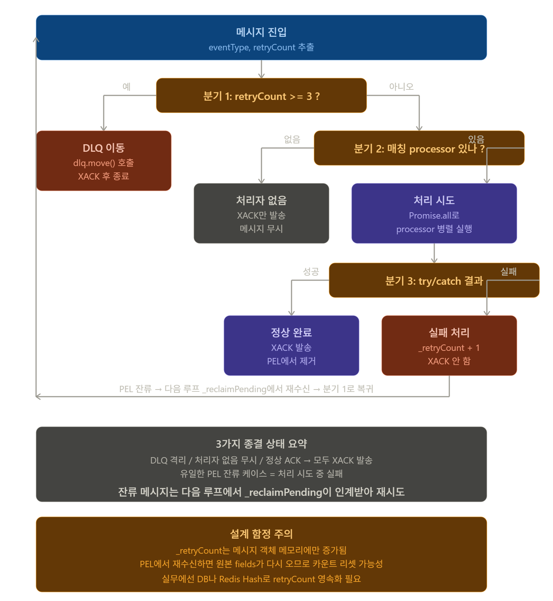

# M2 S10 — EventConsumer 구현과 멱등 처리 통합 검증

> **[Phase 1 — 현재 구현]** 이 모듈은 VASP(월렛원) 위탁 아키텍처를 기반으로 합니다.

> Block B — 이벤트 파이프라인 · M2 S10 · 강의 55분  
> 대상: `internal/packages/event-engine/src/stream/ConsumerGroupWorker.ts`

---

> **M2 블록 B의 집대성 세션이다. S7~S9에서 배운 모든 개념이 ConsumerGroupWorker 하나에 구현된다.**
>
> | 세션 | 무엇을 배웠나 | S10과의 연결 |
> |---|---|---|
> | M2 S7 | Redis Streams 이론 — PEL, Consumer Group, XAUTOCLAIM 원리 | `_reclaimPending()` 구현 기반 |
> | M2 S8 | CLI 실습 — XREADGROUP, XACK, XAUTOCLAIM 직접 조작 | 코드에서 동일 커맨드를 API로 호출 |
> | M2 S9 | At-least-once 4단계 불변 규칙, 멱등성 개념 | `_handleWithRetry()` 4단계 구현 |
> | M2 S10 (여기) | ConsumerGroupWorker 전체 구현 | S7~S9 집대성 |

## 0. 이론 도입 — ConsumerGroupWorker는 무슨 문제를 해결하는가

### 0-1. 메시지 파이프라인에서 Consumer의 역할

```
Redis Streams에 메시지가 쌓이는 것은 "창고에 상품을 적재"하는 것이다.
ConsumerGroupWorker는 그 창고에서 상품을 꺼내 처리하는 "작업자"다.

┌─────────────────────────────────────────────────────────────────┐
│  전체 파이프라인에서 ConsumerGroupWorker의 위치                  │
│                                                                  │
│  ChainEventListener                                             │
│       │                                                         │
│       │ 블록체인 이벤트 감지                                    │
│       ▼                                                         │
│  RedisStreamPublisher                                           │
│       │                                                         │
│       │ XADD → Redis Streams                                   │
│       ▼                                                         │
│  ┌──────────────────────────────┐                               │
│  │  ConsumerGroupWorker (S10)   │ ← 이번 세션                  │
│  │                              │                               │
│  │  무한 루프:                  │                               │
│  │  1. XAUTOCLAIM (미처리 우선) │                               │
│  │  2. XREADGROUP (새 메시지)   │                               │
│  │  3. _handleWithRetry(msg)    │                               │
│  └──────────────────────────────┘                               │
│       │                                                         │
│       │ 성공 → XACK / 실패 → PEL 잔류 / 3회 실패 → DLQ         │
│       ▼                                                         │
│  LedgerService (DB 업데이트)                                    │
└─────────────────────────────────────────────────────────────────┘
```

---

### 0-2. `_handleWithRetry` 결정 트리 — 메시지 1건의 운명

```
메시지 수신
    │
    ▼
retryCount >= MAX_RETRIES(3)?
    │
    ├── Yes ──► DLQ 이동 + XACK ──► 종료 (영구 격리)
    │
    └── No
         │
         ▼
    eventType 처리자 있는가?
         │
         ├── No ──► XACK (무시) ──► 종료
         │
         └── Yes
              │
              ▼
         processor.process() 실행
              │
              ├── 성공 ──► XACK ──► 종료 (정상 완료)
              │
              └── 실패 ──► retryCount +1 ──► XACK 없음
                                                │
                                                ▼
                                          PEL 잔류
                                          (다음 루프에서 재수신)

──────────────────────────────────────────────────────
핵심: XACK 안 하는 유일한 경우 = "처리 실패 + 재시도 횟수 남음"
이게 At-least-once 보장의 본체
──────────────────────────────────────────────────────
```

---

### 0-3. Consumer 수평 확장 시 흐름

```
트래픽 증가 → 단일 Consumer 처리 한계
    │
    ▼
Consumer 인스턴스 추가 (코드 변경 없음)

  ┌──────────────────────────────────────┐
  │  Redis Streams: kyobo:events          │
  │  [msg-001] [msg-002] [msg-003] [msg-004]│
  └──────────────────────────────────────┘
         │
         │ XREADGROUP (같은 그룹, 메시지 분배)
         │
         ├──► Consumer-1: msg-001, msg-003
         └──► Consumer-2: msg-002, msg-004

  Consumer-1 크래시:
    msg-001, msg-003이 PEL에 남음
    30초 후 Consumer-2가 XAUTOCLAIM으로 인계
    → Consumer-2: msg-001, msg-002, msg-003, msg-004 모두 처리

  멱등성이 있기 때문에: 인계 후 재처리해도 중복 발행 없음
```

---

## 1. ConsumerGroupWorker 전체 구조

```
F:\Workplace\kyobo-digital-asset-platform\
└── internal/packages/event-engine/src/stream/
    ├── ConsumerGroupWorker.ts   ← 이번 주요 대상
    ├── DLQHandler.ts
    └── RedisStreamPublisher.ts
```

**ConsumerGroupWorker 의존 관계:**

```
ConsumerGroupWorker
    ├── RedisConsumerClient  — XREADGROUP, XACK, XAUTOCLAIM
    ├── EventProcessor[]     — eventType별 처리 로직
    └── DLQHandler           — 3회 실패 메시지 격리
```

**EventProcessor 인터페이스:**

```typescript
// ConsumerGroupWorker.ts:54
export interface EventProcessor {
  eventTypes: string[];
  process(message: StreamMessage): Promise<void>;
}
```

`eventTypes`에 선언된 이벤트 타입만 처리한다.  
`process()`는 **반드시 멱등성을 보장**해야 한다 (At-least-once 환경).

## 2. 실행 루프 — start()

```typescript
// ConsumerGroupWorker.ts:88
async start(): Promise<void> {
  this.running = true;

  while (this.running) {
    try {
      // 순서 중요: PEL 재수신 먼저 → 새 메시지 처리
      await this._reclaimPending();   // 미처리(PEL) 재수신
      await this._processNew();       // 새 메시지
    } catch (err) {
      console.error('[ConsumerGroupWorker] error:', err);
      await this._sleep(1000);        // 오류 시 1초 대기 후 재시도
    }
  }
}
```

왜 `_reclaimPending()`을 먼저 호출하는가?  
→ 재시작 직후 PEL에 처리 안 된 메시지가 남아 있을 수 있다.  
→ 새 메시지보다 미처리 메시지를 먼저 처리하는 것이 일관성 측면에서 유리.

## 3. 새 메시지 처리 — _processNew()

```typescript
// ConsumerGroupWorker.ts:111
private async _processNew(): Promise<void> {
  const result = await this.redis.xreadgroup(
    this.config.groupName,     // "issuer-consumers"
    this.config.consumerId,    // "consumer-1"
    [{ key: this.config.streamKey, id: '>' }],  // '>' = 새 메시지만
    this.config.batchSize,     // COUNT 10
    this.config.blockMs,       // BLOCK 5000 (5초 대기)
  );

  for (const { messages } of result ?? []) {
    for (const msg of messages) {
      await this._handleWithRetry(msg);
    }
  }
}
```

`id: '>'` 의미: **이 Consumer가 아직 한 번도 받지 않은 새 메시지만**.  
`id: '0-0'`으로 바꾸면 PEL에 있는 이전 메시지부터 재수신한다 (XAUTOCLAIM과 다른 방식).

## 4. PEL 재수신 — _reclaimPending()

```typescript
// ConsumerGroupWorker.ts:143
private async _reclaimPending(): Promise<void> {
  const { messages } = await this.redis.xautoclaim(
    this.config.streamKey,    // "kyobo:events"
    this.config.groupName,    // "issuer-consumers"
    this.config.consumerId,   // "consumer-1" (재수신 받는 쪽)
    this.config.minIdleMs,    // 30_000ms = 30초 이상 idle인 것만
    '0-0',                    // 스트림 처음부터 검색
    this.config.batchSize,
  );

  for (const msg of messages) {
    await this._handleWithRetry(msg);
  }
}
```

**XAUTOCLAIM 동작 원리:**

```
Consumer-1이 메시지 소유 (PEL)
     ↓
Consumer-1 크래시
     ↓
minIdleMs(30초) 경과
     ↓
Consumer-2가 XAUTOCLAIM 호출
     ↓
PEL 소유권: Consumer-1 → Consumer-2 이전
     ↓
Consumer-2가 정상 처리 + XACK
```

## 5. 처리 + 재시도 — _handleWithRetry()

> **M2 S9에서 4단계 불변 규칙으로 개념화한 함수의 실제 구현이다.**  
> XACK는 항상 처리 완료 후 — 이 원칙 자체는 S9 참조.  
> 여기서는 S9에 없던 실제 구현 디테일(DLQ 분기, 처리자 매칭, retryCount 관리)에 집중한다.

```typescript
// ConsumerGroupWorker.ts:164
private async _handleWithRetry(msg: StreamMessage): Promise<void> {
  const eventType  = msg.fields['eventType'] ?? '';
  const retryCount = parseInt(msg.fields['_retryCount'] ?? '0', 10);

  // 3회 초과 → DLQ
  if (retryCount >= this.MAX_RETRIES) {
    await this.dlq.move({
      messageId: msg.id,
      streamKey: this.config.streamKey,
      groupName: this.config.groupName,
      event:     msg.fields,
      reason:    `max retries (${this.MAX_RETRIES}) exceeded`,
      failedAt:  new Date(),
    });
    await this.redis.xack(this.config.streamKey, this.config.groupName, msg.id);
    return;
  }

  const processors = this.processors.filter(p => p.eventTypes.includes(eventType));

  if (processors.length === 0) {
    // 처리자 없음 → ACK (무시)
    await this.redis.xack(this.config.streamKey, this.config.groupName, msg.id);
    return;
  }

  try {
    await Promise.all(processors.map(p => p.process(msg)));
    // 성공 → ACK
    await this.redis.xack(this.config.streamKey, this.config.groupName, msg.id);
  } catch (err) {
    // 실패 → retryCount 증가, XACK 안 함 → PEL 잔류
    msg.fields['_retryCount'] = String(retryCount + 1);
    console.error(`[ConsumerGroupWorker] message ${msg.id} failed (attempt ${retryCount + 1}):`, err);
  }
}
```




### (1) 한 줄 요약

**메시지 1건을 받아 "DLQ로 보낼지, 무시할지, 처리할지"를 결정하고 결과에 따라 XACK 또는 PEL 잔류를 결정하는 디스패처.**

워커의 모든 메시지가 이 함수를 통과. 처리 결정의 단일 진입점.

### (2) 함수의 5가지 책임

1. 메시지 메타데이터 추출 (eventType, retryCount)
2. **재시도 한도 체크** → 초과 시 DLQ
3. **처리자 매칭** → 없으면 무시
4. **실제 처리 실행** (Promise.all)
5. **결과에 따른 ACK 결정** (성공 → XACK, 실패 → PEL 잔류)

### (3) TS 문법 새로 등장한 것

#### `parseInt(msg.fields['_retryCount'] ?? '0', 10)`
- **`parseInt(문자열, 진법)`** — 문자열을 정수로 변환
- **두 번째 인자 `10`** — 10진수 명시 (필수에 가까움)
- 안 쓰면 옛 환경에서 `'08'`을 8진수로 오해할 수 있음 (현대는 안전하지만 관례)

#### `String(retryCount + 1)`
- **`String(값)`** — 어떤 타입이든 문자열로 변환
- `(retryCount + 1).toString()`과 같음
- Redis Streams는 모든 필드가 string이라 변환 필수

#### `processors.filter(p => p.eventTypes.includes(eventType))`
- **`filter`** — 조건 만족하는 것만 남김
- **`includes(value)`** — 배열에 값이 있나 boolean으로
- 한 줄로 "이 eventType을 처리할 수 있는 processor만 추출"

#### `Promise.all(processors.map(p => p.process(msg)))`
- **`map`** — 배열을 새 배열로 변환 (각 processor → 각 Promise)
- **`Promise.all`** — 모든 Promise를 병렬 실행 + 모두 끝날 때까지 대기
- 하나라도 reject하면 전체 reject (catch로 잡힘)

#### `new Date()`
- 현재 시각을 Date 객체로
- `Date.now()`는 숫자(밀리초), `new Date()`는 객체
- DLQ 기록엔 객체가 더 풍부 (포맷팅 등 가능)

#### `msg.fields['_retryCount'] = String(retryCount + 1);`
- **객체 필드 동적 수정**
- `_retryCount` 필드를 직접 덮어씀
- 주의: 이 변경은 **메모리 객체에만** 적용됨 (PEL 원본 안 바뀜)

### (4) 라인별 분기 흐름

#### ① 메타데이터 추출

```typescript
const eventType  = msg.fields['eventType'] ?? '';
const retryCount = parseInt(msg.fields['_retryCount'] ?? '0', 10);
```

- 둘 다 `??`로 누락 방어
- eventType 없으면 빈 문자열 → 매칭되는 processor 0개 → 분기 ②에서 무시
- retryCount 없으면 0 → 신규 메시지로 취급

#### ② 분기 1: 재시도 한도 초과

```typescript
if (retryCount >= this.MAX_RETRIES) {
  await this.dlq.move({ ... });
  await this.redis.xack(...);
  return;
}
```

- **3회 시도해도 실패한 메시지는 DLQ로 격리**
- DLQ 기록 후 **반드시 XACK** → 원 스트림 PEL에서 제거
- DLQ에 안 보내고 XACK만 하면 **메시지 소실**, XACK 안 하고 DLQ만 보내면 **무한 재시도**

**dlq.move 인자 분석:**

```typescript
{
  messageId: msg.id,           // 추적용 원본 ID
  streamKey: '...',            // 어느 스트림에서 왔는지
  groupName: '...',            // 어느 그룹에서 왔는지
  event:     msg.fields,       // 원본 데이터 전체
  reason:    'max retries...', // 실패 사유
  failedAt:  new Date(),       // 실패 시각
}
```

운영자가 나중에 DLQ 보고 "왜 실패했나" 분석할 수 있도록 **컨텍스트 전부 보존**.

#### ③ 분기 2: 처리자 없음

```typescript
const processors = this.processors.filter(p => p.eventTypes.includes(eventType));

if (processors.length === 0) {
  await this.redis.xack(...);
  return;
}
```

- 등록된 processor 중 이 eventType을 처리할 수 있는 것 찾기
- 없으면 **그냥 XACK하고 무시**

**왜 무시하나:**
- 새 이벤트 타입이 추가됐는데 이 워커는 옛 버전이라 모름
- 다른 워커가 처리할 수도 있음 (단, 같은 그룹이면 못 받으니 영구 미처리)
- "모르는 건 그냥 통과시키고 다음으로" — 큐 막힘 방지

**주의점:** 진짜 처리해야 할 이벤트인데 잘못된 eventType이면 **소실**. 모니터링 필수.

#### ④ 분기 3: 처리 시도 + 결과 분기
```typescript
try {
  await Promise.all(processors.map(p => p.process(msg)));
  await this.redis.xack(...);  // 성공
} catch (err) {
  msg.fields['_retryCount'] = String(retryCount + 1);  // 실패
  console.error(...);
  // XACK 호출 안 함 → PEL 잔류
}
```

**성공 분기:**
- 모든 processor가 throw 안 했음
- XACK → PEL에서 제거 → 메시지 영구 처리 완료

**실패 분기:**
- 한 processor라도 throw → Promise.all reject → catch
- 카운터 +1
- **XACK 안 함이 핵심** → PEL에 남음 → 다음 루프 _reclaimPending에서 재수신
- 재수신되면 다시 이 함수 진입 → 분기 1에서 카운트 체크

### (5) 결정 트리 종합

| 상황 | 분기 | XACK? | DLQ? | 결과 |
|------|------|-------|------|------|
| retryCount ≥ 3 | ① | ✅ | ✅ | 영구 격리 |
| 처리자 없음 | ② | ✅ | ❌ | 무시 (소실 가능) |
| 처리 성공 | ③-성공 | ✅ | ❌ | 정상 완료 |
| 처리 실패 | ③-실패 | ❌ | ❌ | PEL 잔류, 재시도 |

**XACK 안 하는 유일한 경우 = 처리 실패.**  
이게 At-least-once의 핵심 설계.

### (6) Promise.all의 동작 정밀 분석

```typescript
await Promise.all([
  ledgerProcessor.process(msg),
  auditProcessor.process(msg),
  notificationProcessor.process(msg),
]);
```

**병렬 실행:**
- 셋 다 동시 시작
- 가장 오래 걸리는 것까지 대기
- 셋 다 성공하면 통과

**한 개라도 실패하면:**
- Promise.all이 즉시 reject
- 다른 두 개는 이미 시작됐을 수 있음 (취소되지 않음)
- catch로 진입

**이게 의미하는 것:**
- 한 processor가 실패하면 **메시지 전체가 재시도 대상**
- 성공한 processor도 **재시도 시 다시 실행됨**
- → 모든 processor가 **멱등해야** 안전

**대안: Promise.allSettled**
```typescript
const results = await Promise.allSettled(...);
// 실패한 것만 따로 처리
```
이 코드는 사용 안 함 — "전부 성공 아니면 전부 재시도" 정책.

### (7) 재시도 메커니즘의 미묘한 함정

#### 함정: _retryCount는 메모리에만 저장됨

```typescript
msg.fields['_retryCount'] = String(retryCount + 1);
```

- 이 변경은 **현재 함수의 msg 객체**에만 적용
- PEL의 원본 메시지 fields는 **변경 안 됨**
- 다음 _reclaimPending이 PEL에서 가져오면 → 원본 fields → retryCount 다시 0?

#### 실제 동작 (Redis Streams)
- Redis Streams는 메시지를 한 번 적재하면 **fields 변경 불가**
- PEL은 messageId만 추적, fields는 스트림 원본
- 따라서 _retryCount는 **현재 워커 프로세스 내에서만** 유효

#### 결과적 동작
- 같은 워커 프로세스 내에서 즉시 재처리되면 → 카운트 누적 (정상)
- 워커 재시작 또는 다른 워커가 인계 → 카운트 리셋

#### 실무 해법
- DB나 Redis Hash에 `messageId → retryCount` 별도 저장
- `_handleWithRetry` 진입 시 외부에서 카운트 조회
- 또는 DLQ 정책을 시간 기반으로 (idle 1시간 → DLQ)

### (8) 강의 강조 포인트

- **모든 메시지가 이 함수의 4가지 분기 중 하나로 종결** — 누락 없는 결정 트리 설계
- **XACK은 "처리 끝" 영수증, DLQ는 "포기 선언"** — 둘 다 PEL 정리에 사용
- **Promise.all은 "모두 성공 아니면 재시도"** — 부분 성공 허용 안 함
- **try/catch가 _handleWithRetry 안에만** — start()의 try/catch는 워커 자체 보호용. 메시지 단위 실패는 여기서 잡음
- **return으로 조기 종료** — 분기마다 명시적 return → 의도 명확
- **`_retryCount`는 메모리 카운터** — 분산/재시작 환경에선 불완전. 실무는 영속화
- **`new Date()`로 타임스탬프** — DLQ 운영자가 "언제 실패했는지" 추적
- **eventType 누락 방어** — `?? ''`로 빈 문자열 → 자동으로 처리자 없음 분기로 빠짐
- **DLQ도 멱등성 필요** — DLQ 이동 자체가 실패할 수 있음. dlq.move도 멱등 설계 권장
- **모니터링 지표** — DLQ 적재 건수, 처리자 없음 무시 건수, 평균 retry 횟수 — 모두 알람 대상

### (9) 한 줄 정리

> **`_handleWithRetry`는 메시지 1건의 운명을 결정하는 4분기 디스패처.**  
> retry 한도면 DLQ, 처리자 없으면 무시, 처리 성공이면 XACK, 처리 실패면 PEL 잔류.  
> **유일하게 XACK 안 하는 경우 = 처리 실패** — 이게 At-least-once 보장의 본체.

**핵심 설계 포인트:**

| 경우 | 동작 |
|------|------|
| 처리 성공 | XACK → PEL 제거 |
| 처리 실패 (3회 미만) | XACK 안 함 → PEL 잔류 → 다음 _reclaimPending에서 재수신 |
| 처리 실패 (3회 이상) | DLQ 이동 + XACK |
| eventType 처리자 없음 | XACK (무시) |

## 6. 실습 — NFTIssuedProcessor 구현

```typescript
// 실습: EventProcessor 구현체 — NFT 발행 이벤트 처리
import type { EventProcessor, StreamMessage } from './ConsumerGroupWorker';

export class NFTIssuedProcessor implements EventProcessor {
  readonly eventTypes = ['NFTIssued'];

  constructor(
    private readonly ledgerService: LedgerService,
    private readonly idempotencyGuard: IdempotencyGuard,
  ) {}

  async process(message: StreamMessage): Promise<void> {
    const event = JSON.parse(message.fields['payload'] ?? '{}') as NFTIssuedEvent;

    // 멱등성 키: txHash + logIndex
    const idempotencyKey = `NFTIssued:${event.txHash}:${event.logIndex}`;

    // TODO: idempotencyGuard.run()으로 중복 처리 차단 + DB 트랜잭션
    await this.idempotencyGuard.run(idempotencyKey, async () => {
      await this.ledgerService.db.transaction(async (trx) => {
        // TODO: MintRequest 상태 → FINALIZED (PoS finality 확보 기준) → 원장 업데이트 후 CONFIRMED
        // TODO: user_nft_holdings +1
      });
    });
  }
}
```

```typescript
// 답안
async process(message: StreamMessage): Promise<void> {
  const event = JSON.parse(message.fields['payload'] ?? '{}') as NFTIssuedEvent;
  const idempotencyKey = `NFTIssued:${event.txHash}:${event.logIndex}`;

  await this.idempotencyGuard.run(idempotencyKey, async () => {
    await this.ledgerService.db.transaction(async (trx) => {
      await trx('mint_requests')
        .where({ request_id: event.requestId })
        .update({ status: 'CONFIRMED', confirmed_at: new Date() });

      await trx('user_nft_holdings')
        .insert({ user_id: event.to, token_id: event.tokenId, amount: 1 })
        .onConflict(['user_id', 'token_id'])
        .merge({ amount: trx.raw('amount + 1') });
    });
  });
}
```

**완료 기준:**
- [ ] 동일 txHash+logIndex 이벤트 2회 → `user_nft_holdings.amount = 1` (1회만 반영)
- [ ] Consumer 재시작 후 미ACK 메시지 자동 재수신

---

# 실습 (30분)

실습 파일: `course/exercises/M2/S10_handle_with_retry.ts`

```bash
npm run exercise:s10
```

파일 상단의 실험 변수를 바꾸고 실행하면서 출력이 어떻게 달라지는지 확인하세요.

```typescript
const MAX_RETRIES          = 3;  // DLQ로 이동하는 임계값
const FAIL_MSG_RETRY_COUNT = 1;  // 실패 메시지의 현재 재시도 횟수
```

---

## 단계별 진행 가이드

### 실험 1 — 기본 상태 확인 (변수 그대로)

```
MAX_RETRIES = 3 / FAIL_MSG_RETRY_COUNT = 1
```

```bash
npm run exercise:s10
```

**기대 출력:**
```
[A] retryCount=3 (>= MAX_RETRIES=3) → DLQ
  [DLQ] ...
  [XACK] ...
  ✅ DLQ 이동: 1건 (기대: 1)
  ✅ XACK: 1건 (기대: 1)

[B] UNKNOWN_EVENT → 매칭 processor 없음
  [XACK] ...
  ✅ DLQ 이동: 0건 (기대: 0)
  ✅ XACK: 1건 (기대: 1)

[C] NFT_ISSUED → 처리 성공 → XACK
  [processor] NFT_ISSUED → 성공
  [XACK] ...
  ✅ XACK: 1건 (기대: 1)

[D] 처리 실패, 현재 retryCount=1
  [retry] message ... failed (attempt 2): 일시적 오류
  ✅ retryCount: 2 (기대: 2)
  ✅ XACK: 0건 (기대: 0, PEL 유지)
```

> **확인 포인트:** 4가지 분기가 모두 독립적으로 동작합니다. 시나리오 D에서는 XACK가 없어 PEL에 메시지가 남습니다.

---

### 실험 2 — MAX_RETRIES를 1로 줄이면?

파일에서 `MAX_RETRIES = 1` 로 바꾸고 실행하세요.

**확인 포인트:**
- 시나리오 A는 `retryCount=1 >= MAX_RETRIES=1` 조건을 그대로 충족 → DLQ 이동
- 시나리오 D의 `FAIL_MSG_RETRY_COUNT = 1` 이면 이미 MAX_RETRIES에 도달 → DLQ 분기로 빠짐

> `MAX_RETRIES` 를 낮출수록 메시지가 더 빨리 DLQ로 이동합니다. 너무 낮으면 일시적 오류도 DLQ로 가버립니다.

---

### 실험 3 — 실패 카운터를 경계값으로 맞추기

```
MAX_RETRIES = 3
FAIL_MSG_RETRY_COUNT = 2
```

**확인 포인트:** 시나리오 D에서 retryCount가 2→3이 됩니다. 다음 수신 시 시나리오 A(DLQ 분기)로 빠집니다. 이것이 "마지막 재시도"의 순간입니다.

---

### 실험 4 — FAIL_MSG_RETRY_COUNT = MAX_RETRIES이면?

```
MAX_RETRIES = 3
FAIL_MSG_RETRY_COUNT = 3
```

**확인 포인트:** 시나리오 D는 처리 실패 상황인데, 메시지의 현재 카운트가 이미 MAX_RETRIES와 같습니다. 하지만 시나리오 A가 먼저 체크하므로 → 시나리오 D는 실행되지 않고 시나리오 A에서 DLQ로 이동합니다.

---

## 완료 기준

- [ ] 실험 1: 4개 시나리오 모두 ✅ 확인
- [ ] 실험 2: MAX_RETRIES=1 시 시나리오 D가 DLQ 분기로 전환됨 확인
- [ ] 실험 3: retryCount 경계값(MAX_RETRIES - 1)의 의미 이해
- [ ] 아래 결정 트리를 말로 설명 가능:

```
retryCount >= MAX_RETRIES? → DLQ + XACK
매칭 processor 없음?       → XACK (무시)
처리 성공?                  → XACK
처리 실패?                  → retryCount+1, XACK 없음 (PEL 잔류)
```
