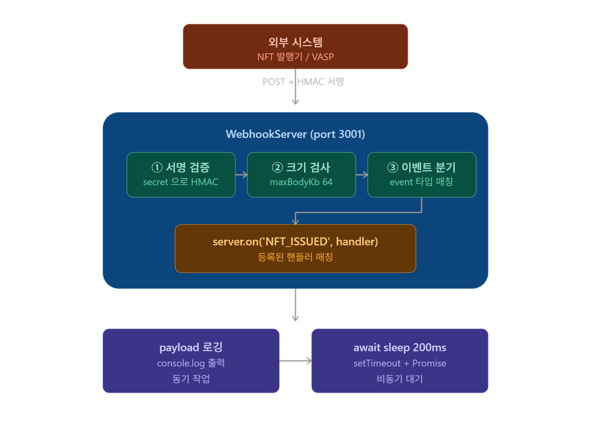
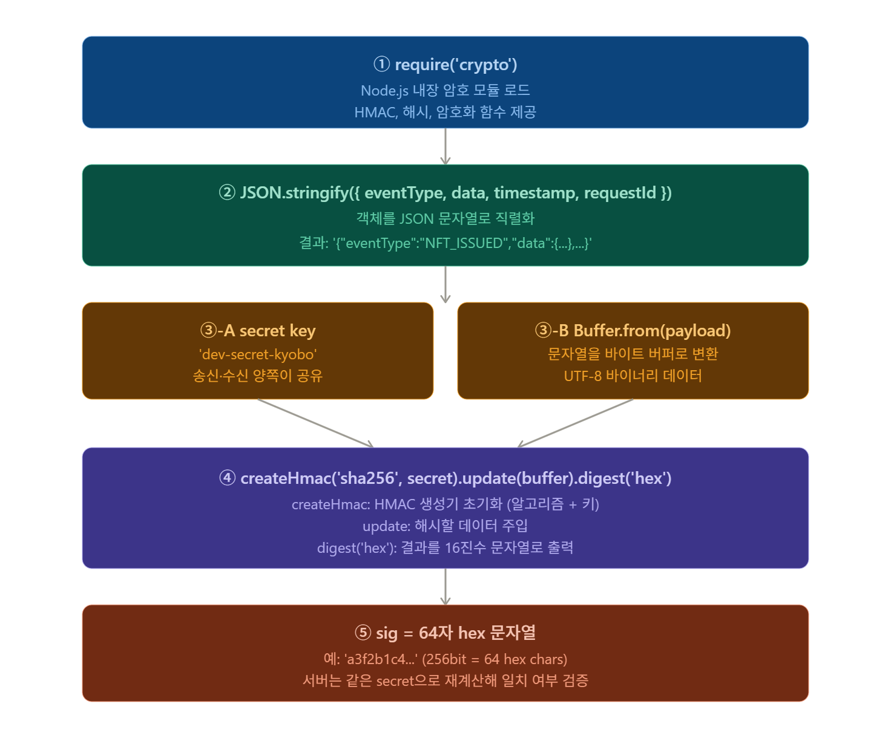

# M2 S5 — 온체인 이벤트 수신 설계: 즉시 처리의 위험과 비동기 분리

> Block A — DMZ 이벤트 파이프라인 · Day 02 · 강의 25분 + 실습 30분  
> 대상: `internal/packages/event-engine/src/webhook/WebhookServer.ts`

> **[Phase 1 — 현재 구현]** 이 모듈은 VASP(월렛원) 위탁 아키텍처를 기반으로 합니다.

---

> **Phase 1 Webhook 발신자 구분**  
> Phase 1에서 WebhookReceiver가 수신하는 이벤트는 두 종류다.  
> - `ACTIVITY_ACHIEVED` — **내부망(교보 앱 서버)** 발신: 사용자 활동 달성 알림  
> - `NFT_ISSUED` — **월렛원(외부 VASP)** 발신: 온체인 TX 확정 후 발행 완료 콜백  
>
> Phase 3에서 직접 Custody를 운영하면 `NFT_ISSUED`는 VASP Webhook이 아니라  
> `ChainEventListener`가 블록체인 이벤트를 직접 구독해 처리한다.

---

# 이 세션이 답하는 질문

```
Q1. Webhook을 받자마자 DB에 저장하면 안 되는가?
    → DB 장애 순간 Webhook이 오면 이벤트가 영구적으로 사라진다.
    → 발신자가 응답을 기다리다 timeout 후 재전송해도, 우리 쪽이 복구될 때까지 계속 유실된다.

Q2. 202를 즉시 반환하면 처리가 안 된 것 아닌가?
    → "나 받았어 (Accepted)"와 "나 처리했어 (Done)"는 다르다.
    → 202는 "받았으니 내가 알아서 처리할게"라는 의미다.
    → 처리는 Queue를 통해 비동기로, 실패해도 재처리 가능하다.

Q3. Queue가 없으면 어떤 일이 생기는가?
    → 처리 실패 시 재시도 메커니즘이 없다.
    → Consumer가 느려지면 수신 속도가 함께 느려진다.
    → 수신과 처리를 분리해야 각자 독립적으로 확장할 수 있다.
```

---

# 전체 흐름에서의 위치

```
[교보 앱 서버]              ← 사용자 활동 달성 이벤트 발신 (ACTIVITY_ACHIEVED)
          │  HTTP POST + HMAC 서명
          ▼
[WebhookServer]                          ← S5 핵심 구간 (수신 → 202 → Queue 적재)
  _readBody()       rawBody Buffer 수집
  _verifySignature() HMAC 검증
  202 즉시 응답
  handlers 비동기 실행
          │  WebhookPayload
          ▼
[Queue (Redis Streams)]                  ← S6/S7에서 상세 학습
  XADD → messageId
          │
          ▼
[ConsumerGroupWorker]                    ← S9 이후
  XREADGROUP → 처리 → XACK
          │ 발행 요청 실행
          ▼
[블록체인]                               ← NFT 발행 트랜잭션
          │ 온체인 이벤트 (Issued)
          ▼
[ChainEventListener]                     ← 블록체인 이벤트는 이쪽이 수신
          │
          ▼
[Core Banking 아웃바운드 알림]            ← DMZ → Core Banking (반대 방향)
```

## 이 세션의 구간

```
[교보 앱 서버] ──────────────► [WebhookServer] ──────────────► [Queue]
      ↑                               ↑                           ↑
 활동 달성 이벤트 발신           이 세션 핵심                   다음 세션

※ 블록체인 이벤트 (NFT 발행 확인)는 WebhookServer가 아닌 ChainEventListener가 수신한다.
   Core Banking은 DMZ가 아웃바운드로 알림을 보내는 대상 — WebhookServer를 호출하지 않는다.
```

---

# 1부 — 왜 즉시 처리가 위험한가 (10분)

## 1-1. 기존 방식: Webhook 수신 → 즉시 처리

많은 개발자가 처음 Webhook을 구현할 때 이렇게 짠다:

```typescript
// ❌ 잘못된 구현 — 즉시 처리 패턴
app.post('/webhook', async (req, res) => {
  const payload = req.body;

  // DB에 직접 저장
  await db.save(payload);           // ← 여기서 장애 나면?

  // 원장 업데이트
  await ledger.update(payload);     // ← 여기서 timeout 나면?

  // 알림 발송
  await notifier.send(payload);     // ← 여기서 실패하면?

  res.status(200).json({ ok: true });
});
```

**이 코드의 문제점을 타임라인으로 보면:**

```
시각   발신자(교보 앱 서버)  수신자(우리 서버)
────────────────────────────────────────────────────
T+0    POST /webhook 전송           요청 수신
T+1                                 db.save() 호출 중...
T+2                                 [DB 연결 오류 발생] ← 💥
T+3    (응답 없음 — 대기 중)
T+30   timeout → 재전송 시도        서버가 아직 장애 중
T+60   재전송 포기                  이벤트 영구 유실 ← 💀
```

**핵심 문제 3가지:**

| 문제 | 설명 | 결과 |
|------|------|------|
| 이벤트 유실 | DB 장애 시 이벤트 저장 불가 | 회계 불일치, NFT 누락 |
| 느린 응답 | 처리 완료까지 응답 지연 | 발신자 timeout → 재전송 |
| 결합도 | 수신 속도 = 처리 속도 | 처리가 느리면 수신도 막힘 |

---

## 1-2. 올바른 방식: 202 + Queue 패턴

```typescript
// ✅ 올바른 구현 — 202 + Queue 패턴
app.post('/webhook', async (req, res) => {
  const rawBody = await readRawBody(req);  // Buffer로 수집

  // 서명 검증 (빠름)
  if (!verifySignature(rawBody, req.headers['x-kyobo-signature'])) {
    return res.status(401).end();
  }

  // 즉시 202 응답 ← 발신자에게 "받았어" 확인
  res.status(202).end();

  // Queue 적재는 비동기 ← 응답 이후 처리
  const payload = JSON.parse(rawBody.toString('utf8'));
  await queue.publish(payload);            // 실패해도 발신자는 이미 202 받음
});
```

**타임라인 비교:**

```
시각   발신자(교보 앱 서버)  수신자(우리 서버)
────────────────────────────────────────────────────
T+0    POST /webhook 전송           요청 수신
T+1                                 서명 검증 (1ms 이내)
T+2                                 202 응답 ← 즉시 반환 ✅
T+3    202 수신 — "OK, 전달 완료"
                                    [비동기] Queue.publish()
                                    → Redis XADD → messageId 기록
                                    이후 Consumer가 처리
```

---

# 2부 — WebhookServer 코드 해부 (15분)

## 2-1. 클래스 구조 전체 읽기

```bash
cat internal/packages/event-engine/src/webhook/WebhookServer.ts
```

```typescript
// WebhookServer.ts 핵심 구조

export type WebhookPayload = {
  eventType: string;
  data:      Record<string, unknown>;
  timestamp: number;
  requestId: string;   // 멱등성 키 — 중복 처리 방지에 사용
};

export type WebhookHandler = (payload: WebhookPayload) => Promise<void>;

export class WebhookServer {
  private server:   http.Server;
  private handlers: Map<string, WebhookHandler[]> = new Map();

  constructor(private readonly config: {
    port:      number;
    secret:    string;    // HMAC 시크릿 — 환경 변수로 주입
    maxBodyKb: number;    // payload 크기 제한
  }) {
    this.server = http.createServer(this._handleRequest.bind(this));
  }

  // 핸들러 등록 — 체이닝 가능
  on(eventType: string, handler: WebhookHandler): this {
    const list = this.handlers.get(eventType) ?? [];
    list.push(handler);
    this.handlers.set(eventType, list);
    return this;
  }

  listen(): Promise<void> { ... }
  close():  Promise<void> { ... }

  private async _handleRequest(req, res): Promise<void> { ... }  // ← 이 세션
  private        _readBody(req):          Promise<Buffer> { ... }  // ← 이 세션
  private        _verifySignature(rawBody, signature): boolean { ... }  // ← S6에서 상세 해부
}
```

---

## 2-2. _handleRequest 흐름 완전 해부

`_handleRequest`는 WebhookServer의 심장이다. 6단계로 이루어진다:

```typescript
private async _handleRequest(
  req: http.IncomingMessage,
  res: http.ServerResponse,
): Promise<void> {
  // Step 1: POST 메서드만 허용
  if (req.method !== 'POST') {
    res.writeHead(405).end();
    return;
  }

  try {
    // Step 2: rawBody를 Buffer로 수집
    //         string이 아닌 Buffer로 유지하는 이유 → _verifySignature 설명 참고
    const rawBody   = await this._readBody(req);

    // Step 3: HMAC 서명 검증
    const signature = req.headers['x-kyobo-signature'] as string ?? '';
    if (!this._verifySignature(rawBody, signature)) {
      res.writeHead(401).end('invalid signature');
      return;
    }

    // Step 4: 서명 통과 후 JSON 파싱
    //         검증 전에 파싱하지 않는 이유:
    //         → 공격자가 보낸 악의적 JSON을 파싱하는 비용 절감
    //         → 서명 검증이 신뢰의 관문
    const payload: WebhookPayload = JSON.parse(rawBody.toString('utf8'));

    // Step 5: 202 즉시 응답 ← 이 줄이 핵심
    res.writeHead(202).end();

    // Step 6: 핸들러 비동기 실행 (202 응답 이후)
    //         Promise.allSettled: 하나가 실패해도 나머지는 실행 계속
    const handlers = this.handlers.get(payload.eventType) ?? [];
    await Promise.allSettled(handlers.map(h => h(payload)));

  } catch (err) {
    if (!res.headersSent) res.writeHead(400).end();
    console.error('[WebhookServer] error:', err);
  }
}
```

**Step 5와 6의 순서가 왜 중요한가:**

```
❌ 잘못된 순서:
   await Promise.allSettled(handlers...)  ← 처리 완료까지 대기
   res.writeHead(202).end();              ← 처리 완료 후 응답
   → 처리 시간(수백ms~수초)만큼 발신자 대기
   → DB 장애 시 202 응답 자체가 안 됨 → 이벤트 재전송 루프

✅ 올바른 순서:
   res.writeHead(202).end();              ← 즉시 응답 (검증만 통과하면)
   await Promise.allSettled(handlers...)  ← 응답 이후 비동기 처리
   → 발신자는 1~5ms 내에 응답 받음
   → 처리 실패는 Queue 레이어가 담당
```

---

## 2-3. Promise.allSettled vs Promise.all

```typescript
// ❌ Promise.all — 하나라도 실패하면 나머지 취소
await Promise.all(handlers.map(h => h(payload)));
//  handler1: Queue 적재 ✅
//  handler2: AuditLog ← 실패 → handler1 결과가 의미없어짐? 아님.
//  → 실제로 handler1은 이미 실행됨. 하지만 에러가 throw돼 오해 유발.

// ✅ Promise.allSettled — 모두 실행, 결과는 개별 confirmed/rejected
await Promise.allSettled(handlers.map(h => h(payload)));
//  handler1: { status: 'fulfilled', value: undefined }
//  handler2: { status: 'rejected',  reason: Error }
//  → 각 핸들러 독립 실행, 실패 로그만 기록
```

**실제 핸들러 등록 방법:**

```typescript
const server = new WebhookServer({ port: 3000, secret: process.env.WEBHOOK_SECRET!, maxBodyKb: 64 });

// 같은 eventType에 여러 핸들러 등록 가능 (체이닝)
server
  .on('NFT_ISSUED', async (payload) => {
    // Queue에 적재
    await publisher.publish({
      streamKey:   'kyobo:events',
      eventType:   payload.eventType,
      payload:     payload.data,
      txHash:      payload.data['txHash'] as string,
      blockNumber: payload.data['blockNumber'] as number,
      requestId:   payload.requestId,
    });
  })
  .on('NFT_ISSUED', async (payload) => {
    // AuditLog 기록 (두 번째 핸들러)
    await auditLog.record(payload);
  })
  .on('NFT_BURNED', async (payload) => {
    await publisher.publish({ ... });
  });

await server.listen();
```

---

## 2-4. _readBody — rawBody를 Buffer로 유지하는 이유

```typescript
private _readBody(req: http.IncomingMessage): Promise<Buffer> {
  return new Promise((resolve, reject) => {
    const chunks: Buffer[] = [];
    let size = 0;

    req.on('data', (chunk: Buffer) => {
      size += chunk.length;

      // 크기 제한 — payload injection 방지
      if (size > this.config.maxBodyKb * 1024) {
        reject(new Error('payload too large'));
        return;
      }
      chunks.push(chunk);
    });

    req.on('end',   () => resolve(Buffer.concat(chunks)));
    req.on('error', reject);
  });
}
```

**왜 `string`이 아니라 `Buffer`인가?**

```
❌ string으로 받으면:
   req.setEncoding('utf8');          // Node.js가 자동 디코딩
   data += chunk;                    // string 누적
   → Buffer.from(body) 로 재변환 필요
   → 인코딩 오류 가능성 (멀티바이트)

✅ Buffer로 받으면:
   chunks.push(chunk as Buffer);    // 원본 바이트 보존
   Buffer.concat(chunks)            // 그대로 합침
   → HMAC 계산: 원본 바이트 그대로 사용 → 발신자 서명과 일치
   → JSON 파싱: rawBody.toString('utf8') 으로 명시적 변환
```

---

# 3부 — 202 패턴의 설계 철학 (5분)

## 3-1. HTTP 응답 코드의 의미

| 코드 | 의미 | 사용 시점 |
|------|------|-----------|
| 200 OK | 처리 완료 | 동기 처리가 완료된 경우 |
| 201 Created | 리소스 생성 완료 | POST로 새 자원 생성 시 |
| **202 Accepted** | **수신 확인, 처리는 나중에** | **비동기 처리 예약 시** |
| 400 Bad Request | 요청 형식 오류 | JSON 파싱 실패 등 |
| 401 Unauthorized | 인증 실패 | 서명 검증 실패 |

## 3-2. 202 패턴이 만드는 시스템 특성

```
202 즉시 응답
      │
      ├─── 발신자: "전달 성공" 확신 → 재전송 루프 없음
      │
      ├─── 수신자: 처리 실패는 내부에서 재시도 (Queue 레이어)
      │           수신과 처리의 속도가 분리됨
      │
      └─── 시스템: 수신 처리량 ≠ 처리 처리량
                  각각 독립적으로 확장 가능

Queue 없이 202만 쓰면?
      → 비동기 처리 중 실패 → 재시도 불가 → 이벤트 유실
      → 202는 반드시 Queue와 함께 사용해야 의미가 있다
```

---

# 실습 (30분)

## 실습 목표

WebhookServer의 `_handleRequest` 구조를 직접 따라가며,  
Queue 적재 실패 시 어떻게 처리할지 정책을 결정한다.

---

## Step 1: 코드 읽기 (5분)

```powershell
# 실제 파일 열기
code internal/packages/event-engine/src/webhook/WebhookServer.ts
```

아래 질문에 답하면서 읽어라:

```
[ ] _handleRequest의 try/catch 블록이 잡는 에러는 어떤 종류인가?
[ ] 202를 보낸 후 handlers 실행이 실패하면 catch에 걸리는가?
[ ] maxBodyKb 초과 시 어떤 응답이 가는가?
```

---

## Step 2: 핸들러 등록 → 서버 기동 (10분)



```typescript
// TODO: 아래 스켈레톤을 채워서 WebhookServer를 기동하라

import { WebhookServer } from './webhook/WebhookServer';

const server = new WebhookServer({
  port:      3001,
  secret:    'dev-secret-kyobo',
  maxBodyKb: 64,
});

// TODO 1: 'NFT_ISSUED' 이벤트에 핸들러 등록
//         핸들러 내용: console.log로 payload 출력 + 200ms 슬립
server.on('NFT_ISSUED', async (payload) => {
  // TODO: 구현
});

// TODO 2: 서버 listen
// TODO: 구현

console.log('WebhookServer ready');
```

### (1) 이 코드가 뭐하는 코드인가

**한 줄 요약:** 교보 앱 서버가 보내는 활동 달성 이벤트를 받아 처리하는 **웹훅 수신 서버**의 진입점(entry point) 스켈레톤.

**맥락:**

- ERC-1155 NFT 보상이 발행되면 → 외부에서 "NFT_ISSUED" 이벤트를 이 서버로 POST 전송
- 서버는 그 이벤트를 받아 후속 처리 (DB 기록, 알림, 다음 트랜잭션 트리거 등)
- 지금 보이는 파일은 **부트스트랩(기동) 파일** — 실제 로직은 `WebhookServer` 클래스 안에 있고, 여기서는 "어떤 설정으로 띄울지 + 어떤 이벤트에 어떻게 반응할지"만 선언

### (2) TS 문법 라인별 설명

#### `import { WebhookServer } from './webhook/WebhookServer';`

- **`import { X } from '경로'`** = 다른 파일의 named export 가져오기
- 중괄호 `{}`는 **named import** (`export class WebhookServer` 또는 `export { WebhookServer }`로 내보낸 것)
- 중괄호 없으면 **default import** (`export default`로 내보낸 것)
- `.ts` 확장자 생략 — TS가 자동으로 찾음

#### `const server = new WebhookServer({ ... });`

- **`const`** = 재할당 불가 변수 (객체 내부 변경은 가능)
- **`new`** = 클래스 인스턴스 생성. `WebhookServer`는 클래스라는 뜻
- **`{ port, secret, maxBodyKb }`** = 객체 리터럴을 생성자 인자로 전달
   - TS가 이 객체의 타입을 `WebhookServer`의 생성자 시그니처와 자동 검증
   - `port: '3001'` (문자열)로 넘기면 컴파일 에러 — TS의 핵심 가치

#### `server.on('NFT_ISSUED', async (payload) => { ... });`

- **`.on(이벤트명, 콜백)`** = 이벤트 리스너 등록 (Node.js EventEmitter 패턴)
- **`async`** = 비동기 함수. 안에서 `await` 사용 가능, 자동으로 `Promise` 리턴
- **`(payload) => { ... }`** = 화살표 함수. `function(payload) { ... }`의 짧은 형태
- `payload` 타입은 TS가 `WebhookServer.on` 시그니처에서 추론

### 3. 전체 실행 흐름

(1) **모듈 로드** — `WebhookServer` 클래스 import
(2) **인스턴스 생성** — port 3001, HMAC secret, body 64KB 제한 (아직 안 띄움)
(3) **이벤트 핸들러 등록** — "NFT_ISSUED 오면 이렇게 처리해라" 약속만 걸어둠
(4) **listen()** — 실제로 포트 열고 요청 수신 시작 (TODO 2)
(5) **"WebhookServer ready" 로그**

핵심: **3번까지는 다 "선언"이고, 4번 listen()부터가 실제 동작.**

**답안:**

```typescript
import { WebhookServer } from './webhook/WebhookServer';

const server = new WebhookServer({
  port:      3001,
  secret:    'dev-secret-kyobo',
  maxBodyKb: 64,
});

server.on('NFT_ISSUED', async (payload) => {
  console.log('[handler] NFT_ISSUED received:', JSON.stringify(payload, null, 2));
  await new Promise(r => setTimeout(r, 200));  // 처리 시뮬레이션
  console.log('[handler] NFT_ISSUED processed');
});

(async () => {
  await server.listen();
  console.log('WebhookServer ready on :3001');
})();
```

### (1) 답안에서 새로 등장한 문법 포인트

#### `JSON.stringify(payload, null, 2)`

- 객체를 사람이 읽기 좋은 JSON 문자열로 변환
- **첫 번째 인자** `payload`: 변환 대상 객체
- **두 번째 인자** `null`: replacer 함수 (필터링 안 함)
- **세 번째 인자** `2`: 들여쓰기 칸 수
- 그냥 `console.log(payload)` 하면 깊은 객체는 `[Object]`로 잘리는데, stringify 쓰면 전체 구조 보임

#### `new Promise(r => setTimeout(r, 200))`

- **`Promise`** = "나중에 끝나는 작업"을 표현하는 객체
- **`r`** = `resolve` 함수 (이름 짧게 줄인 것). 호출하면 Promise가 "끝났다"고 신호
- **`setTimeout(r, 200)`** = 200ms 후 `r()` 호출 → Promise가 resolve됨
- 즉 "200ms 뒤에 끝나는 Promise"를 만들고, `await`으로 그 끝날 때까지 기다림
- **JS/TS의 sleep 관용구** — 표준 sleep 함수가 없어서 이렇게 씀

#### `await server.listen();`

- **top-level await** — async 함수 안이 아닌 파일 최상단에서 await 사용
- ES2022+ 모듈에서만 가능 (`tsconfig.json`의 `module`이 `es2022` 이상)
- 안 되면 IIFE로 감싸야 함:
```typescript
  (async () => {
    await server.listen();
    console.log('ready');
  })();
```

### (2) 실행 흐름 (시간 순)

#### 기동 단계 (서버 켤 때 1회)

① **import** — `WebhookServer` 클래스 정의 메모리에 로드
② **`new WebhookServer({...})`** — 설정 객체로 인스턴스 생성. 아직 포트 안 열음
③ **`server.on(...)`** — "NFT_ISSUED 오면 이렇게 처리해라"는 콜백을 내부 맵에 저장. **함수 본문은 실행 안 됨**
④ **`await server.listen()`** — 실제로 포트 3001 바인딩. 성공하면 다음 줄로
⑤ **"ready" 로그** 후 이벤트 루프 대기 모드

#### 요청 수신 시 (POST 들어올 때마다 반복)

- 외부 시스템이 POST + HMAC 서명 전송
- WebhookServer 내부에서 서명 검증, body 크기 검사 통과
- 'NFT_ISSUED' 이벤트 emit → 등록된 핸들러 호출
   - **A.** payload를 들여쓰기 2칸 JSON으로 로그 출력
   - **B.** `await`으로 200ms 일시정지 (이 동안 다른 요청은 정상 수신)
   - **C.** 처리 완료 로그
- 핸들러 종료 → 다음 요청 대기

### (3) 답안의 핵심 차이 (스켈레톤 → 답안)

| 항목 | 스켈레톤 | 답안 |
|------|---------|------|
| payload 출력 | `console.log(payload)` 예상 | `JSON.stringify(payload, null, 2)` — 깊은 객체도 보임 |
| 슬립 표현 | 막연히 200ms | `new Promise(r => setTimeout(r, 200))` 관용구 |
| 처리 전후 로그 | 1회 | `received` / `processed` 2회 — 디버깅 용이 |
| listen | `server.listen()` | `await server.listen()` — 실패 시 즉시 throw |
| ready 로그 | 단순 메시지 | `:3001` 포트 명시 — 운영 시 어느 포트인지 추적 |

### (4) 강의 강조 포인트

- **`async`/`await`은 비동기 작업을 동기처럼 보이게 함** — 실제로는 200ms 기다리는 동안 서버가 멈추지 않음. Node.js 이벤트 루프가 다른 요청 처리
- **핸들러 등록과 실행은 분리** — `server.on()`은 약속만, 실제 실행은 이벤트 도착 시점
- **로그는 처리 전·후 2회** — 운영 환경에서 "어디서 멈췄는지" 추적할 때 필수 패턴
- **`await server.listen()`** — 포트 충돌이나 권한 에러를 즉시 잡음. await 없으면 에러가 unhandled rejection으로 새어나감

## Step 3: curl로 Webhook 전송 (10분)

**HMAC 서명 생성:**

```typescript
// 실행: npx tsx src/exercises/S05_make_sig.ts
import crypto from 'crypto';

const payload = JSON.stringify({
  eventType: 'NFT_ISSUED',
  data:      { tokenId: '42', owner: '0xABCD' },
  timestamp: Date.now(),
  requestId: 'test-001',
});
const sig = crypto.createHmac('sha256', 'dev-secret-kyobo')
                  .update(Buffer.from(payload))
                  .digest('hex');
console.log('signature:', sig);
console.log('payload:  ', payload);
```




### (1) 이 코드가 뭐하는 코드인가

**한 줄 요약:** WebhookServer로 보낼 가짜 요청의 **HMAC-SHA256 서명을 미리 계산해서 출력**하는 테스트 스크립트.

**왜 필요한가:**
- WebhookServer는 들어오는 요청의 서명을 secret으로 검증함
- 개발 중에 curl이나 Postman으로 테스트하려면 **올바른 서명을 직접 만들어 헤더에 넣어야** 함
- 이 스크립트가 그 서명 계산을 대신 해줌

**용도:** 강의 실습에서 "이 payload로 이 서명을 헤더에 넣고 POST 보내라" 시연용

### (2) TS/Node.js 문법 라인별 설명

#### `const crypto = require('crypto');`

- **`require()`** = CommonJS 방식의 모듈 로딩 (TS의 `import`와 동등)
- `'crypto'`는 **Node.js 내장 모듈** — 별도 설치 불필요
- TS 파일에서도 `require()` 동작하지만, 보통은 `import * as crypto from 'crypto'` 또는 `import crypto from 'crypto'` 권장

#### `JSON.stringify({ ... })`

- 객체를 **JSON 문자열로 직렬화**
- HTTP body로 전송하려면 반드시 문자열이어야 함
- 객체 그대로는 네트워크로 못 보냄

#### `Date.now()`

- 현재 시각을 **밀리초 단위 정수**로 반환 (예: `1730000000000`)
- 타임스탬프 검증용 — 서버가 너무 오래된 요청은 거부 (재전송 공격 방어)

#### `crypto.createHmac('sha256', 'dev-secret-kyobo')`

- HMAC 생성기 객체 만듦
- 첫 번째 인자: **해시 알고리즘** (`'sha256'`, `'sha512'` 등)
- 두 번째 인자: **secret key** — 송신자와 수신자만 아는 비밀
- secret을 모르면 서명을 위조 못 함 = 인증 효과

#### `.update(Buffer.from(payload))`

- **메서드 체이닝** — `createHmac()` 결과에 `.update()` 바로 연결
- `Buffer.from(payload)` = 문자열을 **바이트 버퍼(바이너리)로 변환**
- HMAC 내부는 바이트 단위로 동작하므로 변환 필요
- 사실 `.update(payload)`처럼 문자열도 받지만, **명시적으로 Buffer 쓰는 게 인코딩 안전**

#### `.digest('hex')`

- 해시 계산 **확정 + 결과 출력**
- `'hex'` = 16진수 문자열로 (예: `'a3f2...'`)
- 다른 옵션: `'base64'`, `'binary'`, 인자 생략 시 Buffer 반환
- SHA-256 결과는 256비트 = **64자 hex 문자열**

### (3) 메서드 체이닝 풀어 쓰기

답안의 한 줄짜리 코드:

```typescript
const sig = crypto.createHmac('sha256', 'dev-secret-kyobo')
                  .update(Buffer.from(payload))
                  .digest('hex');
```

풀어 쓰면:

```typescript
const hmac   = crypto.createHmac('sha256', 'dev-secret-kyobo'); // ① 생성기 만들기
const buffer = Buffer.from(payload);                            // ② 문자열을 바이트로
hmac.update(buffer);                                            // ③ 데이터 주입
const sig    = hmac.digest('hex');                              // ④ 16진수로 출력
```

체이닝이 짧지만 **각 단계는 독립적**임. `.update()`는 여러 번 호출해서 데이터를 나눠 주입할 수도 있음.

### (4) 실행 흐름 (시간 순)

① **crypto 모듈 로드** — Node.js 내장
② **payload 객체 생성 후 JSON 문자열로 변환**
   - `eventType`, `data`, `timestamp`, `requestId` 4개 필드
③ **HMAC 계산**
   - 알고리즘: SHA-256
   - 키: `'dev-secret-kyobo'`
   - 데이터: payload 문자열의 바이트 표현
④ **결과를 hex 문자열로 받음** (64자)
⑤ **콘솔에 서명과 payload 출력** → 복사해서 curl 헤더로 사용

### (5) 실제 사용 시나리오 (강의 실습용)

이 스크립트 실행하면 콘솔에 출력됨:
```
signature: a3f2b1c4d5e6...
payload:   {"eventType":"NFT_ISSUED","data":{"tokenId":"42","owner":"0xABCD"},...}
```

이걸 가지고 PowerShell로 WebhookServer 호출:
```powershell
Invoke-WebRequest -Uri http://localhost:3001 -Method POST `
  -Headers @{ "Content-Type" = "application/json"; "X-Kyobo-Signature" = "a3f2b1c4d5e6..." } `
  -Body '{"eventType":"NFT_ISSUED",...}' | Select-Object -ExpandProperty StatusCode
```

서버는:
1. 받은 payload + 자신이 가진 secret으로 서명 재계산
2. 헤더의 `X-Signature`와 비교
3. **일치하면 진짜 요청**, 불일치면 401 거부

---

### (6) 보안 핵심 개념

#### HMAC이 뭔가

- **H**ash-based **M**essage **A**uthentication **C**ode
- "해시 + 비밀키"로 메시지의 **무결성 + 인증** 동시 달성
- 단순 해시(`SHA-256(payload)`)와의 차이: 키 없으면 같은 결과를 못 만듦

#### 왜 secret이 필요한가

- 단순 해시는 누구나 계산 가능 → 공격자가 payload 위조 + 해시 새로 계산 가능
- HMAC은 secret 모르면 위조 불가
- 송신자(외부 시스템)와 수신자(WebhookServer)만 secret 공유

#### 왜 Buffer.from(payload)인가

- 같은 문자열도 인코딩에 따라 바이트가 다름 (UTF-8 vs UTF-16)
- 명시적으로 Buffer 만들면 **양쪽이 같은 바이트 시퀀스**로 해시 계산 보장
- 서명 검증 실패의 흔한 원인이 인코딩 불일치

#### 왜 timestamp + requestId가 들어가는가

- **timestamp**: 오래된 요청 차단 (예: 5분 지난 건 거부) — 재전송 공격 방어
- **requestId**: 같은 요청 중복 처리 방지 — idempotency

### (7) 강의 강조 포인트

- **`import` 통일** — 이 강의에서는 CommonJS `require()` 대신 ES Module `import` 방식으로 통일
- **메서드 체이닝** — `.createHmac().update().digest()` 패턴은 crypto 외에도 곳곳에 등장 (stream, query builder 등)
- **운영 환경 주의점:**
   - secret을 코드에 평문으로 박는 건 **개발용만** — 실제로는 환경변수, AWS Secrets Manager, Vault 등 사용
   - 검증 시 `crypto.timingSafeEqual()` 써야 함 — `===` 비교는 **타이밍 공격에 취약**
- **표준 헤더명** — `X-Signature`, `X-Hub-Signature-256` 등 — GitHub, Stripe, Slack 등 대형 서비스도 같은 패턴 사용


**Webhook 전송 (PowerShell):**

```powershell
# S05_make_sig.ts 실행 → 출력된 명령어 복붙
npx tsx src/exercises/S05_make_sig.ts
```

출력된 PowerShell 명령어를 그대로 복붙해서 실행한다.

**예상 결과:**

```
올바른 서명:  202
잘못된 서명:  401
서명 헤더 없음: 401
POST 외 메서드: 405
```

## Step 4: Queue 적재 실패 정책 결정 (5분)

**시나리오:** Redis가 일시적으로 다운된 상태에서 Webhook이 들어왔다.

```
T+0  발신자 → POST /webhook (NFT_ISSUED)
T+1  서명 검증 통과
T+2  202 응답 ← 이미 전송됨
T+3  handler() 호출 → publisher.publish() 호출
T+4  Redis 연결 오류 → publish() throw
T+5  Promise.allSettled: status: 'rejected' 확인
```

**이때 어떻게 처리해야 하는가?**

```
정책 A: 로그만 기록하고 넘어간다
         → 이벤트 유실 발생
         → 금융 시스템에서 절대 불가

정책 B: 인메모리 재시도 큐에 넣는다
         → 서버 재시작 시 유실
         → 완화책이지 해결책 아님

정책 C: 로컬 파일/DB에 Fallback 저장 후 Redis 복구 시 재처리
         → 구현 복잡도 증가, 단일 장애점 감소

정책 D: Redis를 HA(Sentinel/Cluster) 구성으로 단일 장애점 제거
         → 근본 해결: Redis가 절대 단독 다운되지 않도록 인프라 설계
```

**교보 프로젝트 선택 이유:** D + C 조합  
Redis Sentinel으로 고가용성 확보 + 최후 수단으로 C(DLQ fallback).

---

# 완료 기준 체크리스트

```
[ ] WebhookServer를 기동하고 Invoke-WebRequest로 202 응답을 직접 확인했다
[ ] 잘못된 서명으로 401이 반환되는 것을 확인했다
[ ] _handleRequest에서 202 응답이 핸들러 실행보다 먼저 나가는 것을 이해했다
[ ] Promise.allSettled를 쓰는 이유를 설명할 수 있다
[ ] Queue 적재 실패 정책을 결정하고 이유를 설명할 수 있다
```

---

# 핵심 정리

| 개념 | 핵심 | 기억할 것 |
|------|------|-----------|
| 202 Accepted | "받았어, 처리는 내가 알아서" | 발신자 timeout 방지 |
| rawBody Buffer | JSON 재직렬화 없이 원본 바이트 보존 | 서명 불일치 방지 |
| Promise.allSettled | 독립 핸들러 모두 실행 | 하나 실패해도 나머지 실행 |
| Queue 분리 이유 | 이벤트 내구성 / 독립 확장 / 재처리 | 202만으로는 불충분 |
| 즉시 처리 금지 | DB 장애 시 이벤트 영구 유실 | 금융 시스템 절대 원칙 |

---

# 다음 세션 예고

S6에서는 Queue로 선택한 **Redis Streams**의 내부 구조를 배운다.

```
Pub/Sub  vs  Queue  vs  Streams
          왜 Streams인가?

At-least-once 보장이란?
  → XREADGROUP으로 메시지를 읽으면 PEL에 등록된다.
  → 처리 완료 후 XACK를 보내야 PEL에서 제거된다.
  → Consumer가 crash해도 PEL에 남아있던 메시지는 재수신된다.

이 메커니즘의 내부 구조를 S6에서 완전히 해부한다.
```

---

# 예상 Q&A

**Q1. 202를 보내고 나서 Queue 적재에 실패하면 이벤트가 유실되는 것 아닌가?**

A: 맞다. 그래서 202만으로는 완전하지 않다.  
202 패턴의 전제는 Queue가 충분히 신뢰할 수 있다는 것이다.  
Redis Sentinel/Cluster로 Queue 자체를 HA 구성하는 것이 선행 조건이다.  
Queue 적재 실패는 별도의 Fallback 정책(인메모리 재시도, 파일 기록 등)으로 보완한다.

**Q2. maxBodyKb 제한을 넘으면 어떻게 되는가?**

A: `_readBody`에서 `reject(new Error('payload too large'))`가 호출된다.  
`_handleRequest`의 try/catch에서 잡혀 `res.writeHead(400).end()`가 반환된다.  
정상 Webhook은 수KB 이내이므로 64KB는 충분한 여유값이다.

**Q3. on()으로 등록한 핸들러가 없는 eventType이 오면?**

A: `this.handlers.get(payload.eventType) ?? []`로 빈 배열이 반환된다.  
`Promise.allSettled([])` — 아무것도 실행하지 않는다.  
202 응답은 정상 반환된다. 핸들러 미등록 eventType은 무시된다.  
미처리 eventType을 로그로 남기는 핸들러를 기본 등록하는 것이 좋다.
