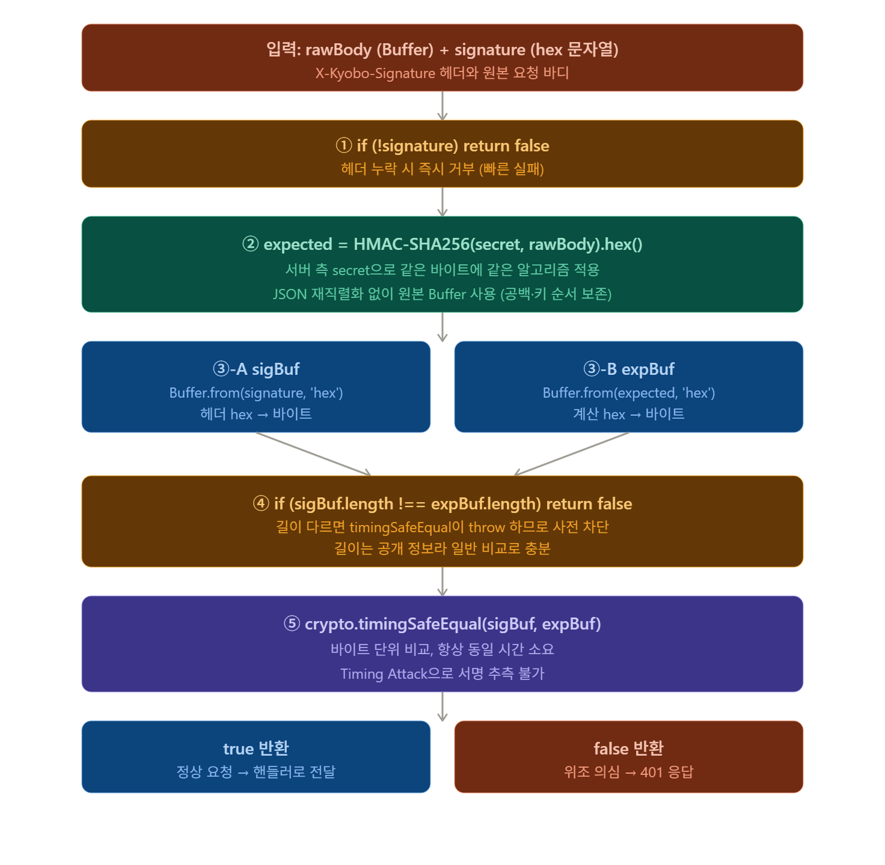

# M2 S6 — Webhook 보안 검증과 QueueService 구현

> **[Phase 1 — 현재 구현]** 이 모듈은 VASP(월렛원) 위탁 아키텍처를 기반으로 합니다.

> Block A — DMZ 이벤트 파이프라인 · Day 02 · 강의 25분 + 실습 30분  
> 대상: `dmz/packages/event-engine/src/webhook/WebhookServer.ts`

---

# 이 세션이 답하는 질문

```
Q1. Webhook 서명 검증을 왜 === 로 비교하면 안 되는가?
    → 응답 시간이 달라진다. 첫 번째 다른 바이트에서 즉시 false를 반환하므로
      공격자가 시도를 반복하면서 응답 시간으로 올바른 서명을 추측할 수 있다.
      timingSafeEqual은 길이가 같으면 항상 동일한 시간에 비교한다.

Q2. rawBody를 JSON.parse 후 JSON.stringify로 재직렬화해서 서명 계산하면 안 되는가?
    → 키 순서가 바뀌거나 공백이 달라질 수 있다.
    → JSON.stringify({ b: 1, a: 2 }) → '{"b":1,"a":2}'
       발신자의 원본 JSON이 '{"a":2,"b":1}'이었다면 서명이 달라진다.
    → 반드시 원본 Buffer(rawBody)로 계산해야 한다.

Q3. timingSafeEqual이 throw하는 경우는 언제인가?
    → 두 Buffer의 길이가 다를 때 throw한다. TypeError: Input buffers must have the same byte length.
    → 길이 비교를 먼저 해야 한다. (길이 자체는 timing safe하지 않아도 무방 — 헤더에 공개된 정보)
```

---

# 전체 흐름에서의 위치

```
[교보 앱 서버]                ← 사용자 활동 달성 이벤트 발신
   │  POST /webhook
   │  X-Kyobo-Signature: <hmac-sha256-hex>
   │  Body: { eventType: "ACTIVITY_ACHIEVED", data: {...}, requestId: "..." }
   ▼
[WebhookServer._handleRequest()]  ← DMZ 경계. 서명 검증 후 큐 적재.
   │
   ├── _readBody()             ← rawBody Buffer 수집
   │       │
   │       ▼
   ├── _verifySignature()      ← S6 구현 핵심 (1)
   │   HMAC-SHA256(rawBody, secret)
   │   timingSafeEqual(expected, received)
   │       │
   │       ├── false → 401 반환
   │       └── true  → 계속
   │
   ├── 202 즉시 응답
   │
   └── handler() 비동기 실행
           │
           ▼
[RedisStreamPublisher.publish()]  ← S6 구현 핵심 (2)
   XADD kyobo:events * {...fields}
   → messageId 반환
```

---

# 1부 — HMAC-SHA256 서명 검증 원리 (25분)

## 0. 왜 이 세션이 필요한가 — 금융 시스템의 Webhook 보안 요구 (5분)

### 0-1. Webhook 인증 문제의 본질

S5에서 WebhookServer가 202를 반환하고 Queue에 적재하는 구조를 배웠다. 그런데 한 가지 질문이 남는다.

```
교보 앱 서버만 이 Webhook을 호출해야 한다.
그런데 공격자가 같은 엔드포인트로 HTTP POST를 보내면?

→ 서버는 합법적인 요청인지, 공격인지 어떻게 구분하는가?
```

HTTP 엔드포인트는 공개되어 있다. IP 필터링은 우회 가능하다. **암호학적 서명**이 유일한 신뢰 기반이다.

### 0-2. 전체 보안 위협 모델

```
위협 1: 위조 요청 (Forgery)
  공격자가 임의의 payload를 만들어 POST 전송
  → HMAC 없으면 서버가 처리 → 가짜 NFT 발행
  → HMAC 있으면: secret을 모르면 올바른 서명 계산 불가 → 401 ✅

위협 2: 재전송 공격 (Replay Attack)
  공격자가 합법적인 요청을 캡처해서 나중에 재전송
  → timestamp 유효 기간 체크 + requestId 중복 차단으로 방어 (S9에서 상세)

위협 3: 타이밍 공격 (Timing Attack)
  일반 문자열 비교로 서명 검증 시, 응답 시간으로 서명 추측 가능
  → timingSafeEqual로 항상 동일 시간에 비교 → 정보 누출 없음 ✅

위협 4: 본문 변조 (Tampering)
  중간자가 HTTP body를 바꿔서 전달
  → 서명은 원본 body로 계산됨 → body 바뀌면 서명 불일치 → 401 ✅
```

이 세션에서 구현하는 `_verifySignature`가 위협 1, 3, 4를 막는다.

### 0-3. HMAC vs 단순 해시 vs 비대칭 서명

```
┌────────────────────┬──────────────────────────────────┬─────────────────────┐
│ 방식               │ 특성                              │ Webhook에 적합?     │
├────────────────────┼──────────────────────────────────┼─────────────────────┤
│ 단순 해시 (SHA256) │ 키 없음 → 누구나 계산 가능        │ ❌ 위조 방지 불가   │
│ HMAC-SHA256        │ 대칭키(공유 secret)               │ ✅ 표준 Webhook 방식│
│ RSA/ECDSA          │ 비대칭키 (공개키/개인키)          │ 가능, 오버킬 경우多 │
└────────────────────┴──────────────────────────────────┴─────────────────────┘

왜 HMAC이 표준인가?
  - GitHub Webhooks: X-Hub-Signature-256 (HMAC-SHA256)
  - Stripe Webhooks: Stripe-Signature (HMAC-SHA256)
  - Slack Events: X-Slack-Signature (HMAC-SHA256)
  → 업계 표준. 검증 라이브러리와 레퍼런스가 풍부.
  → 비대칭 서명보다 성능 우수, 구현 단순.
```

### 0-4. 금융 시스템에서 추가로 고려해야 할 것

```
일반 Webhook 검증으로 충분하지 않은 이유:

1. Secret 로테이션 정책
   - Secret 유출 의심 시 즉시 교체 가능해야 함
   - 교체 과도기(rollover): 현재 키 + 이전 키 동시 검증 → 무중단 교체
   - 교보 프로젝트: 90일 주기 Secret 자동 교체 (AWS Secrets Manager)

2. Timestamp 검증
   - Replay Attack 방어: 요청의 timestamp가 현재 시각 ±5분 이내만 허용
   - 이 코드에는 없음 → S9 IdempotencyGuard가 requestId로 보완

3. TLS 전제
   - HMAC은 TLS(HTTPS) 위에서 동작해야 함
   - HTTP에서는 서명이 맞아도 네트워크 도청으로 replay 가능
   - 교보 프로젝트: 모든 Webhook 통신은 TLS 1.3 이상 필수
```

---



## (1) 이 코드가 뭐하는 코드인가

**한 줄 요약:** WebhookServer가 받은 요청이 **진짜 외부 시스템에서 보낸 것인지, 위조된 것인지** 판별하는 보안 검증 메서드.

**역할 위치:**
```
[외부 요청] → WebhookServer 수신 → _verifySignature() ← 지금 여기
                                        ↓
                         true → 핸들러 실행 (RedisStreamPublisher로)
                         false → 401 Unauthorized 응답
```

테스트 스크립트(앞에서 본 `crypto.createHmac(...).digest('hex')`)가 만든 서명을 **이 메서드가 검증**함. 송신과 수신은 거울처럼 대칭.

## (2) TS 문법 새로 등장한 것

### `private _verifySignature(rawBody: Buffer, signature: string): boolean`
- **반환 타입 `: boolean`** = 함수 끝에 명시. true/false만 리턴
- **`Buffer`** = Node.js 내장 타입, 바이트 배열을 다루는 객체
- **`private` + `_` prefix** = 내부 전용 메서드 표시 (외부에서 호출 못 함)

### `Buffer.from(signature, 'hex')`
- 두 번째 인자가 **인코딩 지정**
- `'hex'` = "이 문자열은 16진수다, 두 글자씩 묶어서 1바이트로 해석"
- 예: `'a3f2'` (4글자 hex) → `[0xa3, 0xf2]` (2바이트)
- 다른 인코딩: `'utf8'`, `'base64'`, `'binary'`

### `sigBuf.length !== expBuf.length`
- Buffer의 `.length`는 **바이트 수**
- 문자열 `.length`는 글자 수 (UTF-8에선 다를 수 있음)
- SHA-256 결과는 항상 32바이트 = hex 64글자

### `crypto.timingSafeEqual(a, b)`
- Node.js crypto 내장 함수
- 일반 `===`나 `Buffer.equals()`와 달리 **항상 동일 시간 소요**
- 길이가 다르면 throw → 그래서 사전에 길이 검사 필수

## (3) 라인별 흐름

### ① 헤더 존재 확인
```typescript
if (!signature) return false;
```
- 헤더 자체가 없으면 즉시 거부
- 빈 문자열, undefined, null 모두 falsy로 처리됨

### ② 서버 측에서 같은 계산 수행
```typescript
const expected = crypto
  .createHmac('sha256', this.config.secret)
  .update(rawBody)
  .digest('hex');
```
- **테스트 스크립트와 완전히 같은 코드** — 송수신이 거울 대칭
- 차이점: 외부는 자기 secret으로 계산해서 헤더에 넣음, 서버는 자기 secret으로 다시 계산해서 비교
- secret이 일치하면 같은 입력에 같은 출력 → 서명 일치
- secret이 다르면 결과가 완전히 다름 → 서명 불일치

### ③ hex 문자열을 바이트로 변환
```typescript
const sigBuf = Buffer.from(signature, 'hex');
const expBuf = Buffer.from(expected,  'hex');
```
- `timingSafeEqual`은 Buffer만 받음 → 변환 필요
- 64글자 hex → 32바이트 Buffer

### ④ 길이 사전 검사
```typescript
if (sigBuf.length !== expBuf.length) return false;
```
- `timingSafeEqual`은 길이 다르면 **throw**
- 그러면 호출자가 try/catch로 감싸야 하는 번거로움
- 길이 자체는 공개 정보(SHA-256은 항상 32바이트)이므로 그냥 비교해도 안전

### ⑤ 타이밍 안전 비교
```typescript
return crypto.timingSafeEqual(sigBuf, expBuf);
```
- 일반 비교는 **첫 다른 바이트에서 즉시 종료** → 시간 누설
- 이 함수는 **모든 바이트를 끝까지 비교** → 시간 누설 없음
- 결과는 boolean

## (4) 핵심 설계 포인트 3가지

### 포인트 ①: rawBody Buffer로 계산 (JSON 재직렬화 함정)

**잘못된 방식 (재직렬화):**
```typescript
const body = JSON.parse(rawBody.toString());  // 객체로
const reSerialized = JSON.stringify(body);    // 다시 문자열로
const hmac = createHmac('sha256', secret).update(reSerialized).digest('hex');
// → 이러면 서명 절대 일치 안 함
```

**왜 안 되는가:**
- 외부가 보낸 원본: `{"a":1, "b":2}` (공백 포함, 키 순서 그대로)
- JSON.parse → JSON.stringify: `{"a":1,"b":2}` (공백 제거, 키 순서 변경 가능)
- **한 바이트만 달라도 HMAC 결과가 완전히 달라짐**

**올바른 방식 (이 코드):**
```typescript
.update(rawBody)  // Buffer 그대로
```
- 외부가 보낸 원본 바이트 그대로 사용
- 공백, 키 순서, 들여쓰기까지 동일하게 해시

### 포인트 ②: 길이 검사로 throw 회피

```typescript
if (sigBuf.length !== expBuf.length) return false;
```

- `timingSafeEqual`의 throw 조건을 사전 차단
- "길이 정보 누설" 우려할 수 있지만 SHA-256 길이는 **고정 32바이트**
- 즉 길이 비교는 정보 가치 없음 → 일반 비교로 충분

### 포인트 ③: timingSafeEqual로 Timing Attack 방지

**Timing Attack이란:**
- 일반 비교(`===`)는 첫 번째 다른 바이트에서 멈춤
- "비교 시간"으로 어디까지 일치했는지 추측 가능
- 공격자가 한 바이트씩 맞춰가며 서명 추측 시도

**예시 (이론적):**
```
공격자가 'a000...000' 보냄 → 1ns 만에 거부 (첫 바이트부터 다름)
공격자가 'b000...000' 보냄 → 2ns (첫 바이트 일치, 두 번째에서 다름)
→ "첫 바이트는 b가 맞다" 추론
```

**`timingSafeEqual` 방어:**
- 항상 모든 바이트를 끝까지 비교
- 시간으로 추측 불가

**현실적 위협도:**
- 네트워크 지연 변동이 ns 단위 차이를 가림
- 그래도 보안 표준은 **항상 timingSafeEqual 권장**

---

## 5. 송신과 수신 대칭 구조

| | 송신 (외부 클라이언트) | 수신 (이 코드) |
|---|---|---|
| 입력 | payload 객체 | rawBody Buffer |
| 직렬화 | `JSON.stringify(obj)` | (이미 직렬화된 상태) |
| 바이트화 | `Buffer.from(json)` | (이미 Buffer) |
| HMAC 알고리즘 | SHA-256 | SHA-256 |
| Secret | `'dev-secret-kyobo'` | `this.config.secret` |
| 출력 | hex 문자열 → 헤더 | hex 문자열 → 비교 |

**송신과 수신이 같은 secret + 같은 알고리즘이면 결과 일치 → 정당한 요청**  
**다르면 불일치 → 위조**

---

## 6. 보안 체크리스트

| 항목 | 처리 여부 | 이 코드의 방식 |
|------|----------|---------------|
| 헤더 누락 | ✅ | 즉시 false |
| JSON 재직렬화 함정 | ✅ | rawBody Buffer 사용 |
| 길이 불일치 throw | ✅ | 사전 검사 |
| Timing Attack | ✅ | timingSafeEqual |
| Replay Attack | ❌ | 별도 처리 (timestamp + requestId) |
| Secret 유출 | ❌ | 환경변수/Vault로 분리 필요 |

---

## 7. 강의 강조 포인트

- **rawBody는 절대 JSON.parse 후 다시 stringify 하면 안 됨** — 가장 흔한 함정
- **secret은 평문 코드에 박지 마라** — `process.env.WEBHOOK_SECRET` 또는 Vault
- **timingSafeEqual은 길이 다르면 throw** — 사전 길이 검사 필수 패턴
- **Buffer.from(string, 'hex')** — hex 문자열을 바이트로 정확히 복원하는 표준 방식
- **송수신은 거울 대칭** — 같은 알고리즘, 같은 secret, 같은 입력 → 같은 출력
- **HMAC 검증만으론 부족** — Replay Attack 방어를 위해 timestamp 검증 + requestId 중복 차단 필요
- **금융권 시각** — secret 로테이션 정책(예: 90일마다 교체) + 이중 검증(현재 키 + 직전 키 동시 허용 기간) 권장
- **`private _xxx` 패턴** — 클래스 내부 전용 메서드 명명 컨벤션

## 1-1. HMAC이란?

**HMAC (Hash-based Message Authentication Code)**  
= "이 메시지가 우리가 공유한 시크릿을 가진 발신자에게서 왔음을 증명"

```
발신자 (교보 앱 서버):
  secret = "kyobo-webhook-secret-2024"
  payload = '{"eventType":"ACTIVITY_ACHIEVED","data":{"userId":"u-001","activityId":"steps-10k"},...}'
  
  signature = HMAC-SHA256(secret, payload)
  → "a3f4b2c1d8e9f0..." (64자 hex)
  
  HTTP 요청:
    X-Kyobo-Signature: a3f4b2c1d8e9f0...
    Body: {"eventType":"ACTIVITY_ACHIEVED","data":...}

수신자 (우리):
  rawBody = 수신한 Body bytes
  expected = HMAC-SHA256(secret, rawBody)
  
  timingSafeEqual(received_hex, expected_hex)
  → 같으면: 발신자가 시크릿을 알고 있음 + 본문 미변조 ✅
  → 다르면: 위조된 요청 ❌
```

## 1-2. Timing Attack이란?

```
❌ 일반 비교:
function verify(received: string, expected: string): boolean {
  return received === expected;
  //                   ↑
  // 내부 구현: 첫 번째 다른 문자에서 즉시 false 반환
}

공격자의 전략:
  시도 1: "0000...0000" → 응답 시간 0.1ms  (첫 바이트부터 틀림)
  시도 2: "a000...0000" → 응답 시간 0.2ms  (두 번째 바이트에서 틀림)
  시도 3: "a300...0000" → 응답 시간 0.3ms  (세 번째 바이트에서 틀림)
  ...
  → 응답 시간 패턴으로 서명을 한 자리씩 추측 가능 (Timing Attack)

✅ timingSafeEqual:
  두 Buffer의 모든 바이트를 항상 비교
  → 첫 바이트가 다르든 마지막 바이트가 다르든 동일한 시간 소요
  → 응답 시간으로 서명 추측 불가
```

## 1-3. timingSafeEqual 길이 불일치 예외

```typescript
// ❌ 길이 체크 없이 바로 비교
const sigBuf = Buffer.from(signature, 'hex');  // 공격자가 짧은 서명 전송 가능
const expBuf = Buffer.from(expected,  'hex');
crypto.timingSafeEqual(sigBuf, expBuf);
// → TypeError: Input buffers must have the same byte length ← throw!

// ✅ 길이 체크 후 비교
if (sigBuf.length !== expBuf.length) return false;  // 사전 차단
return crypto.timingSafeEqual(sigBuf, expBuf);

// 왜 length 비교 자체는 timing safe 불필요한가?
// → signature 헤더의 length는 요청을 보내는 쪽이 이미 알고 있음 (공개 정보)
// → length 비교 자체로는 시크릿이 누출되지 않음
```

## 1-4. rawBody Buffer로 서명 계산

```typescript
// ❌ JSON 재직렬화 후 계산
const body   = JSON.parse(rawBody.toString());     // 파싱
const reJson = JSON.stringify(body);               // 재직렬화
const hmac   = crypto.createHmac('sha256', secret)
                     .update(reJson)               // 재직렬화 문자열로 계산
                     .digest('hex');
// 문제: 키 순서·공백·개행이 달라져 발신자 서명과 불일치 가능

// ✅ 원본 Buffer 그대로 계산
const hmac = crypto.createHmac('sha256', secret)
                   .update(rawBody)                // 원본 Buffer 그대로
                   .digest('hex');
// 이유: 발신자가 이 bytes 그대로 서명했으므로 동일한 결과 보장
```

---

# 2부 — _verifySignature() 완성본 해부

## WebhookServer.ts 전체 구조 복습

```typescript
export class WebhookServer {
  constructor(private readonly config: {
    port:      number;
    secret:    string;    // ← HMAC 시크릿 (환경변수 주입)
    maxBodyKb: number;
  }) { ... }

  // 핸들러 등록
  on(eventType: string, handler: WebhookHandler): this { ... }

  // 요청 처리 흐름
  private async _handleRequest(req, res): Promise<void> {
    const rawBody   = await this._readBody(req);
    const signature = req.headers['x-kyobo-signature'] as string ?? '';

    if (!this._verifySignature(rawBody, signature)) {
      res.writeHead(401).end('invalid signature');
      return;
    }

    const payload = JSON.parse(rawBody.toString('utf8'));
    res.writeHead(202).end();

    const handlers = this.handlers.get(payload.eventType) ?? [];
    await Promise.allSettled(handlers.map(h => h(payload)));
  }

  // ← S6 구현 핵심
  private _verifySignature(rawBody: Buffer, signature: string): boolean { ... }
}
```

## _verifySignature() 완성본

```typescript
/**
 * HMAC-SHA256 서명 검증.
 *
 * @param rawBody  - 수신한 원본 바이트 (Buffer). JSON.parse 전 원본.
 * @param signature - X-Kyobo-Signature 헤더 값 (hex string).
 *
 * 설계 포인트:
 *   1. rawBody Buffer로 HMAC 계산 — JSON 재직렬화 함정 회피
 *   2. 길이 불일치 사전 차단 — timingSafeEqual throw 방지
 *   3. timingSafeEqual — Timing Attack 방지
 */
private _verifySignature(rawBody: Buffer, signature: string): boolean {
  // 서명 헤더 없음 → 즉시 false
  if (!signature) return false;

  // Step 1: rawBody Buffer로 HMAC-SHA256 계산
  const expected = crypto
    .createHmac('sha256', this.config.secret)
    .update(rawBody)          // ← string이 아닌 Buffer
    .digest('hex');           // ← hex string 반환

  // Step 2: hex → Buffer 변환 (byte-level 비교를 위해)
  const sigBuf = Buffer.from(signature, 'hex');
  const expBuf = Buffer.from(expected,  'hex');

  // Step 3: 길이 불일치 → timingSafeEqual이 throw하므로 사전 차단
  // (signature 헤더 길이는 공개 정보 — 이 비교는 timing safe 불필요)
  if (sigBuf.length !== expBuf.length) return false;

  // Step 4: 항상 동일 시간에 비교 — Timing Attack 방지
  return crypto.timingSafeEqual(sigBuf, expBuf);
}
```

**각 단계가 막는 공격:**

```
Step 1: rawBody Buffer 사용
        → JSON 재직렬화 불일치 방지

Step 3: 길이 사전 체크
        → timingSafeEqual TypeError 방지
        → 짧은 prefix-match 공격 방지 (길이 다르면 즉시 false)

Step 4: timingSafeEqual
        → Timing Attack 방지
```

---

# 실습 (40분)

실습 파일: `exercises/S06_hmac_webhook.ts` / 답안: `S06_hmac_webhook.answer.ts`

```bash
# dmz/packages/event-engine 폴더에서
npx ts-node src/exercises/S06_hmac_webhook.ts
```

## Step 1: _verifySignature() 직접 구현 (15분)

### 스켈레톤

```typescript
// WebhookServer.ts — _verifySignature 스켈레톤 (실습용)
private _verifySignature(rawBody: Buffer, signature: string): boolean {
  // TODO 1: signature가 없으면 즉시 false 반환

  // TODO 2: crypto.createHmac으로 expected 계산
  //         - algorithm: 'sha256'
  //         - key: this.config.secret
  //         - data: rawBody (Buffer 그대로)
  //         - 결과: hex string

  // TODO 3: signature, expected를 각각 Buffer.from(?, 'hex') 로 변환

  // TODO 4: 길이가 다르면 false 반환

  // TODO 5: crypto.timingSafeEqual로 비교 결과 반환

  return false; // placeholder
}
```

### 답안

```typescript
private _verifySignature(rawBody: Buffer, signature: string): boolean {
  // TODO 1 답안
  if (!signature) return false;

  // TODO 2 답안
  const expected = crypto
    .createHmac('sha256', this.config.secret)
    .update(rawBody)
    .digest('hex');

  // TODO 3 답안
  const sigBuf = Buffer.from(signature, 'hex');
  const expBuf = Buffer.from(expected,  'hex');

  // TODO 4 답안
  if (sigBuf.length !== expBuf.length) return false;

  // TODO 5 답안
  return crypto.timingSafeEqual(sigBuf, expBuf);
}
```

---

## Step 2: 서명 검증 테스트 (15분)

### 테스트 서버 기동

```typescript
// test-webhook-server.ts (실습 테스트 파일)
import { WebhookServer } from './webhook/WebhookServer';

const SECRET = 'kyobo-test-secret-2024';

const server = new WebhookServer({
  port:      3002,
  secret:    SECRET,
  maxBodyKb: 64,
});

server.on('ACTIVITY_ACHIEVED', async (payload) => {
  console.log('[received] ACTIVITY_ACHIEVED:', payload.requestId);
});

await server.listen();
console.log('Test WebhookServer ready on :3002');
console.log('SECRET:', SECRET);
```

### 테스트 시나리오 1: 서명 없는 요청 → 401

```bash
curl -s -o /dev/null -w "%{http_code}\n" \
  -X POST http://localhost:3002 \
  -H "Content-Type: application/json" \
  -d '{"eventType":"ACTIVITY_ACHIEVED","data":{"userId":"u-001","activityId":"steps-10k"},"timestamp":1714000000,"requestId":"test-no-sig"}'

# 예상: 401
```

### 테스트 시나리오 2: 잘못된 서명 → 401

```bash
curl -s -o /dev/null -w "%{http_code}\n" \
  -X POST http://localhost:3002 \
  -H "Content-Type: application/json" \
  -H "X-Kyobo-Signature: 0000000000000000000000000000000000000000000000000000000000000000" \
  -d '{"eventType":"ACTIVITY_ACHIEVED","data":{"userId":"u-001","activityId":"steps-10k"},"timestamp":1714000000,"requestId":"test-bad-sig"}'

# 예상: 401
```

### 테스트 시나리오 3: 올바른 서명 → 202

**서명 생성 (Node.js):**

```javascript
// generate-sig.js
const crypto  = require('crypto');
const payload = JSON.stringify({
  eventType: 'ACTIVITY_ACHIEVED',
  data:      { userId: 'u-001', activityId: 'steps-10k' },
  timestamp: 1714000000,
  requestId: 'test-correct-sig',
});

const sig = crypto
  .createHmac('sha256', 'kyobo-test-secret-2024')
  .update(Buffer.from(payload))   // ← Buffer.from() 필수 (rawBody 시뮬레이션)
  .digest('hex');

console.log('PAYLOAD:', payload);
console.log('SIG:    ', sig);
```

```bash
node generate-sig.js
# PAYLOAD: {"eventType":"ACTIVITY_ACHIEVED","data":{"userId":"u-001","activityId":"steps-10k"},"timestamp":1714000000,"requestId":"test-correct-sig"}
# SIG:     a3f4b2c1...  (실제 출력된 hex)
```

**curl 전송:**

```bash
PAYLOAD='{"eventType":"ACTIVITY_ACHIEVED","data":{"userId":"u-001","activityId":"steps-10k"},"timestamp":1714000000,"requestId":"test-correct-sig"}'
SIG=$(node -e "
  const crypto = require('crypto');
  const sig = crypto.createHmac('sha256','kyobo-test-secret-2024')
    .update(Buffer.from('$PAYLOAD'))
    .digest('hex');
  console.log(sig);
")

curl -s -o /dev/null -w "%{http_code}\n" \
  -X POST http://localhost:3002 \
  -H "Content-Type: application/json" \
  -H "X-Kyobo-Signature: $SIG" \
  -d "$PAYLOAD"

# 예상: 202
```

### 테스트 시나리오 4: JSON 재직렬화 함정 확인

```javascript
// JSON 재직렬화 함정 시뮬레이션
const original = '{"b":2,"a":1}';   // 발신자 원본 (키 순서: b, a)

// 발신자 서명
const originalSig = crypto
  .createHmac('sha256', SECRET)
  .update(Buffer.from(original))
  .digest('hex');

// 수신자가 재직렬화해서 검증하면?
const parsed     = JSON.parse(original);      // { b: 2, a: 1 }
const reserialized = JSON.stringify(parsed);  // '{"b":2,"a":1}' ← 같을 수도
                                               // (V8은 삽입 순서 보존하지만 보장 안 됨)

// 실제로 문제되는 경우:
// 발신자: Python dict (키 순서 보장 안 됨)
//   '{"a":1,"b":2}' 로 직렬화 → 서명
// 수신자: JS JSON.stringify
//   '{"b":2,"a":1}' 로 재직렬화 → 서명 불일치 ❌

// 결론: rawBody Buffer 그대로 서명 계산만이 100% 안전
```

---

# 전체 연결: S5 → S6 통합 흐름

## 완성된 파이프라인 코드

```typescript
// 서비스 초기화 (main.ts)
import { WebhookServer }          from './webhook/WebhookServer';
import { WebhookPublishHandler }  from './webhook/WebhookPublishHandler';
import { IdempotencyGuard, InMemoryIdempotencyStore } from './webhook/IdempotencyGuard';
import { RedisStreamPublisher }   from './dmz/RedisStreamPublisher';

const redis = createRedisClient();  // ioredis 등

const publisher = new RedisStreamPublisher(redis);
await publisher.initialize();       // XGROUP CREATE (BUSYGROUP 무시)

const idempotency = new IdempotencyGuard(new InMemoryIdempotencyStore());
// 운영 환경에서는 new RedisIdempotencyStore(redis) 사용

const server = new WebhookServer({
  port:      3000,
  secret:    process.env.WEBHOOK_SECRET!,
  maxBodyKb: 64,
});

// WebhookPublishHandler: 멱등성 확인 → Stream 적재
const handler = new WebhookPublishHandler(publisher, idempotency);
server.on('NFT_ISSUED', handler.createHandler());
// ↑ createHandler()가 반환한 함수가 payload를 받아 idempotency.run() → publisher.publish()

await server.listen();
console.log('[app] DMZ event pipeline ready');
```

**WebhookPublishHandler 역할:**
- `IdempotencyGuard.run(requestId)` → 동일 requestId 두 번 → Stream에 1건만 적재
- `RedisStreamPublisher.publish()` → XADD
- 인라인 람다 대신 클래스로 분리 → 단위 테스트 가능

## S5~S6 완성 흐름 도식

```
[교보 앱 서버 / VASP]        ← NFT 발행 이벤트 → WebhookServer를 호출
   │  POST /webhook
   │  X-Kyobo-Signature: <hmac-sha256>
   │  Body: { eventType: "NFT_ISSUED", requestId: "...", ... }
   ▼
[WebhookServer._readBody()]          ← rawBody Buffer 수집 (S5)
   ↓ Buffer
[WebhookServer._verifySignature()]   ← HMAC + timingSafeEqual (S6 구현)
   │  false → 401
   │  true  → 계속
   ↓
[res.writeHead(202).end()]           ← 즉시 응답 (S5 패턴)
   ↓
[WebhookPublishHandler.createHandler()(payload)]   ← 비동기 실행
   ↓
[IdempotencyGuard.run(requestId)]    ← 중복 requestId → 스킵
   ↓ 신규 이벤트만
[RedisStreamPublisher.publish()]     ← XADD (S7 구현)
   ↓ messageId
[Redis Streams: kyobo:events]        ← append-only 로그 (S7/S8)
   ↓
[ConsumerGroupWorker]                ← XREADGROUP + XACK (S10)
   ↓
[NFTIssuedProcessor]                 ← 멱등성 재확인 → 원장 업데이트 (S12)
   ↓
[LedgerService.creditNFT()]          ← DB 트랜잭션 → XACK
```

---

# 완료 기준 체크리스트

```
[ ] _verifySignature() 를 TODO → 답안으로 직접 구현했다
[ ] curl로 3가지 시나리오를 테스트했다:
    [ ] 서명 없음 → 401
    [ ] 잘못된 서명 → 401
    [ ] 올바른 서명 → 202
[ ] rawBody Buffer로 서명 계산해야 하는 이유를 설명할 수 있다
[ ] timingSafeEqual이 throw하는 경우와 사전 차단 방법을 설명할 수 있다
[ ] WebhookPublishHandler가 왜 인라인 람다 대신 클래스로 분리되는지 설명할 수 있다
[ ] S5~S6 전체 파이프라인을 코드 레벨에서 설명할 수 있다
```

---

# 핵심 정리

| 개념 | 구현 | 핵심 이유 |
|------|------|-----------|
| HMAC-SHA256 | `crypto.createHmac('sha256', secret).update(rawBody).digest('hex')` | 위변조 이벤트 거부 |
| rawBody Buffer | `.update(rawBody)` not `.update(JSON.stringify(parsed))` | JSON 재직렬화 불일치 방지 |
| timingSafeEqual | `crypto.timingSafeEqual(sigBuf, expBuf)` | Timing Attack 방지 |
| 길이 사전 체크 | `if (sigBuf.length !== expBuf.length) return false` | timingSafeEqual throw 방지 |

---

# Block A 전체 복습 (S5~S6)

```
S5: 202 패턴
    Webhook 수신 즉시 202 반환
    처리는 Queue를 통해 비동기
    → 발신자 timeout 방지 / 이벤트 내구성 확보

S6: Webhook 보안 (이 세션)
    _verifySignature: HMAC + timingSafeEqual
    curl 테스트: 401/401/202 확인
    → WebhookServer 완결

S7: Redis Streams 이론
    Pub/Sub vs Queue vs Streams
    Entry ID = timestamp-seq
    Consumer Group + PEL
    XREADGROUP(>) → PEL 등록 → XACK → PEL 제거

S8: Redis Streams CLI 실습
    XADD / XGROUP CREATE / XREADGROUP / XACK / XPENDING / XAUTOCLAIM
    PEL 직접 눈으로 확인
    Consumer 2개 분배 시뮬레이션

S9: At-least-once 설계 원리
    XACK 순서 불변 규칙, Exactly-once 불가 이유

S10: ConsumerGroupWorker 코드 상세
    start() / _processNew() / _reclaimPending() / _handleWithRetry()
```

---

# 예상 Q&A

**Q1. 서명 시크릿이 환경변수로 노출되면 어떻게 되는가?**

A: 서명 검증이 무의미해진다.  
공격자가 시크릿을 알면 임의의 payload에 대한 올바른 서명을 생성할 수 있다.  
따라서:  
- 시크릿은 절대 코드에 하드코딩 금지 → 환경변수 또는 Secret Manager 사용  
- 정기적으로 시크릿 로테이션 (30~90일)  
- 시크릿 노출 의심 시 즉시 로테이션 + 로그 분석  
교보 프로젝트에서는 AWS Secrets Manager 또는 Vault를 사용한다.

**Q2. publish()가 throw하면 어떻게 되는가? 이벤트가 유실되는가?**

A: 현재 구현에서는 handler() 내에서 throw가 나면  
`Promise.allSettled`의 `rejected` 결과로 잡혀 로그가 기록된다.  
202는 이미 전송됐으므로 발신자는 "성공"으로 인식한다.  
즉, 이 경우 이벤트가 유실된다.  
이를 방지하기 위해:  
1. Redis를 HA 구성으로 단일 장애 제거  
2. publish 실패 시 인메모리 재시도 큐에 넣는 폴백  
3. ConsumerGroupWorker의 재처리 메커니즘이 이미 있으므로, Redis가 복구되면 놓친 이벤트를 Chain 재스캔으로 보완 (ChainEventListener의 _recoverMissedEvents)

**Q3. Content-Type이 application/json이 아닌 요청이 오면?**

A: 현재 WebhookServer는 Content-Type을 검증하지 않는다.  
`_readBody`는 모든 HTTP body를 rawBuffer로 수집한다.  
서명 검증 통과 후 `JSON.parse(rawBody.toString('utf8'))`에서 파싱 오류가 나면  
`catch (err)` 블록에서 잡혀 400이 반환된다.  
Content-Type 헤더 검증을 추가하면 더 명확한 400 응답을 줄 수 있다:  
```typescript
if (req.headers['content-type'] !== 'application/json') {
  res.writeHead(415).end('Unsupported Media Type');
  return;
}
```
