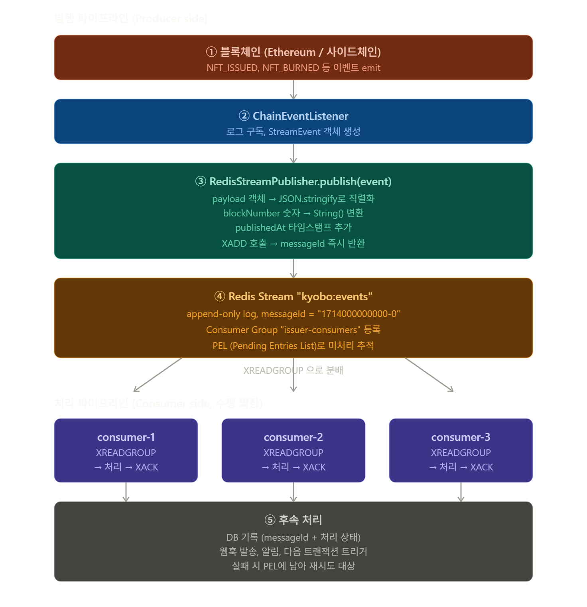

# M2 S7 — Redis Streams 내부 구조

> **[Phase 1 — 현재 구현]** 이 모듈은 VASP(월렛원) 위탁 아키텍처를 기반으로 합니다.

> Block A — DMZ 이벤트 파이프라인 · Day 02 · 강의 55분 (이론 전용)  
> 대상: `dmz/packages/event-engine/src/dmz/RedisStreamPublisher.ts`

---

# 왜 실습은 Redis Streams인가 — Kafka와의 관계

교보생명 실제 운영 환경은 **Kafka**다. 그런데 이 강의 실습은 Redis Streams로 진행한다.

**이유:**

| 항목 | Redis Streams | Kafka |
|---|---|---|
| 실습 환경 세팅 | `docker-compose up redis` 한 줄 | ZooKeeper/KRaft + Broker 별도 설치 |
| 핵심 개념 | Consumer Group, At-least-once, PEL, ACK | 동일 (Consumer Group, offset commit) |
| 처리량 | 수만 msg/초 (강의 실습 충분) | 수백만 msg/초 (운영 필요) |
| 메시지 보존 | 메모리 기반, TTL | 디스크, 무제한 보존 |
| 운영 복잡도 | 낮음 | 높음 |

**핵심: 개념이 동일하다.**

Redis Streams로 배운 Consumer Group, 멱등성, DLQ, 재처리 패턴은 Kafka에 그대로 적용된다.

| Redis Streams | Kafka |
|---|---|
| `XACK` | `commitOffset` |
| `PEL` | `__consumer_offsets` |
| `XREADGROUP` | `poll()` |
| `XADD` | `produce()` |

**운영 전환 시:** `RedisStreamPublisher`와 `ConsumerGroupWorker`만 Kafka 구현체로 교체하면 된다. 비즈니스 로직은 건드리지 않는다.

---

# 이 세션이 답하는 질문

```
Q1. Pub/Sub이 있는데 왜 Streams인가?
    → Pub/Sub은 구독자가 없으면 메시지가 사라진다. 내구성 없음.
    → Streams는 append-only 로그. 구독자가 없어도 데이터가 남는다.
    → Redis Streams는 Kafka의 Consumer Group 개념을 Redis에서 구현한 것이다.

Q2. At-least-once란 정확히 무슨 뜻인가?
    → "최소 한 번은 반드시 처리된다"는 보장.
    → 네트워크 장애나 Consumer crash 후 재시작해도 메시지가 재전달된다.
    → 단, 두 번 처리될 수도 있다(at-least, not exactly-once). 멱등성 필수.

Q3. PEL이란 무엇이고, XACK는 왜 필수인가?
    → PEL(Pending Entry List) = "읽었지만 아직 처리 완료 확인 안 된 메시지 목록"
    → XREADGROUP으로 읽으면 자동으로 PEL에 등록된다.
    → XACK를 보내야 PEL에서 제거된다 = "처리 완료" 선언.
    → XACK 없이 Consumer가 crash → PEL에 남음 → 재시작 후 재수신.
```

---

# 전체 흐름에서의 위치

```
[WebhookServer]                          ← S5 완료
  202 즉시 응답
  handler 비동기 실행
          │ WebhookPayload
          ▼
[RedisStreamPublisher]                   ← S7 이론 핵심
  publish() → XADD → Redis Streams
          │ messageId: "1714000000000-0"
          ▼
[Redis Streams: kyobo:events]            ← S7 내부 구조 학습 대상
  append-only log
  Consumer Group: issuer-consumers
  PEL (Pending Entry List)
          │
          ▼
[ConsumerGroupWorker]                    ← S7 실습 대상
  XREADGROUP → PEL 등록
  처리 성공 → XACK → PEL 제거
  장애 후 → XAUTOCLAIM → 재수신
```



# RedisStreamPublisher 코드 분석

## 1. 이 코드가 뭐하는 코드인가

**한 줄 요약:** 블록체인에서 감지한 NFT 이벤트를 **Redis Streams 큐에 발행**해서, 무거운 후속 처리(DB 기록·웹훅·알림)를 별도 워커가 비동기로 받아 처리하게 만드는 **메시지 브로커 발행자**.

**왜 필요한가 (202 패턴):**
- 체인 이벤트 처리가 느리면 → 다음 블록 구독이 밀림 → 이벤트 누락
- 그래서 "받았다(202 Accepted)"만 즉시 응답하고 → 큐에 던지고 → 워커가 처리
- 체인 구독은 항상 빠르게 흐름 유지

**전체 파이프라인 위치:**
```
ChainEventListener → RedisStreamPublisher → Redis Streams → ConsumerGroupWorker
       (감지)            (이 파일)            (큐)            (실제 처리)
```

---

## 2. TS 문법 새로 등장한 것

### `export interface StreamEvent { ... }`
- **`interface`** = 객체의 타입 형태(shape) 정의
- 클래스와 달리 **런타임에 존재 안 함** — 컴파일 타임에 타입 체크만 하고 사라짐
- `export` 붙으면 다른 파일에서 import 가능

### `Record<string, unknown>`
- **`Record<K, V>`** = "키는 K 타입, 값은 V 타입인 객체"의 단축 표현
- `Record<string, unknown>` = "문자열 키에 무슨 값이든 들어가는 객체"
- `{ [key: string]: unknown }`과 같은 의미
- **`unknown`** = `any`보다 안전한 "뭔지 모름" 타입 (사용 전 타입 좁히기 강제)

### `Promise<string>`, `Promise<void>`, `Promise<boolean>`
- **`Promise<T>`** = "나중에 T 타입 값을 내놓는 비동기 작업"
- `<string>` = 결과로 문자열 줌
- `<void>` = 결과 없음 (성공/실패만 의미)
- 제네릭 `<>`는 "타입 매개변수" — 함수의 인자처럼 타입에도 인자가 있음

### `private readonly redis: RedisStreamClient`
- **`private`** = 클래스 외부에서 접근 불가
- **`readonly`** = 한 번 할당 후 변경 불가 (const의 클래스 필드 버전)
- **생성자 매개변수에 직접 쓰면** = 자동으로 필드로 등록됨 (TS 단축 문법)

```typescript
// 단축형 (TS 전용)
constructor(private readonly redis: RedisStreamClient) {}

// 풀어 쓰면
private readonly redis: RedisStreamClient;
constructor(redis: RedisStreamClient) {
  this.redis = redis;
}
```

### `groupName = 'issuer-consumers'`
- **매개변수 기본값** — 안 넘기면 자동으로 'issuer-consumers' 사용
- 호출: `initialize()` 또는 `initialize('my-group')` 둘 다 가능

### `event.streamKey ?? this.defaultStream`
- **`??`** = nullish coalescing 연산자
- 왼쪽이 `null` 또는 `undefined`면 오른쪽 사용
- `||`(OR)와 차이: `||`은 `0`, `''`, `false`도 falsy 취급. `??`는 오직 null/undefined만

### `catch (err: unknown)`
- 에러 객체 타입이 `unknown` (TS 4.4+ 기본값)
- 옛날엔 `any`였지만 안전하게 변경됨
- 사용 전에 타입 확인 필요 (`String(err)`로 강제 문자열화)

### `} catch { ... }`
- catch 블록에서 **에러 객체가 필요 없으면 괄호 생략 가능** (TS 4.0+)
- `ping()` 메서드의 catch가 이 형태

### `export { RedisStreamPublisher as QueueService }`
- **alias re-export** — 같은 클래스를 다른 이름으로도 내보냄
- 다른 파일에서 `import { QueueService }`로 가져오면 동일 클래스
- 커리큘럼 명칭과 실제 구현 명칭이 다를 때 호환성 유지

---

## 3. 핵심 메서드 라인별 흐름

### `initialize()` — 기동 시 1회
```typescript
async initialize(groupName = 'issuer-consumers'): Promise<void> {
  try {
    await this.redis.xgroupCreate(this.defaultStream, groupName, '$', true);
  } catch (err: unknown) {
    if (!String(err).includes('BUSYGROUP')) throw err;
  }
}
```
1. **`xgroupCreate`** 호출로 Consumer Group 생성 시도
   - `'$'` = "지금 이후 새 메시지부터" (과거 메시지 무시)
   - `mkstream: true` = 스트림 자체가 없으면 같이 만듦
2. 이미 그룹 있으면 Redis가 **`BUSYGROUP` 에러** 반환
3. 그 에러는 정상 상황이므로 무시, 다른 에러만 재throw

**왜 필요:** 서비스 첫 가동/재가동 모두에서 안전하게 호출 가능 (idempotent)

### `publish()` — 매 이벤트마다 호출
```typescript
const messageId = await this.redis.xadd(
  event.streamKey ?? this.defaultStream,
  {
    eventType:   event.eventType,
    payload:     JSON.stringify(event.payload),
    txHash:      event.txHash,
    blockNumber: String(event.blockNumber),
    requestId:   event.requestId,
    publishedAt: String(Date.now()),
  },
);
return messageId;
```
1. 스트림 키 결정 (이벤트별 지정 우선, 없으면 기본값)
2. 필드 객체 구성 — **모든 값을 string으로 변환** (Redis Streams 제약)
   - `payload` (객체) → `JSON.stringify`
   - `blockNumber` (숫자) → `String()`
   - `Date.now()` (숫자) → `String()`
3. `xadd` 호출 → Redis가 **자동 생성한 messageId** 반환
   - 형식: `"1714000000000-0"` (밀리초 타임스탬프 + 시퀀스)
4. messageId 리턴 → 호출자가 DB에 기록해 추적

### `ping()` — 헬스체크
```typescript
async ping(): Promise<boolean> {
  try {
    await this.redis.ping();
    return true;
  } catch {
    return false;
  }
}
```
- 단순히 Redis 연결 상태 확인
- 실패해도 throw 안 함 → boolean으로 반환 (헬스체크 엔드포인트용)

---

## 4. 핵심 개념 3가지

### 개념 ①: 202 패턴
- HTTP 202 Accepted = "요청은 받았지만 처리는 나중에"
- 이 코드의 publish는 Redis에 적재만 하고 즉시 리턴 → 200ms 안에 끝남
- 실제 처리는 별도 워커가 큐에서 꺼내 진행
- **체인 구독 절대 막히지 않게** 하는 게 목적

### 개념 ②: At-least-once 보장
- "최소 한 번은 처리됨" 보장 (중복 가능, 누락 불가)
- **메커니즘:**
  1. publish 시 messageId를 DB에 "pending"으로 기록
  2. 워커가 처리 후 XACK + DB를 "done"으로 갱신
  3. 워커 죽으면 PEL에 남음 → 재시작 후 자동 재전달
- **중복 처리는 requestId로 방지** (idempotency key)

### 개념 ③: Consumer Group으로 수평 확장
- 같은 그룹에 워커 여러 개 붙이면 **메시지가 자동 분배됨**
- 처리량 부족하면 워커 추가만 하면 됨 (코드 변경 0)
- 한 워커가 죽어도 나머지가 처리 + 죽은 워커 PEL은 다른 워커가 인수

---

## 5. Redis Streams 핵심 명령

| 명령 | 의미 | 이 코드에서의 역할 |
|------|------|---------------------|
| `XADD` | 스트림에 메시지 추가 | publish() — 이벤트 적재 |
| `XGROUP CREATE` | Consumer Group 생성 | initialize() — 기동 시 |
| `XREADGROUP` | 그룹으로 메시지 읽기 + 소유권 | 워커 쪽 (이 파일엔 없음) |
| `XACK` | 처리 완료 확인 | 워커 쪽 (이 파일엔 없음) |
| `XPENDING` | PEL 조회 | 모니터링용 |

---

## 6. 강의 강조 포인트

- **`interface`는 런타임에 사라짐** — 컴파일 후 JS엔 흔적 없음. 순수 타입 도구
- **`Record<string, unknown>`은 안전한 객체 타입** — `any`보다 무조건 우선
- **생성자 매개변수 단축 문법** — TS의 강력한 보일러플레이트 절약
- **`??` vs `||` 차이** — 0이나 빈 문자열을 유효값으로 다룰 때 반드시 `??`
- **`as` re-export** — 큰 코드베이스에서 명칭 변경/마이그레이션 시 호환성 유지 도구
- **모든 Redis Stream 필드는 문자열** — 숫자/객체는 반드시 변환. 잊으면 런타임 에러
- **idempotent initialize()** — 분산 환경에서 여러 노드가 동시에 호출해도 안전한 패턴
- **TODO 주석 + 실제 구현 병행** — 강의 자료에서 흔한 패턴. 수강생은 TODO를 직접 채워보고, 답안과 비교


## 이 세션의 구간

```
[RedisStreamPublisher] ──────────────► [Redis Streams 내부] ──────────► [Consumer]
          ↑                                    ↑                             ↑
     XADD 발행                         이 세션 핵심                    다음 세션 (S7)
```

---

# 1부 — Pub/Sub vs Queue vs Streams 비교 (10분)

## 1-1. 세 가지 메시징 패턴

### 패턴 1: Pub/Sub (Redis PUBLISH/SUBSCRIBE)

```
발행자               구독자A         구독자B
  │   PUBLISH "msg"    │               │
  ├──────────────────► │ (수신 ✅)     │
  └──────────────────────────────────► │ (수신 ✅)

[구독자가 오프라인인 경우]
  │   PUBLISH "msg"    X               │
  │                    (오프라인)      │
  └────────────────────────────────── ► │ (수신 ✅)
  
  → 오프라인 구독자는 메시지를 영구 유실 ❌
```

**특징:**
- Fire-and-forget: 발행 즉시 삭제
- 구독자가 없으면 메시지 소멸
- 금융 시스템에서 사용 불가 (이벤트 유실 = 회계 불일치)

---

### 패턴 2: 단순 List/Queue (LPUSH/RPOP)

```
발행자               Redis List          Consumer
  │   LPUSH "msg"      │                   │
  ├──────────────────► [msg3,msg2,msg1]    │
                                │          │
                             RPOP ──────── ► msg1 처리 중...
                                           │
                                           [crash!]
                                           
  → msg1은 List에서 이미 제거됨 → 유실 ❌
```

**특징:**
- Consumer가 pop하면 데이터 삭제
- 처리 중 crash → 재처리 불가
- 처리 완료 확인 메커니즘 없음

---

### 패턴 3: Redis Streams (XADD/XREADGROUP/XACK)

```
발행자               Redis Stream         Consumer Group
  │   XADD "msg"      │                   │
  ├──────────────────► [로그: msg 보존]   │
                                │          │
                         XREADGROUP ────── ► msg 처리 중 (PEL에 등록)
                                           │
                                           [crash!]
                                           
                       [재시작 후]
                         XAUTOCLAIM ────── ► msg 재수신 (PEL에 여전히 있음) ✅
```

**특징:**
- append-only log: 읽어도 삭제되지 않음
- Consumer Group + PEL로 처리 완료 추적
- Consumer crash 후 재시작 시 미처리 메시지 자동 재전달
- 수평 확장: Consumer N개가 같은 그룹으로 메시지 분담

---

### 패턴 4: Kafka (produce/poll/commitOffset) — 교보 운영 환경

```
발행자               Kafka Topic (Partition)    Consumer Group
  │   produce "msg"   │                          │
  ├──────────────────► [디스크 로그: 영구 보존]  │
                                │                 │
                          poll() ──────────────── ► msg 처리 중 (offset 미commit)
                                                  │
                                                  [crash!]

                       [재시작 후]
                          poll() ──────────────── ► msg 재수신 (offset 그대로) ✅
```

**특징:**
- 디스크 기반 영구 보존 — 메모리 제약 없음
- offset commit으로 처리 완료 추적 (Redis PEL과 동일 개념)
- 수백만 msg/초 처리량 — 대규모 운영 환경 적합
- Partition 단위 수평 확장 — Consumer Group이 Partition을 분담
- 운영 복잡도 높음 (KRaft 클러스터, 모니터링 필요)

**Redis Streams → Kafka 전환 시 변경 대상:**
- `RedisStreamPublisher` → Kafka Producer 구현체로 교체
- `ConsumerGroupWorker` → Kafka Consumer 구현체로 교체
- 비즈니스 로직(LedgerService, AuditLog 등)은 변경 없음

---

## 1-2. 세 패턴 비교표

| 특성 | Pub/Sub | List Queue | Redis Streams | **Kafka** |
|------|---------|------------|---------------|-----------|
| 메시지 내구성 | 없음 (실시간) | 처리 전까지 | 영구 보존 (MAXLEN 설정 가능) | **디스크 영구 보존** |
| 오프라인 수신 | 불가 | 가능 | 가능 | **가능** |
| 처리 확인 | 없음 | 없음 | XACK (PEL) | **offset commit** |
| Consumer 장애 복구 | 불가 | 불가 | XAUTOCLAIM | **재조인 후 재수신** |
| Consumer 수평 확장 | 모든 구독자 수신 | 1개만 pop | Consumer Group 분담 | **Consumer Group 분담** |
| 메시지 재처리 | 불가 | 불가 | PEL 재수신 | **offset 리셋** |
| 처리량 | 낮음 | 낮음 | 수만 msg/초 | **수백만 msg/초** |
| 운영 복잡도 | 낮음 | 낮음 | 낮음 | **높음** |
| 금융 시스템 적합성 | ❌ | △ | ✅ (강의 실습) | **✅ (교보 운영)** |

**결론: Redis Streams만이 At-least-once를 보장한다. 핵심 개념은 Kafka와 동일 — 운영 전환 시 구현체만 교체.**

---

# 2부 — Stream Entry 구조와 XADD (10분)

## 2-1. Stream Entry 구조

Redis Stream은 **append-only 로그**다. 각 항목은 "Entry"라고 부른다.

```
Stream: kyobo:events
─────────────────────────────────────────────────────────
Entry ID              Fields
─────────────────────────────────────────────────────────
1714000000000-0       eventType=NFT_ISSUED
                      payload={"tokenId":"42","owner":"0xABCD"}
                      txHash=0xdeadbeef...
                      blockNumber=18500000
                      requestId=req-001
                      publishedAt=1714000000000

1714000001000-0       eventType=NFT_BURNED
                      payload={"tokenId":"43"}
                      txHash=0xcafebabe...
                      blockNumber=18500001
                      requestId=req-002
                      publishedAt=1714000001000

1714000002000-0       eventType=NFT_ISSUED
                      ...
─────────────────────────────────────────────────────────
```

## 2-2. Entry ID 형식: `{timestamp}-{sequence}`

```
1714000000000-0
│             │
│             └── sequence: 같은 밀리초에 여러 항목이 추가될 때 순서 보장
│                           첫 번째 = 0, 두 번째 = 1, ...
└── unix timestamp (밀리초 단위)
    Python: int(time.time() * 1000)
    JS:     Date.now()
```

**특징:**
- Redis가 자동 생성 (`XADD stream * ...`에서 `*` = 자동)
- 시간 순 정렬 보장 (같은 밀리초 내에서도 sequence로 순서 보장)
- ID로 특정 시점 이후 메시지 조회 가능

## 2-3. XADD 명령어

```bash
# 기본 형식
XADD <stream-key> <id> <field1> <value1> [<field2> <value2> ...]

# id = * : Redis가 자동 생성
XADD kyobo:events * \
  eventType NFT_ISSUED \
  payload '{"tokenId":"42"}' \
  txHash 0xdeadbeef \
  blockNumber 18500000 \
  requestId req-001 \
  publishedAt 1714000000000

# 결과: "1714000000000-0"  ← 생성된 messageId 반환

# 크기 제한 (MAXLEN) — 스트림이 무한 증가하지 않도록
XADD kyobo:events MAXLEN ~ 10000 * \
  eventType NFT_ISSUED \
  ...
# ~ : approximate (정확히 10000이 아닐 수 있지만 성능상 유리)
```

## 2-4. RedisStreamPublisher.publish() 코드

```typescript
// RedisStreamPublisher.ts

export interface StreamEvent {
  streamKey:   string;               // "kyobo:events"
  eventType:   string;               // "NFT_ISSUED", "NFT_BURNED"
  payload:     Record<string, unknown>;
  txHash:      string;
  blockNumber: number;
  requestId:   string;               // Idempotency key
}

export interface RedisStreamClient {
  xadd(key: string, fields: Record<string, string>): Promise<string>;
  xgroupCreate(key: string, group: string, id: string, mkstream: boolean): Promise<void>;
  ping(): Promise<string>;
}

async publish(event: StreamEvent): Promise<string> {
  const messageId = await this.redis.xadd(
    event.streamKey ?? this.defaultStream,
    {
      eventType:   event.eventType,
      payload:     JSON.stringify(event.payload),   // ← 객체는 JSON 직렬화 필수
      txHash:      event.txHash,
      blockNumber: String(event.blockNumber),        // ← 숫자는 string으로 변환
      requestId:   event.requestId,
      publishedAt: String(Date.now()),
    },
  );
  return messageId;  // "1714000000000-0" — DB에 기록해 At-least-once 추적
}
```

**Redis Streams는 string-string map만 지원한다:**

```
❌ blockNumber: 18500000      (number — Redis 저장 불가)
✅ blockNumber: "18500000"    (string — 저장 가능)

❌ payload: { tokenId: "42" }  (object — Redis 저장 불가)
✅ payload: '{"tokenId":"42"}' (JSON string — 저장 가능)
```

---

# 3부 — Consumer Group과 PEL 내부 원리 (20분)

## 3-1. Consumer Group이란?

**Consumer Group = 같은 스트림을 여러 Consumer가 협력해서 처리하는 구조**

```
Stream: kyobo:events
─────────────────────
msg-001  NFT_ISSUED
msg-002  NFT_BURNED
msg-003  NFT_ISSUED
msg-004  NFT_ISSUED
─────────────────────

Consumer Group: issuer-consumers
┌─────────────────────────────────────────────────────────┐
│  consumer-1                    consumer-2               │
│  msg-001 처리 중               msg-002 처리 중           │
│  msg-003 대기 중               msg-004 대기 중           │
└─────────────────────────────────────────────────────────┘

→ 4개 메시지를 2개 Consumer가 분담 처리
→ 수평 확장: Consumer 4개로 늘리면 처리량 2배 증가
```

## 3-2. XGROUP CREATE

```bash
# Consumer Group 생성
XGROUP CREATE <stream-key> <group-name> <start-id> [MKSTREAM]

# 실제 사용
XGROUP CREATE kyobo:events issuer-consumers $ MKSTREAM
#                                              │   │
#                                              │   └── 스트림 없으면 자동 생성
#                                              └── "$" = 지금 이후 새 메시지만
#                                                  "0" = 스트림 처음부터 전부

# $ vs 0:
# $ → 그룹 생성 시점 이후 메시지만 수신 (기존 메시지 무시)
# 0 → 스트림의 처음부터 모든 메시지 수신 (재처리 시 사용)
```

**RedisStreamPublisher.initialize() 코드:**

```typescript
async initialize(groupName = 'issuer-consumers'): Promise<void> {
  try {
    await this.redis.xgroupCreate(this.defaultStream, groupName, '$', true);
    //                                                              │    │
    //                                                              │    └── mkstream: true
    //                                                              └── '$': 지금 이후만
  } catch (err: unknown) {
    // BUSYGROUP = 이미 존재하는 그룹 → 정상 (서비스 재시작 시 매번 호출)
    if (!String(err).includes('BUSYGROUP')) throw err;
    // 다른 에러는 그대로 throw
  }
}
```

**BUSYGROUP 에러를 무시하는 이유:**

```
서비스 시작 시 initialize()를 항상 호출한다.
처음 실행: XGROUP CREATE 성공 → 그룹 생성됨
재시작 후: XGROUP CREATE → "BUSYGROUP Consumer Group name already exists" ← 정상
→ 이미 존재하면 아무것도 안 해도 됨. 에러 무시.
→ 다른 에러(연결 실패 등)는 throw해서 상위로 전파.
```

---

## 3-3. PEL (Pending Entry List) 완전 이해

**PEL은 "소유권(ownership)" 추적 장치다.**

```
Consumer Group: issuer-consumers
─────────────────────────────────────────────────────────

[스트림]                     [PEL]
msg-001 NFT_ISSUED    ───► consumer-1이 읽음, 아직 XACK 안 함
msg-002 NFT_BURNED    ───► consumer-2가 읽음, 아직 XACK 안 함  
msg-003 NFT_ISSUED    (미읽음 — PEL에 없음)
msg-004 NFT_ISSUED    (미읽음 — PEL에 없음)
```

**XREADGROUP 호출 순간 PEL에 자동 등록:**

```
consumer-1이 XREADGROUP 호출
  ↓
msg-003 수신
  ↓
PEL에 msg-003 등록 (consumer-1 소유, 시작 시각 기록)
  ↓
consumer-1이 처리 중...
  [crash!]
  ↓
msg-003은 PEL에 여전히 있음 (XACK 없었으므로)
  ↓
일정 시간(minIdleMs) 경과
  ↓
consumer-2가 XAUTOCLAIM 호출 → msg-003 재수신
```

---

## 3-4. `>` 심볼의 의미

```bash
XREADGROUP GROUP issuer-consumers consumer-1 COUNT 10 BLOCK 5000 STREAMS kyobo:events >
#                                                                                       │
#                                                                                       └── ">" = 미처리 새 메시지만 읽기

# ">" 가 아닌 경우:
XREADGROUP GROUP issuer-consumers consumer-1 COUNT 10 STREAMS kyobo:events 0
#                                                                           │
#                                                                           └── "0" = 내 PEL에 있는 기존 미처리 메시지 재읽기
```

**`>` vs 숫자 ID:**

| ID | 의미 | 사용 시점 |
|----|------|-----------|
| `>` | 아직 어떤 Consumer에게도 배달 안 된 새 메시지 | 일반 처리 루프 |
| `0` | 나(this consumer)의 PEL에 있는 모든 메시지 | 재시작 후 미처리 재수신 |
| `0-0` | PEL의 가장 처음부터 | XAUTOCLAIM 시작점 |

---

## 3-5. XREADGROUP → PEL → XACK 전체 흐름

```
┌─────────────────────────────────────────────────────────────────┐
│ 정상 처리 흐름                                                    │
└─────────────────────────────────────────────────────────────────┘

Step 1: XREADGROUP GROUP issuer-consumers consumer-1 COUNT 1 STREAMS kyobo:events >
        → msg-001 반환
        → PEL: { msg-001: consumer-1, idleTime: 0, deliveryCount: 1 }

Step 2: consumer-1이 msg-001 처리 (LedgerService.update())

Step 3: XACK kyobo:events issuer-consumers msg-001
        → PEL에서 msg-001 제거
        → PEL: {} (비어있음)

┌─────────────────────────────────────────────────────────────────┐
│ 장애 복구 흐름                                                    │
└─────────────────────────────────────────────────────────────────┘

Step 1: XREADGROUP ... > → msg-002 반환
        → PEL: { msg-002: consumer-1, idleTime: 0 }

Step 2: consumer-1이 처리 중 → [crash!]
        → XACK 없음 → PEL에 msg-002 그대로 남음

Step 3: 30,000ms 경과 (minIdleMs)

Step 4: consumer-2가 XAUTOCLAIM 호출
        → PEL에서 idleTime > 30,000ms인 메시지 검색
        → msg-002 발견 → consumer-2에게 소유권 이전
        → PEL: { msg-002: consumer-2, idleTime: 0, deliveryCount: 2 }

Step 5: consumer-2가 msg-002 처리 → XACK
        → PEL: {} (비어있음)
```

---

## 3-6. XACK 명령어

```bash
# 기본 형식
XACK <stream-key> <group-name> <message-id> [<message-id> ...]

# 실제 사용
XACK kyobo:events issuer-consumers 1714000000000-0
# 결과: (integer) 1  ← ACK된 메시지 수

# 여러 개 한 번에
XACK kyobo:events issuer-consumers 1714000000000-0 1714000001000-0
# 결과: (integer) 2
```

**XACK는 "처리 완료 선언"이다. 언제 해야 하는가?**

```
❌ 잘못된 시점: 처리 시작 전 XACK
   XACK → 처리 중 crash → 이벤트 유실 (PEL에서 이미 제거됨)

❌ 잘못된 시점: 처리와 무관하게 XACK
   실제 처리 성공 여부와 XACK가 분리됨

✅ 올바른 시점: 처리 성공 확인 후 XACK
   try {
     await processor.process(message);
     await redis.xack(streamKey, groupName, message.id);  // 성공 후 ACK
   } catch {
     // ACK 안 함 → PEL에 남음 → 재시도
   }
```

---

> At-least-once 설계 원칙(처리 순서 불변 규칙, 멱등성, 수평 확장) → **S9 참조**

---

# 핵심 정리

| 개념 | Redis 명령 | 의미 |
|------|-----------|------|
| 스트림 발행 | XADD | append-only 로그에 항목 추가 |
| 그룹 생성 | XGROUP CREATE | Consumer Group 등록 |
| 새 메시지 읽기 | XREADGROUP ... > | 미처리 새 메시지만 수신 + PEL 등록 |
| 처리 완료 선언 | XACK | PEL에서 제거 = "완료" |
| 미처리 재수신 | XAUTOCLAIM | idle 초과 PEL 메시지 인계 |
| PEL 조회 | XPENDING | 현재 미처리 대기 목록 확인 |

| 패턴 | 보장 수준 | 사용 조건 |
|------|-----------|-----------|
| Pub/Sub | 없음 (fire-and-forget) | 유실 허용 가능한 알림 |
| List Queue | at-most-once | 단순 작업 큐 |
| Redis Streams + Group | at-least-once | 금융 이벤트 처리 |
| Streams + 멱등성 | effectively exactly-once | 금융 원장 업데이트 |

---

# 4부 — 보완: 빠진 명령어와 디버깅 도구

> **강의 주요 흐름 밖 — 실습·운영 시 참조용.** 강의 시간에는 4-5(XPENDING 출력 해석)만 간략히 다루고, 나머지는 강의 후 참조 자료로 제공한다.

> 블로그 [Redis Stream 기본 정리](https://kingjakeu.github.io/page2/) 참조 보완.  
> 강의 메인 흐름(XADD → XREADGROUP → XACK → XAUTOCLAIM)에는 없지만 실습·운영 시 자주 쓰는 명령어들.

---

## 4-1. 메시지 상태 3단계

블로그에서 명시적으로 정의하는 메시지 상태 용어:

```
XADD로 스트림에 적재
        │
        ▼
[IDLE]              아직 어떤 Consumer에게도 배달 안 됨

XREADGROUP 호출 순간
        │
        ▼
[DELIVERED]         Consumer에게 전달됨, PEL에 등록

처리 완료 + XACK
        │
        ▼
[ACK]               처리 완료 확인. PEL에서 제거.

※ XACK 없이 시간 경과 → PENDING 상태로 간주 → XAUTOCLAIM/XCLAIM 대상
```

| 상태 | PEL 존재 여부 | 의미 |
|------|-------------|------|
| IDLE | 없음 | 아직 미배달 |
| DELIVERED / PENDING | 있음 | 배달됨, 처리 완료 미확인 |
| ACK | 없음 (제거됨) | 처리 완료 |

---

## 4-2. XRANGE — ID 범위 조회

Consumer Group 없이 스트림 내용을 직접 조회할 때 사용. **모니터링·디버깅 필수 명령어.**

```bash
# 기본 형식
XRANGE <stream-key> <start-id> <end-id> [COUNT <n>]

# 전체 조회 (- = 최솟값 ID, + = 최댓값 ID)
XRANGE kyobo:events - +

# 특정 시점 이후 최대 10개
XRANGE kyobo:events 1714000000000-0 + COUNT 10

# 특정 구간
XRANGE kyobo:events 1714000000000-0 1714000005000-0
```

**반환 예시:**
```
1) 1) "1714000000000-0"
   2) 1) "eventType"
      2) "NFT_ISSUED"
      3) "tokenId"
      4) "42"

2) 1) "1714000001000-0"
   2) 1) "eventType"
      2) "NFT_BURNED"
      ...
```

**시간 복잡도:** O(log N) — 특정 ID를 빠르게 찾음. 전체 스캔 아님.

역방향 조회:
```bash
XREVRANGE kyobo:events + - COUNT 5   # 최신 5개
```

---

## 4-3. XREAD — Consumer Group 없는 기본 읽기

Consumer Group을 쓰지 않는 단순 읽기. **여러 Consumer가 동일 메시지를 각자 수신**하는 Pub/Sub 유사 패턴에 사용.

```bash
# 기본 형식
XREAD COUNT <n> STREAMS <stream-key> <start-id>

# 처음부터 전체 (0 = 최솟값 ID부터)
XREAD COUNT 10 STREAMS kyobo:events 0

# 특정 ID 이후 새 메시지
XREAD COUNT 10 STREAMS kyobo:events 1714000000000-0

# 블로킹 (새 메시지 올 때까지 대기, ms 단위. 0 = 무한 대기)
XREAD COUNT 1 BLOCK 5000 STREAMS kyobo:events $
```

**XREAD vs XREADGROUP 차이:**

| 항목 | XREAD | XREADGROUP |
|------|-------|-----------|
| Consumer Group 필요 | 없음 | 있음 |
| 메시지 분배 | 모든 Consumer가 동일 메시지 수신 | Consumer 간 메시지 분담 |
| PEL 관리 | 없음 (ACK 개념 없음) | 있음 |
| 장애 복구 | 없음 | XAUTOCLAIM으로 재수신 |
| 사용 시나리오 | 단순 이벤트 브로드캐스트 | 금융 이벤트 처리 (이 강의) |

**강의 코드는 XREADGROUP을 쓴다.** XREAD는 PEL이 없어서 At-least-once 보장 불가.

---

## 4-4. XCLAIM — 수동 소유권 인계 (XAUTOCLAIM 이전 방식)

XAUTOCLAIM(Redis 7.0+)이 XPENDING + XCLAIM을 원자적으로 합친 것.  
구버전 Redis나 세밀한 제어가 필요할 때 XCLAIM을 직접 쓴다.

```bash
# 기본 형식
XCLAIM <stream-key> <group-name> <new-consumer> <min-idle-ms> <message-id>

# idle 1시간(3600000ms) 초과한 msg를 Alice에게 재배정
XCLAIM kyobo:events issuer-consumers Alice 3600000 1714000000000-0

# 효과:
# - 해당 메시지의 소유권이 Alice로 변경됨
# - idle time 0으로 초기화
# - delivery count +1 증가
# - ACK는 아님 — 여전히 PENDING 상태
```

**XCLAIM vs XAUTOCLAIM:**

| | XCLAIM | XAUTOCLAIM |
|--|--------|-----------|
| 대상 | 특정 message-id 지정 | idle 초과 전체 자동 검색 |
| 방식 | 수동 (XPENDING 먼저 조회 후) | 원자적 자동화 |
| Redis 버전 | 모든 버전 | 7.0+ |
| 강의 코드 | 안 씀 | 사용 (ConsumerGroupWorker) |

**실무 선택 기준:** Redis 7.0 이상이면 XAUTOCLAIM. 하위 버전 호환 필요하면 XPENDING → XCLAIM 조합.

---

## 4-5. XPENDING 출력 해석

강의 노트에 XPENDING이 언급되어 있지만 출력 필드 해석이 없음.

```bash
# Consumer Group의 전체 요약
XPENDING kyobo:events issuer-consumers
# 출력:
# 1) (integer) 3          ← 전체 pending 메시지 수
# 2) "1714000000000-0"    ← 가장 오래된 pending message-id
# 3) "1714000003000-0"    ← 가장 최신 pending message-id
# 4) 1) 1) "consumer-1"
#          2) "2"         ← consumer-1의 pending 수
#       2) 1) "consumer-2"
#          2) "1"

# 상세 조회 (idle 시간 포함)
XPENDING kyobo:events issuer-consumers IDLE 30000 - + 10
# 출력 각 항목:
# 1) message-id
# 2) consumer-name         ← 현재 소유 Consumer
# 3) idle-time (ms)        ← 마지막 배달 후 경과시간 → 이 값이 minIdleMs 초과면 XAUTOCLAIM 대상
# 4) delivery-count        ← 총 배달 횟수 → 2 이상이면 재시도된 메시지
```

**delivery-count 활용 패턴:**

```
delivery-count >= 최대재시도횟수 → DLQ로 이동 (포기)
delivery-count < 최대재시도횟수  → 재처리 계속
```

강의 코드의 `msg.fields['_retryCount']`가 이 역할을 애플리케이션 레벨에서 담당.

---

## 4-6. XINFO — 스트림 상태 조회 (운영·디버깅)

**실습 및 운영 시 가장 먼저 쓰는 모니터링 명령어.**

```bash
# 스트림 전체 정보
XINFO STREAM kyobo:events
# 출력: length(총 메시지 수), groups(Consumer Group 수),
#       first-entry, last-entry, 메모리 사용량 등

# Consumer Group 목록 및 상태
XINFO GROUPS kyobo:events
# 출력 (그룹별):
# - name: 그룹명
# - consumers: Consumer 수
# - pending: 현재 PENDING 메시지 수   ← 이게 계속 증가하면 처리 지연 신호
# - last-delivered-id: 마지막으로 배달된 message-id

# Consumer 목록 및 상태
XINFO CONSUMERS kyobo:events issuer-consumers
# 출력 (Consumer별):
# - name: Consumer 이름
# - pending: 이 Consumer의 PENDING 메시지 수
# - idle: 마지막 활동 이후 경과시간 (ms)   ← 이 값이 크면 Consumer가 죽었을 가능성
```

**운영 시 체크포인트:**

```
XINFO GROUPS로 pending 수 모니터링
  pending 수가 계속 증가 → Consumer 처리 속도 < 발행 속도 → Consumer 추가 필요
  pending 수가 0으로 안 떨어짐 → DLQ 확인, XPENDING으로 stuck 메시지 확인

XINFO CONSUMERS로 idle 시간 모니터링
  idle이 비정상적으로 큰 Consumer → crash 의심 → XAUTOCLAIM 대상
```

---

## 4-7. XDEL — 메시지 삭제

```bash
XDEL <stream-key> <message-id>
XDEL kyobo:events 1714000000000-0
```

**주의:** XDEL은 스트림에서 메시지를 즉시 제거하지만 PEL에는 남는다.  
PEL에 남은 채로 XDEL하면 XREADGROUP 시 빈 결과 반환 → XACK 없이 처리된 것처럼 보임.

**사용 권장 상황:**
- 개인정보가 포함된 잘못 발행된 메시지 즉시 제거
- 개발 환경에서 테스트 데이터 정리

**사용 비권장 상황:**
- 일반적인 처리 완료 후 정리 → XACK + MAXLEN 트리밍이 올바른 방법
- 운영 환경에서 임의 삭제 → 감사 추적 불가

---

## 명령어 전체 정리 (보완 포함)

| 명령 | 의미 | 주 사용 시점 |
|------|------|-------------|
| `XADD` | 메시지 발행 | 이벤트 발생 시 |
| `XRANGE` | ID 범위 조회 | 디버깅, 특정 구간 재확인 |
| `XREVRANGE` | 역방향 범위 조회 | 최신 메시지 확인 |
| `XREAD` | 그룹 없는 기본 읽기 | 브로드캐스트 패턴 |
| `XGROUP CREATE` | Consumer Group 생성 | 서비스 기동 시 |
| `XREADGROUP` | 그룹으로 읽기 + PEL 등록 | 처리 루프 |
| `XACK` | 처리 완료 선언 | 성공 처리 후 |
| `XPENDING` | PEL 조회 | 모니터링, stuck 메시지 확인 |
| `XCLAIM` | 수동 소유권 인계 | 구버전 Redis, 수동 복구 |
| `XAUTOCLAIM` | 자동 소유권 인계 | Consumer 장애 복구 루프 |
| `XDEL` | 메시지 삭제 | 잘못 발행된 메시지 제거 |
| `XINFO STREAM` | 스트림 상태 조회 | 운영 모니터링 |
| `XINFO GROUPS` | Group 상태 조회 | pending 수 확인 |
| `XINFO CONSUMERS` | Consumer 상태 조회 | crash 감지 |

---

# 코드 실습 (S7)

S7 실습은 두 파트로 구성된다. `exercises/` 폴더에서 실행한다.

| 파일 | 내용 |
|---|---|
| `S07_redis_stream.ts` | Part 1: `RedisStreamPublisher` initialize → publish / Part 2: `EventProcessor` 구현 → `ConsumerGroupWorker` XREADGROUP → XACK |

```bash
# dmz/packages/event-engine 폴더에서
npx ts-node src/exercises/S07_redis_stream.ts
```

답안: `S07_redis_stream.answer.ts`

---

## 실습 스켈레톤과 답안

### Part 1: RedisStreamPublisher — initialize() + publish()

```typescript
// S07_redis_stream.ts — Part 1 스켈레톤

import { RedisStreamPublisher } from '../dmz/RedisStreamPublisher';
import { createRedisClient }    from '../test-utils/MockRedisStream';

async function part1() {
  const mockRedis  = createRedisClient();  // MockRedisStream or ioredis
  const publisher  = new RedisStreamPublisher(mockRedis, 'kyobo:events');

  // TODO 1: publisher를 초기화하라 (Consumer Group 생성)
  //   - 그룹 이름: 'issuer-consumers'
  //   - 이미 그룹이 있어도 에러 없이 통과해야 함

  // TODO 2: NFT_ISSUED 이벤트를 1건 발행하라
  //   이벤트 필드:
  //     streamKey:   'kyobo:events'
  //     eventType:   'NFT_ISSUED'
  //     payload:     { to: '0xABCD', tokenId: '42' }
  //     txHash:      '0xdeadbeef'
  //     blockNumber: 18500001
  //     requestId:   'req-s07-001'
  //   반환된 messageId를 콘솔에 출력하라

  // TODO 3: publisher.ping()으로 연결 상태를 확인하라
  //   결과가 true이면 '연결 정상' 출력
}
```

**Part 1 답안:**

```typescript
async function part1() {
  const mockRedis = createRedisClient();
  const publisher = new RedisStreamPublisher(mockRedis, 'kyobo:events');

  // TODO 1 답안
  await publisher.initialize('issuer-consumers');
  console.log('[Part 1] Consumer Group 생성 완료');

  // TODO 2 답안
  const messageId = await publisher.publish({
    streamKey:   'kyobo:events',
    eventType:   'NFT_ISSUED',
    payload:     { to: '0xABCD', tokenId: '42' },
    txHash:      '0xdeadbeef',
    blockNumber: 18500001,
    requestId:   'req-s07-001',
  });
  console.log(`[Part 1] 이벤트 발행 완료: messageId=${messageId}`);

  // TODO 3 답안
  const isAlive = await publisher.ping();
  if (isAlive) {
    console.log('[Part 1] 연결 정상 ✅');
  } else {
    console.error('[Part 1] 연결 실패 ❌');
  }
}
```

**기대 출력:**
```
[Part 1] Consumer Group 생성 완료
[Part 1] 이벤트 발행 완료: messageId=1714000001000-0
[Part 1] 연결 정상 ✅
```

---

### Part 2: EventProcessor 구현 + ConsumerGroupWorker 연동

```typescript
// S07_redis_stream.ts — Part 2 스켈레톤

import type { EventProcessor, StreamMessage } from '../dmz/ConsumerGroupWorker';

// TODO 4: SimpleNFTProcessor 클래스를 구현하라
//   - EventProcessor 인터페이스 구현
//   - eventTypes: ['NFT_ISSUED']
//   - process(): payload를 파싱해서 "NFT 처리 완료: tokenId=XX, owner=YY" 출력

class SimpleNFTProcessor /* TODO: implements ... */ {
  // TODO: eventTypes 선언

  async process(message: StreamMessage): Promise<void> {
    // TODO: payload 파싱 + 출력
  }
}

async function part2() {
  const mockRedis = createRedisClient();
  const processor = new SimpleNFTProcessor();

  // TODO 5: ConsumerGroupWorker를 생성하고 1초간 실행 후 중지하라
  //   config: streamKey='kyobo:events', groupName='issuer-consumers',
  //           consumerId='s07-consumer', batchSize=5, blockMs=100, minIdleMs=5_000
  //   실행 후 1초 대기 → worker.stop()
}
```

**Part 2 답안:**

```typescript
import { ConsumerGroupWorker } from '../dmz/ConsumerGroupWorker';
import { DLQHandler }          from '../dmz/DLQHandler';

class SimpleNFTProcessor implements EventProcessor {
  // TODO 4 답안
  readonly eventTypes = ['NFT_ISSUED'];

  async process(message: StreamMessage): Promise<void> {
    const payload = JSON.parse(message.fields['payload'] ?? '{}');
    console.log(`[SimpleNFTProcessor] NFT 처리 완료: tokenId=${payload.tokenId}, owner=${payload.to}`);
  }
}

async function part2() {
  const mockRedis = createRedisClient();
  const dlqHandler = new DLQHandler(mockRedis);
  const processor  = new SimpleNFTProcessor();

  // TODO 5 답안
  const worker = new ConsumerGroupWorker({
    redis:  mockRedis,
    config: {
      streamKey:  'kyobo:events',
      groupName:  'issuer-consumers',
      consumerId: 's07-consumer',
      batchSize:  5,
      blockMs:    100,
      minIdleMs:  5_000,
    },
    processors: [processor],
    dlq:        dlqHandler,
  });

  worker.start();
  await new Promise(r => setTimeout(r, 1000));
  worker.stop();
  console.log('[Part 2] Worker 종료');
}
```

**기대 출력 (Part 1에서 발행한 메시지가 있는 경우):**
```
[SimpleNFTProcessor] NFT 처리 완료: tokenId=42, owner=0xABCD
[Part 2] Worker 종료
```

---

## 완료 기준

```
[ ] Part 1: publisher.initialize() → Consumer Group 생성 + BUSYGROUP 에러 무시 확인
[ ] Part 1: publisher.publish() → messageId 반환 확인
[ ] Part 1: publisher.ping() → true 반환 확인
[ ] Part 2: SimpleNFTProcessor가 EventProcessor 인터페이스 만족 확인
[ ] Part 2: ConsumerGroupWorker 실행 → Part 1에서 발행한 메시지 처리 확인
[ ] Part 2: worker.stop() 후 루프 종료 확인
[ ] Redis Streams 필드는 모두 string 타입임을 확인 (publish() 내 String() 변환)
```

---

# 다음 세션 예고 (S8)

S8에서는 Redis CLI 실습을 진행한다. Docker 기동부터 Consumer 2개 분배까지 끊김 없이 이어진다.

```
S8 실습 목표:
  Docker 기동 + PING 확인
  → XADD로 이벤트 3개 적재
  → XGROUP CREATE + XREADGROUP으로 메시지 수신
  → XACK + XPENDING으로 PEL 상태 변화 확인
  → XAUTOCLAIM으로 미처리 재수신 시뮬레이션
  → Consumer 2개 동시 실행 → 메시지 분배 확인
```

---

# 예상 Q&A

**Q1. Redis Streams가 Kafka와 무슨 차이인가?**

A: 개념은 동일하다. Consumer Group, PEL(Kafka의 Offset), XACK(Kafka의 commit)은 모두 대응된다.  
차이점:  
- Kafka는 파티션 단위로 순서 보장. Redis Streams는 단일 스트림.  
- Kafka는 메시지 보존 기간 설정 가능 (기본 7일). Redis는 MAXLEN으로 개수 제한.  
- Kafka는 수백만 TPS. Redis Streams는 수만 TPS.  
교보 시스템 규모(하루 수천 건 NFT 발행)에서는 Redis Streams로 충분하다.

**Q2. XACK를 처리 성공 전에 먼저 보내면 어떤 문제가 생기는가?**

A: → S9에서 케이스별로 상세히 다룬다.

**Q3. minIdleMs를 너무 짧게 설정하면?**

A: 처리 중인 메시지가 다른 Consumer에게 재배분된다.  
예: LedgerService.update()가 5초 걸리는데 minIdleMs=3000이면  
처리 완료 전에 다른 Consumer가 XAUTOCLAIM으로 인계받아 중복 처리된다.  
멱등성이 있으면 안전하지만, 불필요한 중복 처리가 증가한다.  
처리 시간의 3~5배를 minIdleMs로 설정하는 것이 일반적이다.
