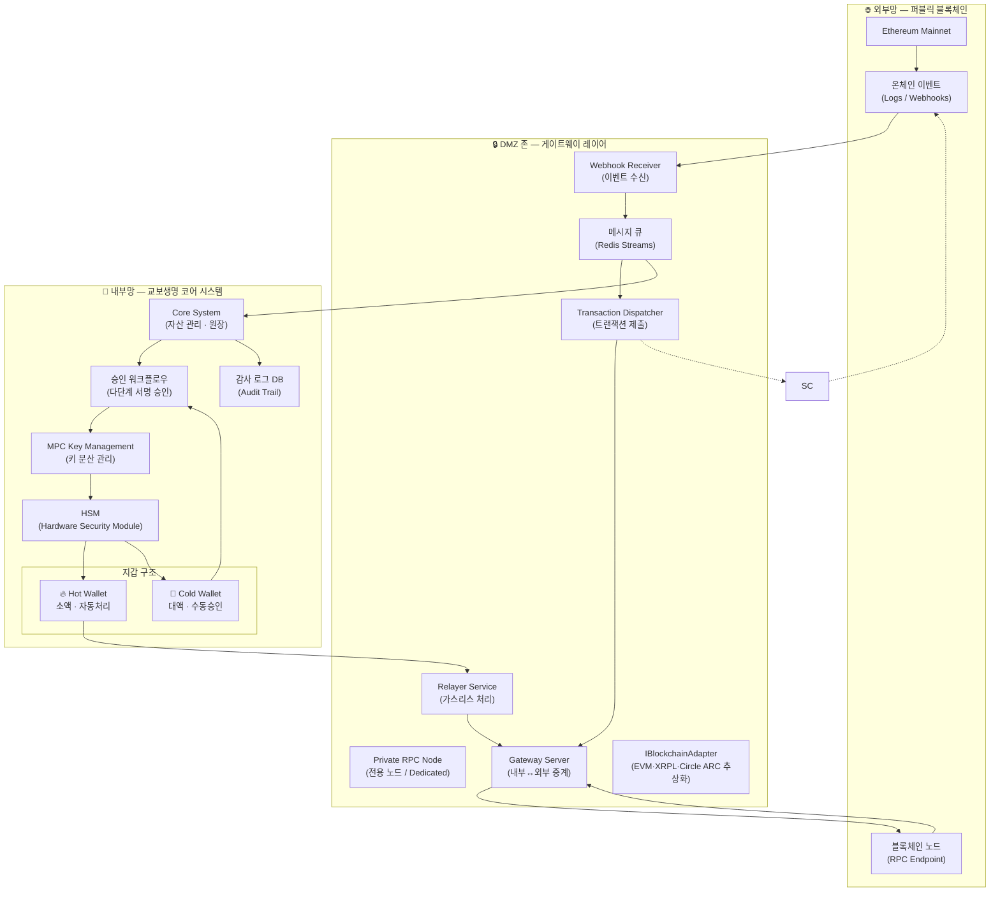

# 교보생명 디지털 자산 커스터디 아키텍처

## 전체 아키텍처 다이어그램

## 구성 요소별 설명

### 🌐 외부망 (퍼블릭 블록체인)
| 구성 요소 | 역할 |
|---|---|
| Ethereum Mainnet | 실제 트랜잭션·자산이 기록되는 퍼블릭 블록체인 |
| 블록체인 노드 (RPC) | 트랜잭션 제출 및 상태 조회 엔드포인트 |
| 온체인 이벤트 | 스마트컨트랙트가 발행하는 이벤트 로그 (전송·승인·상태 변경) |

### 🔒 DMZ 존 (게이트웨이 레이어)
| 구성 요소 | 역할 |
|---|---|
| Private RPC Node | DMZ 내 전용 노드 (자체 운영 또는 Dedicated). 퍼블릭 RPC 직접 노출 차단 |
| Gateway Server | 내부망과 외부 블록체인 사이의 유일한 통신 채널. 직접 접속 차단 |
| Webhook Receiver | 블록체인 이벤트를 안전하게 수신하는 엔드포인트 |
| 메시지 큐 (Redis Streams) | 수신 이벤트를 비동기로 적재. 유실 방지·재처리 보장 |
| Transaction Dispatcher | 내부 승인 완료된 트랜잭션을 블록체인에 제출 |
| Relayer Service | 사용자 서명 → 가스비 없이 온체인 제출 (ERC-2771) |
| Smart Contract | 토큰·NFT 발행·소각, 접근 제어, Pause/Upgrade 관리 |
| IBlockchainAdapter | 발행·소각·잔액 조회·TX 검증·이벤트 구독을 체인 무관하게 추상화. EVM·XRPL·Circle ARC 어댑터 교체 시 상위 비즈니스 로직·원장 코드 무변경. IVaspAdapter와 동일한 Strategy Pattern |

### 🏢 내부망 (코어 시스템)
| 구성 요소 | 역할 |
|---|---|
| Core System | 자산 원장, 잔액 관리, 비즈니스 로직 |
| 승인 워크플로우 | 금액 기준 다단계 서명 승인 (예: 1억 이상 → 2-of-3 서명) |
| MPC Key Management | 비밀키를 분산 보관. 단일 탈취 시 서명 불가 |
| HSM | 키 연산을 물리적 보안 장치 내부에서만 수행 |
| Hot Wallet | 소액 자동 처리. 잔액 한도 설정, 초과 시 Cold로 이관 |
| Cold Wallet | 대액 수동 승인. 오프라인 서명 또는 다중 서명 필요 |
| 감사 로그 DB | 모든 접근·서명·트랜잭션 이력 불변 기록 |

## 커리큘럼과 아키텍처 연결 매핑

| 교육일 | 주제 | 대응 아키텍처 구성 요소 |
|---|---|---|
| **1일차** | 이더리움 아키텍처 · 온체인 이벤트 구조 | 블록체인 노드 / 온체인 이벤트 |
| **2일차** | 운용 가능한 스마트컨트랙트 설계 | Smart Contract (Pause · 권한 관리) |
| **3일차** | ERC-20 심화 · 증권형 토큰 (ERC-3643) | Smart Contract (토큰 발행) |
| **4일차** | NFT 표준 · ERC-2771 가스리스 발급 | Relayer Service / Smart Contract (NFT) |
| **5일차** | 스마트컨트랙트 보안감사 (취약점 공격·방어) | Smart Contract (보안 강화) |
| **6일차** | 보안감사 도구 · 업그레이더블 컨트랙트·롤백 | Smart Contract (Upgrade · Rollback) |
| **7일차** | 온체인 이벤트 수신 · 신뢰할 수 있는 웹훅 구조 | Webhook Receiver / Gateway Server |
| **8일차** | 비동기 메시지 큐 파이프라인 (Redis Streams) | 메시지 큐 / Transaction Dispatcher |
| **9일차** | MPC · 수탁 지갑 · 운영 통합 | MPC · HSM · Hot/Cold Wallet · 승인 워크플로우 |
| **M4 (S16~S17)** | 멀티체인 추상화 레이어 | IBlockchainAdapter (EVM·XRPL·Circle ARC Strategy Pattern) |

> 교육 전 과정이 하나의 아키텍처를 순서대로 구현해가는 구조입니다.  
> 9일차 종료 시점에 수강자들은 이 다이어그램의 각 구성 요소를 직접 구현한 경험을 갖게 됩니다.
