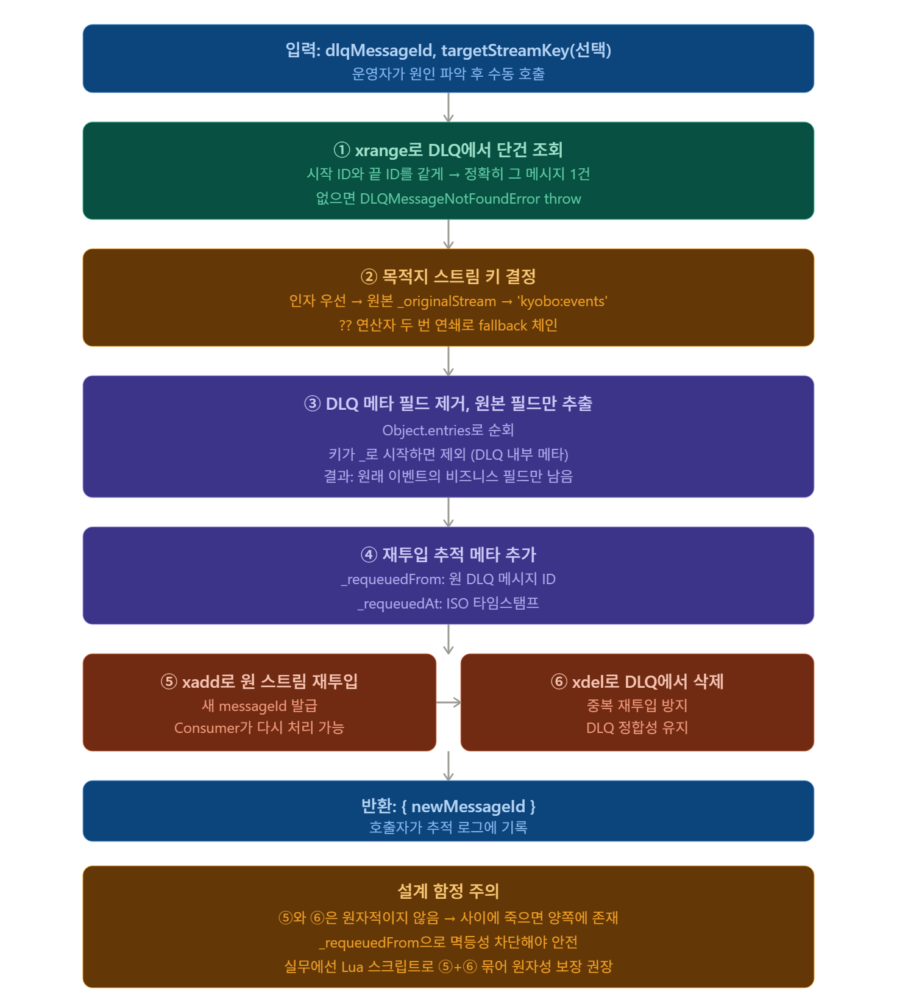

# M2 S11 — 처리 실패 격리 전략 Dead Letter Queue 설계와 운영

> Block B — DMZ 이벤트 파이프라인 · M2 S11 · 강의 55분  
> 대상: `dmz/packages/event-engine/src/dmz/DLQHandler.ts`

---

## 0. 이론 도입 — "무한 재시도"는 왜 위험한가

### 0-1. 재시도만으로는 해결 안 되는 경우

```
재시도가 유효한 경우 (일시적 장애):
  DB 연결 오류 (일시적) → 재시도 → 성공 ✅
  외부 API 타임아웃 → 재시도 → 성공 ✅

재시도해도 소용없는 경우 (영구 장애):
  코드 버그 → 항상 같은 위치에서 throw → 재시도 → 또 실패 ❌
  스키마 불일치 → payload 파싱 오류 → 재시도 → 또 파싱 오류 ❌
  비즈니스 규칙 위반 → 데이터 자체가 잘못됨 → 재시도 → 또 실패 ❌
```

**재시도만 있을 때 발생하는 문제:**

```
┌─────────────────────────────────────────────────────────┐
│  재시도만 있는 시스템:                                   │
│                                                          │
│  msg-bug → 처리 실패 → retryCount+1 → PEL 잔류          │
│  msg-bug → 처리 실패 → retryCount+1 → PEL 잔류          │
│  msg-bug → 처리 실패 → retryCount+1 → PEL 잔류          │
│  ...                                                     │
│                                                          │
│  결과:                                                   │
│  1. PEL이 계속 쌓임 → Redis 메모리 압박                 │
│  2. Consumer가 msg-bug를 계속 처리 시도 → 정상 메시지   │
│     처리 지연                                            │
│  3. 운영자가 장애를 인지하지 못함                        │
│  4. 코드 버그가 있어도 아무도 알 수 없음                 │
└─────────────────────────────────────────────────────────┘
```

---

### 0-2. 비유 — 불량품 격리 창고

```
공장 생산 라인 비유:
  일반 라인: 상품 검사 → 합격 → 출하
  불량 발견: 상품 검사 → 불합격 → 즉시 격리

  불량품을 격리하지 않으면:
  → 계속 같은 라인 돌면서 기계 막힘
  → 합격 상품 처리 지연
  → 불량 원인 파악 안 됨 (어디서 왜 불량인지)

DLQ (Dead Letter Queue) = 불량품 격리 창고
  처리 실패 N회 → 원 스트림에서 격리 → DLQ로 이동
  → 원 스트림은 정상 메시지만 처리 (막힘 없음)
  → 운영자가 DLQ에서 불량 원인 분석
  → 원인 수정 후 → 재투입 (requeueMessage)
  
"DLQ는 무덤이 아니라 임시 격리 병동"
```

---

### 0-3. DLQ 전체 생명주기

```
정상 처리 흐름:
  Redis Streams → Consumer → 처리 성공 → XACK → 완료

DLQ 진입 흐름:
  Redis Streams
      │
      ▼
  Consumer 처리 시도
      │
      ├── 성공 → XACK → 완료 ✅
      │
      └── 실패 → retryCount +1 → PEL 잔류
                      │
                      │ (3회 누적)
                      ▼
               DLQ 이동 (move)
                      │
                      ├── dlq 스트림에 XADD
                      ├── 운영팀 알림 발송
                      └── 원 스트림 XACK (PEL 정리)

DLQ 탈출 흐름:
  운영자 알림 수신
      │
      ▼
  listPending() → 실패 메시지 목록 확인
      │
      ▼
  원인 분석 (코드 버그? 데이터 오류? 외부 서비스?)
      │
      ▼
  원인 수정 (코드 배포 or 데이터 정정)
      │
      ▼
  requeueMessage(dlqMessageId)
      │
      ├── DLQ에서 원본 메시지 조회
      ├── 메타 필드 제거 + 원본 필드만 추출
      ├── 원 스트림에 재투입 (새 messageId)
      └── DLQ에서 삭제
      │
      ▼
  Consumer가 재처리 → 성공 → XACK ✅
```

---

### 0-4. DLQ vs 무한 재시도 — 비교

```
┌──────────────┬─────────────────────────┬──────────────────────────┐
│              │    무한 재시도            │        DLQ               │
├──────────────┼─────────────────────────┼──────────────────────────┤
│ 영구 실패    │ 무한 루프                │ 3회 후 격리              │
│ 메시지 처리  │ 계속 처리 시도 (막힘)   │ 격리 후 정상 메시지 처리  │
│ PEL 상태     │ 계속 증가 (메모리 압박) │ 3회 후 정리 (XACK)       │
│ 운영 인지    │ 누군가 모니터링 없으면  │ 알림으로 즉시 인지        │
│              │ 영원히 모름              │                          │
│ 원인 분석    │ 어렵거나 불가능         │ DLQ에서 원본 + 실패 이유  │
│              │                         │ 보존되어 분석 가능        │
│ 복구 방법    │ 코드 수정 후 재시작     │ 원인 수정 후 requeueMessage│
└──────────────┴─────────────────────────┴──────────────────────────┘
```

---

## 1. DLQ가 필요한 이유

```
재시도 불가 에러 (RetryHandler의 NonRetryableError와 동일 개념):
  - 비즈니스 로직 버그 → 재시도해도 항상 실패
  - 스키마 불일치 → 파싱 오류
  - 외부 서비스 영구 장애
```

DLQ 없이 계속 재시도하면:
1. PEL이 계속 쌓임 → 메모리 압박
2. Consumer 처리 지연 (실패 메시지 계속 처리)
3. 운영자가 장애를 인지하지 못함

## 2. DLQHandler 구조

```
F:\Workplace\kyobo-digital-asset-platform\
└── dmz/packages/event-engine/src/dmz/DLQHandler.ts
```

**DLQ 스트림 키:** `kyobo:events:dlq` (`${sourceStreamKey}:dlq`)

**DLQItem 인터페이스:**

```typescript
// DLQHandler.ts:16
export interface DLQItem {
  messageId: string;    // 원본 Redis messageId (예: "1714320000000-0")
  streamKey: string;    // 원본 스트림 키 (예: "kyobo:events")
  groupName: string;    // Consumer Group 이름
  event:     Record<string, string>;  // 원본 이벤트 필드 전체
  reason:    string;    // 실패 원인 문자열
  failedAt:  Date;
}
```

## 3. move() — DLQ 이동 + 운영 알림

```typescript
// DLQHandler.ts:61
async move(item: DLQItem): Promise<string> {
  // DLQ 스트림에 원본 필드 + 메타 필드 추가해 XADD
  const dlqMessageId = await this.redis.xadd(this.dlqStreamKey, {
    ...item.event,
    _originalMessageId: item.messageId,
    _originalStream:    item.streamKey,
    _groupName:         item.groupName,
    _reason:            item.reason,
    _failedAt:          item.failedAt.toISOString(),
  });

  // 알림: 비동기 (알림 실패가 DLQ 이동을 차단하면 안 됨)
  this.notifier.sendAlert(
    `[DLQ] 메시지 처리 실패\n` +
    `- 원본 ID: ${item.messageId}\n` +
    `- 이벤트: ${item.event['eventType'] ?? 'unknown'}\n` +
    `- 원인: ${item.reason}\n` +
    `- DLQ ID: ${dlqMessageId}`
  ).catch(err => console.error('[DLQHandler] alert failed:', err));

  return dlqMessageId;
}
```

**설계 포인트 — 왜 알림은 `.catch()`로 처리하는가:**

```
알림 서비스 장애 시 두 가지 선택:
  1. await notifier.sendAlert()   → 알림 실패 시 move() 전체 실패
                                    → DLQ 이동 안 됨 → 더 나쁜 상황
  2. .catch(err => log)           → 알림 실패해도 DLQ 이동은 성공
                                    → 알림 유실이 더 나은 트레이드오프
```

## 4. listPending() — DLQ 항목 조회

```typescript
// DLQHandler.ts:90
async listPending(count = 100): Promise<DLQItem[]> {
  const entries = await this.redis.xrange(this.dlqStreamKey, '-', '+', count);

  return entries.map(entry => ({
    messageId: entry.fields['_originalMessageId'] ?? entry.id,
    streamKey: entry.fields['_originalStream']    ?? '',
    groupName: entry.fields['_groupName']         ?? '',
    event:     entry.fields,
    reason:    entry.fields['_reason']            ?? '',
    failedAt:  new Date(entry.fields['_failedAt'] ?? Date.now()),
  }));
}
```

운영자 워크플로우:

```typescript
// 1. DLQ 조회
const pending = await dlqHandler.listPending(50);
console.table(pending.map(p => ({
  id:      p.messageId,
  event:   p.event['eventType'],
  reason:  p.reason,
  failed:  p.failedAt,
})));
```

## 5. requeueMessage() — 수동 재큐잉

```typescript
// DLQHandler.ts:116
async requeueMessage(
  dlqMessageId: string,
  targetStreamKey?: string,
): Promise<{ newMessageId: string }> {
  const [entry] = await this.redis.xrange(
    this.dlqStreamKey, dlqMessageId, dlqMessageId, 1,
  );
  if (!entry) throw new DLQMessageNotFoundError(dlqMessageId);

  const targetKey = targetStreamKey ?? entry.fields['_originalStream'] ?? 'kyobo:events';

  // _로 시작하는 DLQ 메타 필드 제거 → 원본 이벤트 필드만
  const requeueFields: Record<string, string> = {};
  for (const [k, v] of Object.entries(entry.fields)) {
    if (!k.startsWith('_')) requeueFields[k] = v;
  }
  requeueFields['_requeuedFrom'] = dlqMessageId;
  requeueFields['_requeuedAt']   = new Date().toISOString();

  const newMessageId = await this.redis.xadd(targetKey, requeueFields);
  await this.redis.xdel(this.dlqStreamKey, dlqMessageId);  // DLQ에서 제거

  return { newMessageId };
}
```



### (1) 한 줄 요약

**DLQ에 격리된 메시지를 운영자가 검토 후 원 스트림으로 되돌려 재처리하게 하는 함수.**  
DLQ의 마지막 단계 — "구조 작업".

### (2) DLQ 운영 사이클

```
정상 처리 → 실패 → 3회 재시도 실패 → DLQ 격리
                                        ↓
                              운영자 알림 (Slack 등)
                                        ↓
                              원인 파악 (로그 분석, 코드 수정)
                                        ↓
                              requeueMessage() ← 이 함수
                                        ↓
                              원 스트림 재투입 → 재처리
```

이 함수는 **운영자가 수동 호출**. 자동화 안 함 (영구 실패 메시지가 무한 루프 도는 것 방지).

### (3) TS 문법 새로 등장한 것

#### `targetStreamKey?: string`
- **`?:`** = 선택적 매개변수 (optional parameter)
- 호출 시 생략 가능 → 함수 안에선 `undefined`로 들어옴
- `targetStreamKey: string | undefined`와 같은 의미

#### `Promise<{ newMessageId: string }>`
- 반환 타입을 **인라인 객체 타입**으로 명시
- 별도 interface 안 만들고 즉석에서 형태 지정
- 호출자 입장에서 `result.newMessageId`로 접근 가능

#### `const [entry] = await this.redis.xrange(...)`
- **배열 구조 분해** + 첫 요소만 추출
- xrange는 배열을 리턴 → 첫 항목만 `entry`로
- 비어있으면 `entry = undefined`

#### `if (!entry) throw new DLQMessageNotFoundError(dlqMessageId);`
- **커스텀 에러 클래스** throw
- 호출자가 `instanceof DLQMessageNotFoundError`로 잡을 수 있음
- 일반 Error보다 의미 명확

#### `targetStreamKey ?? entry.fields['_originalStream'] ?? 'kyobo:events'`
- **`??` 연쇄 (fallback chain)**
- 왼쪽부터 차례로: 인자 → 원본 메타 → 기본값
- 셋 다 nullish면 마지막 값 사용

#### `Record<string, string>`
- 키와 값이 모두 string인 객체 타입
- `{}` 빈 객체로 시작해서 동적으로 채움

#### `Object.entries(entry.fields)`
- 객체를 `[key, value]` 쌍 배열로 변환
- `{a: 1, b: 2}` → `[['a', 1], ['b', 2]]`
- for...of 루프로 순회 가능하게 만듦

#### `for (const [k, v] of Object.entries(...))`
- **for...of + 배열 구조 분해 콤보**
- 각 entry가 `[key, value]` 배열 → 즉석에서 k, v로 분해
- 일반 for 루프보다 깔끔

#### `k.startsWith('_')`
- 문자열의 prefix 검사
- 언더스코어로 시작하는 키 = DLQ 메타 필드 표식

#### `new Date().toISOString()`
- ISO 8601 형식 문자열 반환
- 예: `'2026-04-30T12:34:56.789Z'`
- 로그/DB 저장에 표준 형식

### (4) 6단계 라인별 흐름

#### ① DLQ에서 메시지 조회

```typescript
const [entry] = await this.redis.xrange(
  this.dlqStreamKey, dlqMessageId, dlqMessageId, 1,
);
```

- **xrange(key, start, end, count)** — 범위 조회
- start와 end를 같게 → **정확히 그 ID 1건만**
- count=1 → 안전장치
- 결과 배열의 첫 요소를 `entry`로 분해

#### ② 존재 확인

```typescript
if (!entry) throw new DLQMessageNotFoundError(dlqMessageId);
```

- 운영자가 잘못된 ID 입력하거나 이미 requeue된 경우
- 명시적 에러로 알려줘야 함 → 호출자가 정확히 처리 가능

#### ③ 목적지 스트림 결정

```typescript
const targetKey = targetStreamKey 
  ?? entry.fields['_originalStream'] 
  ?? 'kyobo:events';
```

**우선순위:**
1) **운영자가 명시한 키** (가장 강함)
2) **DLQ에 기록된 원본 스트림**
3) **하드코딩된 기본값**

이 fallback 체인이 실무에서 매우 유용 — 대부분 케이스 자동, 특수 케이스만 수동.

#### ④ 메타 필드 제거 + 비즈니스 필드만 추출
```typescript
const requeueFields: Record<string, string> = {};
for (const [k, v] of Object.entries(entry.fields)) {
  if (!k.startsWith('_')) requeueFields[k] = v;
}
```

**왜 필요한가:**
- DLQ 메시지에는 **원본 + DLQ 메타**가 섞여있음
  - 원본: `eventType`, `payload`, `txHash`, `requestId`, ...
  - DLQ 메타: `_originalStream`, `_failureReason`, `_failedAt`, `_retryCount`, ...
- 재투입 시엔 **원본만** 보내야 함 (메타는 이번 DLQ 사이클에만 의미)
- `_` prefix 컨벤션으로 자동 필터링

#### ⑤ 재투입 추적 메타 추가
```typescript
requeueFields['_requeuedFrom'] = dlqMessageId;
requeueFields['_requeuedAt']   = new Date().toISOString();
```

**용도:**
- Consumer가 받았을 때 "이건 재투입된 메시지" 인지 가능
- 감사 로그에 추적 가능 (어떤 DLQ에서 언제 풀려났나)
- 무한 루프 감지 — 같은 메시지가 또 DLQ로 가면 `_requeuedFrom` 체인 분석

#### ⑥ 원 스트림 적재
```typescript
const newMessageId = await this.redis.xadd(targetKey, requeueFields);
```
- 새 messageId 발급됨 (원본 ID와 다름)
- Consumer Group의 워커가 일반 메시지처럼 받게 됨
- `_requeuedFrom`을 보고 "재처리 케이스"로 인지 가능

#### ⑦ DLQ에서 삭제
```typescript
await this.redis.xdel(this.dlqStreamKey, dlqMessageId);
```
- DLQ에서 영구 제거
- 운영자가 같은 ID로 다시 requeue 호출하지 못하게
- DLQ 모니터링 대시보드에서도 "처리됨"으로 사라짐

### (5) 메타 필드 컨벤션의 힘

#### `_` prefix 패턴

```
원본 필드:     eventType, payload, txHash, requestId
DLQ 메타:     _originalStream, _failureReason, _failedAt, _retryCount
재투입 메타:   _requeuedFrom, _requeuedAt
```

**규칙:**

- `_`로 시작 = 인프라/메타 정보
- 그 외 = 비즈니스 데이터
- 한 줄 코드 (`if (!k.startsWith('_'))`)로 자동 필터링

**왜 좋은가:**

- 새 메타 필드 추가 시 자동 처리 (코드 변경 X)
- Consumer가 메타와 비즈니스 명확히 구분 가능
- 디버깅 시 "이건 시스템이 추가한 거" 한눈에

### (6) ⑤번과 ⑥번 사이의 위험

#### 부분 실패 시나리오
```
T+0: ⑤ xadd 성공 (원 스트림에 새 메시지 적재됨)
T+1: 네트워크 끊김 또는 프로세스 죽음
T+2: ⑥ xdel 못 함 (DLQ에 원본 그대로)
```

**결과:**
- 같은 메시지가 **원 스트림 + DLQ 양쪽에 존재**
- 운영자가 같은 ID로 또 requeue 호출 가능 → 추가 중복

#### 실무 해법

**해법 1: Lua 스크립트로 원자적 묶기**

```lua
-- xadd + xdel을 Redis에서 원자적으로
local newId = redis.call('XADD', targetKey, ...)
redis.call('XDEL', dlqKey, dlqId)
return newId
```

**해법 2: Consumer 측 멱등성**

- `_requeuedFrom` 체크 → 이미 처리한 dlqMessageId면 무시
- 어떤 함수든 항상 멱등하게 만드는 게 황금률

**해법 3: 트랜잭션 + 보상 작업**

- xadd 성공 → DB에 "requeue 진행 중" 기록
- xdel 실패 시 별도 cleanup 워커가 처리

**현실:** 운영 도구는 보통 해법 2(멱등성)에 의존. 운영자가 같은 ID로 재호출해도 첫 번째 한 번만 효과 발생.

### (7) xrange의 "1" 인자 의미

```typescript
this.redis.xrange(this.dlqStreamKey, dlqMessageId, dlqMessageId, 1);
//                key,                start,         end,         count
```

- **start = end = dlqMessageId** → 범위가 정확히 그 메시지 1건
- **count = 1** → 만약 중복이 있다면 첫 1건만

**왜 안전장치까지?**
- 정상 Redis Streams는 messageId 중복 없음 (자동 시퀀스)
- 하지만 코드는 방어적으로: "혹시 모를 중복" 대비
- count 없으면 모든 매칭 반환 → 의도와 다른 결과 가능성

### (8) 왜 운영자 수동 호출인가

#### 자동 재투입 안 하는 이유

**① 영구 실패 메시지의 무한 루프**
```
DLQ 도착 → 자동 재투입 → 또 실패 → 또 DLQ → ...
```
- 코드 버그가 원인이면 영원히 반복
- 시스템 리소스 낭비

**② 원인 파악 없는 재투입은 위험**
- DLQ에 온 건 "왜 왔는지 모름"이라는 신호
- 데이터 문제? 외부 의존성? 코드 버그?
- 사람이 분석 후 결정해야 함

**③ 부분 처리된 데이터 정리 필요**
- 멱등성이 완벽해도 사이드 이펙트 있을 수 있음
- 외부 API 호출, 이메일 발송 등
- 재투입 전 cleanup 필요할 수 있음

#### 그래서 패턴

```
DLQ 도착 → 알림 → 운영자 분석 → 코드/데이터 수정 → requeue
```

이 함수는 그 마지막 "구조" 단계.

### (9) 호출 예시

#### 운영자 CLI

```typescript
// 모니터링 대시보드에서 클릭하면 호출되는 핸들러
async function handleRequeueClick(dlqMessageId: string) {
  try {
    const { newMessageId } = await dlqHandler.requeueMessage(dlqMessageId);
    showSuccess(`재투입 완료. 새 ID: ${newMessageId}`);
  } catch (err) {
    if (err instanceof DLQMessageNotFoundError) {
      showError('메시지를 찾을 수 없습니다. 이미 처리됐을 수 있습니다.');
    } else {
      showError(`재투입 실패: ${err.message}`);
    }
  }
}
```

#### 다른 스트림으로 라우팅
```typescript
// 원래 'kyobo:events'로 갔지만 분석 후 'kyobo:events:retry-slow' 큐로 보내고 싶을 때
await dlqHandler.requeueMessage('1730000-0', 'kyobo:events:retry-slow');
```

#### 일괄 재투입 (배치)
```typescript
const dlqMessages = await dlqHandler.listDLQ();
for (const msg of dlqMessages) {
  await dlqHandler.requeueMessage(msg.id);
}
```

### (10) 강의 강조 포인트

- **DLQ는 무덤이 아니라 임시 격리** — requeue로 살려낼 수 있어야 완전한 시스템
- **운영자 수동 호출이 핵심** — 자동화 = 무한 루프 위험
- **메타 필드 `_` prefix 컨벤션** — 인프라가 추가하는 메타와 비즈니스 데이터를 구문법적으로 분리
- **fallback 체인 `??` 연쇄** — 실무 코드에서 자주 등장. 우선순위 명시적 표현
- **`Object.entries` + 구조 분해** — 객체 순회의 모던 패턴
- **xrange로 단건 조회** — start=end+count=1로 정확히 1건만 가져오는 방어적 코드
- **xadd + xdel은 원자적이지 않음** — 부분 실패 대비 멱등성 또는 Lua 필요
- **`_requeuedFrom` 체인** — 메시지 추적성 보존, 무한 루프 감지 가능
- **커스텀 에러 클래스** — `DLQMessageNotFoundError` 같은 명확한 에러 타입은 호출자 친화적
- **재투입 메타 추적** — 감사 로그, 컴플라이언스 요구사항에 필수

### (11) 한 줄 정리

> **`requeueMessage`는 DLQ 격리 메시지를 운영자가 분석 후 원 스트림으로 되돌리는 6단계 함수.**  
> DLQ에서 조회 → 메타 제거 → 추적 메타 추가 → 원 스트림 적재 → DLQ 삭제.  
> **수동 호출이 원칙** — 자동화하면 영구 실패 메시지가 무한 루프에 빠진다.  
> 핵심은 메타 필드 `_` 컨벤션과 멱등성 — 부분 실패에도 정합성 유지하는 설계.

**운영 절차 (4단계):**

```
1. dlqHandler.listPending() → DLQ 항목 확인
        ↓
2. 원인 파악
   - 버그: 코드 수정 + 배포
   - 데이터 이상: 정정 후 재큐잉
        ↓
3. dlqHandler.requeueMessage(dlqMessageId)
   → 원본 스트림에 재발행
   → DLQ에서 제거
        ↓
4. Consumer가 재처리
   → 성공 → XACK
   → 실패 → DLQ 재진입 → 즉시 알림 (2회 DLQ = 비즈니스 로직 버그 의심)
```

## 6. 실습 — DLQ 시나리오 실행

| 파일 | 내용 |
|---|---|
| `S11_dlq.ts` | Part 1: 3회 실패 → DLQ 이동 시나리오 / Part 2: listPending + requeueMessage 운영 절차 |

```bash
# dmz/packages/event-engine 폴더에서
npx ts-node src/exercises/S11_dlq.ts
```

**실습 순서 (파일 내 주석 안내에 따라):**

1. `dlqHandler` 인스턴스 생성 (실습 1 — 이미 완성)
2. 항상 실패하는 `brokenProcessor` 확인 (실습 2 — 이미 완성)
3. `ConsumerGroupWorker` 생성 + 실행 블록 주석 해제 (실습 6)
   - 2초 후 worker.stop() → 3회 실패 → DLQ 이동 확인
4. `listPending()` 주석 해제 (실습 3) → DLQ 항목 출력 확인
5. `requeueMessage()` 주석 해제 (실습 4) → 원 스트림 재투입
6. 재큐잉 후 `listPending()` 재확인 (실습 5) → 항목 1개 감소

**완료 기준:**
- [ ] Part 1: `[DLQ XADD] kyobo:events:dlq` 로그 출력 확인 (3회 실패 후 이동)
- [ ] Part 2: `[listPending] DLQ 항목 수: 1` 출력 확인
- [ ] Part 2: `[requeue] 재큐잉 완료` + `[listPending after requeue] DLQ 항목 수: 0` 확인
- [ ] 알림 서비스 장애 시에도 DLQ 이동이 성공하는지 확인 (`.catch()` 패턴 이해)
