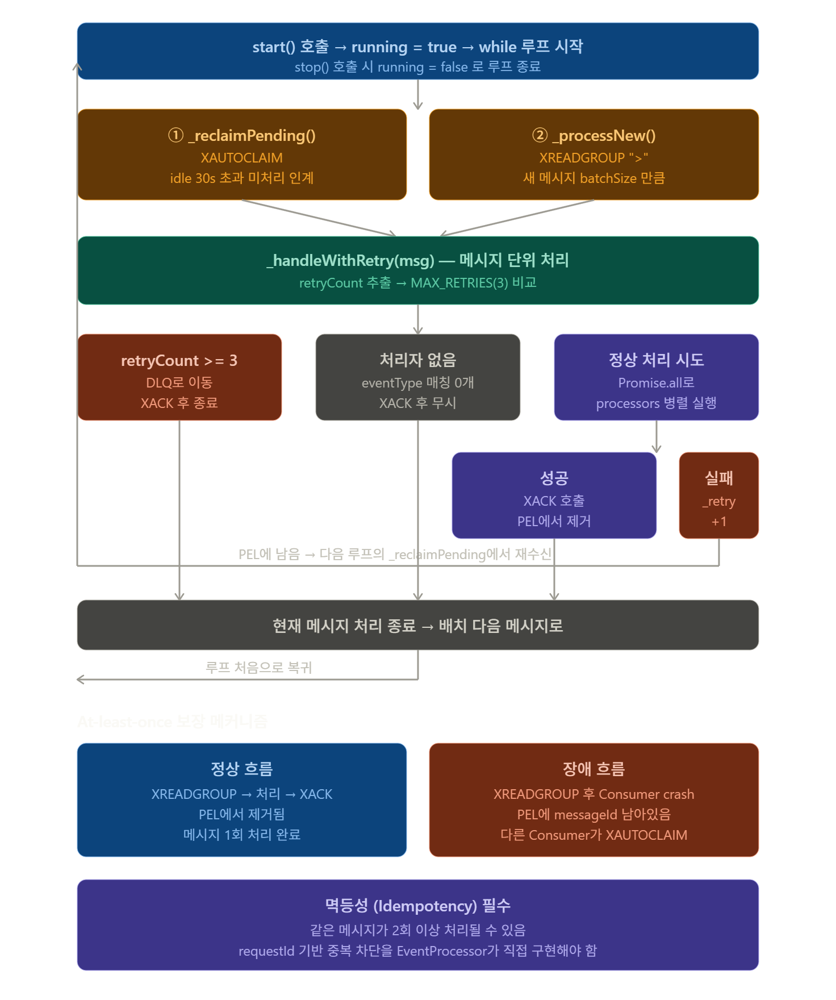

# M2 S7 — Redis Streams CLI 실습과 At-least-once 재처리 시뮬레이션

> Block A — DMZ 이벤트 파이프라인 · Day 02 · 개요 10분 + 실습 50분  
> 대상: Redis CLI, Docker, `dmz/packages/event-engine/src/dmz/ConsumerGroupWorker.ts`

---

# 이 세션이 답하는 질문

```
Q1. S6에서 배운 PEL이 실제로 생기는가?
    → CLI에서 XREADGROUP 후 XPENDING을 치면 직접 눈으로 볼 수 있다.

Q2. Consumer가 crash하면 정말로 메시지가 재수신되는가?
    → XACK 없이 메시지를 읽고 대기하면, XAUTOCLAIM으로 재수신 가능함을 확인한다.

Q3. Consumer 2개가 메시지를 어떻게 나눠 가져가는가?
    → 두 개의 터미널에서 동시에 XREADGROUP을 치면 분배가 보인다.
```

---

# 전체 흐름에서의 위치

```
[WebhookServer]              ← S5 완료
          │
          ▼
[RedisStreamPublisher]       ← S6 완료 (XADD·XGROUP CREATE CLI 포함)
  XADD → Stream
          │
          ▼
[Redis Streams: kyobo:events] ← S7 실습 핵심 (Consumer 관점 CLI)
  XREADGROUP (>)
  XACK
  XPENDING
  XAUTOCLAIM
          │
          ▼
[ConsumerGroupWorker]        ← S8 이후 코드 구현
```



## 1. 이 코드가 뭐하는 코드인가

**한 줄 요약:** Redis Stream에 쌓인 메시지를 **꺼내서 처리하고 결과를 확정**하는 Consumer 워커. 장애 복구·재시도·DLQ까지 책임지는 파이프라인의 종착점.

**S6의 RedisStreamPublisher와의 관계:**
```
[WebhookServer S5]
      ↓
[RedisStreamPublisher S6] — 큐에 적재
      ↓
[Redis Stream "kyobo:events"]
      ↓
[ConsumerGroupWorker (이 파일)] — 큐에서 꺼내 처리
      ↓
[LedgerService / AuditLogService / DLQHandler]
```

Producer(S6)와 Consumer(이 파일)가 **Redis Stream을 매개로 완전히 분리**됨. 둘은 서로의 존재를 모르고, 큐만 공유.

---

## 2. TS 문법 새로 등장한 것

### `import type { DLQHandler, DLQItem } from './DLQHandler';`
- **`import type`** = 타입 정보만 import (런타임 코드 없음)
- 컴파일 후 JS에선 이 줄이 **완전히 사라짐**
- 순환 참조 방지, 번들 크기 최적화에 사용
- `DLQHandler`, `DLQItem`은 인터페이스/타입이라 런타임에 필요 없음

### `Array<{ key: string; id: string }>`
- **`Array<T>`** = `T[]`의 다른 표현
- 안에 들어가는 게 **즉석 인터페이스(inline type)** — 별도 선언 없이 타입 정의
- `Array<{ key: string }>` = 객체 배열, 각 객체에 `key` 필드 필수

### `...ids: string[]`
- **rest 파라미터** — 가변 인자를 배열로 받음
- `xack(key, group, 'id1', 'id2', 'id3')` → `ids = ['id1', 'id2', 'id3']`
- 호출 측은 콤마로 나열, 함수 내부는 배열로 받음

### `private readonly MAX_RETRIES = 3;`
- 클래스 상수 — 인스턴스마다 고정값 보유
- TS에서 `private readonly` + 대문자 = "이 클래스의 상수" 관용

### `msg.fields['eventType'] ?? ''`
- nullish coalescing — 없으면 빈 문자열
- `parseInt(msg.fields['_retryCount'] ?? '0', 10)` 같은 패턴
- **두 번째 인자 `10`** = parseInt의 진법 명시 (10진수). 안 쓰면 일부 환경에서 8진수 오인 가능

### `processors.filter(p => p.eventTypes.includes(eventType))`
- **메서드 체이닝 + 화살표 함수** 조합
- `filter(콜백)` → 콜백이 `true` 반환하는 항목만 남김
- `includes(value)` → 배열에 값이 있는지 boolean
- 한 줄로 "이 eventType을 처리할 수 있는 processor만 추출"

### `Promise.all(processors.map(p => p.process(msg)))`
- **`Promise.all`** = 여러 Promise를 **병렬 실행** + 모두 완료 대기
- 하나라도 실패하면 전체 reject
- `map(p => p.process(msg))` = 각 processor에 대해 process 호출 → Promise 배열
- 직렬 실행하려면 `for (const p of processors) await p.process(msg)`

### `private readonly config: { ... }`
- **인라인 객체 타입을 생성자 매개변수로 직접 명시**
- 별도 `interface Config` 선언 안 하고 즉석에서 형태 지정
- 작은 설정 객체에 적합 (큰 건 인터페이스로 빼는 게 가독성 좋음)

### `private async _reclaimPending()` — 언더스코어 prefix
- TS에 진짜 private 표시법은 `private` 키워드 또는 `#필드`
- `_` prefix는 **관습적 표시** (옛 JS 시절 컨벤션)
- 이 코드는 `private` + `_` 둘 다 써서 "내부용임을 강조"

---

## 3. 핵심 메서드 흐름

### `start()` — 메인 루프
```typescript
while (this.running) {
  try {
    await this._reclaimPending();  // ① PEL 인계
    await this._processNew();      // ② 새 메시지
  } catch (err) {
    console.error(...);
    await this._sleep(1000);       // 에러 시 1초 쉬고 재시도
  }
}
```
- 루프마다 **두 단계 반복**: 미처리 인계 → 새 메시지 처리
- catch가 루프 전체를 감싸서 어떤 에러로도 워커가 죽지 않음

### `_processNew()` — XREADGROUP
```typescript
const result = await this.redis.xreadgroup(
  this.config.groupName,
  this.config.consumerId,
  [{ key: this.config.streamKey, id: '>' }],
  this.config.batchSize,
  this.config.blockMs,
);
```
- **`'>'`** = "내가 아직 본 적 없는 새 메시지만"
- `blockMs` = 새 메시지 없을 때 최대 대기 시간 (0=무한)
- 호출 즉시 메시지의 **소유권이 이 consumer로** 넘어감 (PEL 등록)

### `_reclaimPending()` — XAUTOCLAIM
```typescript
const { messages } = await this.redis.xautoclaim(
  this.config.streamKey,
  this.config.groupName,
  this.config.consumerId,
  this.config.minIdleMs,   // 30초 등
  '0-0',                   // 처음부터 스캔
  this.config.batchSize,
);
```
- 다른 consumer가 XREADGROUP했지만 **30초 넘게 처리 못 한 메시지**를 인계
- consumer crash → PEL에 남은 메시지를 다른 consumer가 자동으로 가져감
- **이게 At-least-once의 핵심 메커니즘**

### `_handleWithRetry()` — 메시지별 처리 결정 트리
```typescript
if (retryCount >= MAX_RETRIES) → DLQ 이동 + XACK
else if (처리자 없음) → XACK (무시)
else {
  try {
    await Promise.all(processors.map(p => p.process(msg)));
    XACK;  // 성공
  } catch {
    msg.fields['_retryCount']++;  // 실패 → 카운터 증가
    // XACK 안 함 → PEL에 남음
  }
}
```

**핵심 분기:**
1. **재시도 한도 초과** → DLQ로 옮기고 XACK (이상 메시지 영구 격리)
2. **처리자 없음** → XACK으로 그냥 버림 (지원 안 하는 이벤트는 무시)
3. **정상 시도** → 성공 시 XACK, 실패 시 PEL에 남겨 다음 루프에서 재처리

---

## 4. At-least-once vs Exactly-once 이해

### Redis Streams의 At-least-once 보장
- **메시지가 누락될 일은 없음** (XACK 받기 전엔 PEL에 남음)
- 단, **같은 메시지가 2회 이상 처리될 수 있음**
  - 예: 처리 완료 직후 XACK 호출 직전에 crash → 재시작 시 또 처리

### 그래서 Exactly-once는 누가 책임지는가?
- 인프라(Redis)는 **At-least-once까지만** 보장
- "한 번만 효과 발생"은 **EventProcessor가 멱등성으로 직접 구현**
- 방법: `requestId`를 DB에 unique 제약으로 저장 → 중복 insert는 자동 무시

```typescript
// EventProcessor.process() 내부 (예시)
async process(msg: StreamMessage) {
  const requestId = msg.fields['requestId'];
  
  // DB에 이미 있으면 그냥 리턴 (멱등성)
  if (await ledger.exists(requestId)) return;
  
  await ledger.insert({ requestId, ...data });
}
```

**강의에서 강조해야 할 핵심:** "At-least-once 큐 + 멱등 핸들러 = 사실상 Exactly-once"

---

## 5. DLQ (Dead Letter Queue) 패턴

### 왜 필요한가
- 일부 메시지는 **영원히 처리 불가**할 수 있음
  - 잘못된 데이터 형식, 외부 API 영구 장애, 비즈니스 규칙 위반
- 무한 재시도하면 큐가 막힘 → 다른 정상 메시지도 영향
- **3회 시도 후 격리**해서 사람이 수동 조사

### 이 코드의 DLQ 흐름
```typescript
if (retryCount >= this.MAX_RETRIES) {
  await this.dlq.move({ messageId, event, reason, failedAt });
  await this.redis.xack(...);  // 원 스트림에서는 ACK
  return;
}
```
- DLQ는 보통 **별도 Redis Stream** (예: `kyobo:dlq`)
- 운영자가 주기적으로 점검 → 원인 파악 → 수정 후 원 스트림에 재발행

### 강의 포인트
- DLQ 없으면 **장애 메시지 하나가 시스템 전체를 마비** 시킬 수 있음
- 금융권에선 DLQ 모니터링 + 알림이 필수 (SLA 항목)

---

## 6. 수평 확장 메커니즘

### Consumer 인스턴스 N개를 띄우면
- 같은 `groupName`, 다른 `consumerId`로 시작
- Redis가 자동으로 메시지를 분배 (선착순 XREADGROUP)
- **라운드 로빈 아님** — 먼저 호출한 쪽이 받아감

### 장애 시나리오 단계별
1. consumer-1이 XREADGROUP으로 msg-A 가져감 (PEL에 등록)
2. consumer-1이 처리 도중 crash
3. 30초(`minIdleMs`) 경과
4. consumer-2의 다음 루프에서 `_reclaimPending()` 호출
5. XAUTOCLAIM으로 msg-A 인계받음
6. consumer-2가 처리 시도

**메시지는 누락되지 않고, 자동으로 살아있는 워커가 인수.**

---

## 7. 강의 강조 포인트

- **`import type`** — 타입과 런타임 코드 분리, 순환 참조 방지
- **재시도 카운터를 메시지 필드에 저장** — Redis Streams는 자체 재시도가 없으므로 직접 관리
- **`_retryCount`처럼 언더스코어 prefix** — "내부 메타데이터 필드" 관용 (사용자 데이터와 구분)
- **`Promise.all` 병렬 실행** — 여러 processor가 같은 메시지에 관심 있을 때 동시 처리
- **At-least-once + 멱등성 = Exactly-once** — 인프라와 애플리케이션의 책임 분담
- **DLQ는 운영 필수** — 코드만 짜고 모니터링 안 하면 무용지물
- **try-catch가 루프를 감쌈** — 워커는 어떤 일이 있어도 죽으면 안 됨 (서비스 중단 직결)
- **`'>'` vs `'0-0'`** — XREADGROUP은 새 메시지(`>`), XAUTOCLAIM은 처음부터 스캔(`0-0`)
- **3대 의존성** — LedgerService(원장), AuditLogService(감사), DLQHandler(실패) — 각자 책임 명확히 분리

---

## 8. 전체 파이프라인 종합 (S5~S9)

| 단계 | 컴포넌트 | 책임 | 실패 시 |
|------|----------|------|---------|
| S5 | WebhookServer | HTTP 인증 + 수신 | 401 응답 |
| S6 | RedisStreamPublisher | 큐 적재 | 호출자에게 throw |
| S7~ | (Redis Stream 자체) | 메시지 보관 + 분배 | MAXLEN으로 크기 제한 |
| S9 | ConsumerGroupWorker | 처리 + 재시도 + DLQ | 3회 후 DLQ |
| (보조) | LedgerService | 원장 업데이트 | EventProcessor가 throw |
| (보조) | AuditLogService | 감사 로그 | 동일 |
| (보조) | DLQHandler | 실패 메시지 격리 | 별도 스트림에 적재 |

**각 단계가 자기 책임만 명확히** — 큐 매개로 느슨하게 결합되어 한 단계 장애가 전체로 번지지 않음.

## 실습 전체 구성

```
Step 1: Docker로 Redis 기동
Step 2: XADD로 NFT 이벤트 3개 적재
Step 3: Consumer Group 생성 + XREADGROUP으로 읽기
Step 4: XACK + XPENDING으로 PEL 확인
Step 5: 미ACK 재수신 시뮬레이션 (XAUTOCLAIM)
Step 6: Consumer 2개 동시 실행 → 메시지 분배 확인
```

---

# 실습 환경 준비 (개요 10분)

## 전제 조건

```powershell
# Docker 설치 확인
docker --version
# Docker Desktop 4.x 이상
```

## ConsumerGroupWorker 코드 미리 훑어보기

실습 전 1분간 핵심 인터페이스만 확인한다:

```typescript
// ConsumerGroupWorker.ts 핵심 인터페이스

export interface RedisConsumerClient {
  xreadgroup(group, consumer, streams, count, blockMs): Promise<...>;
  xack(key, group, ...ids): Promise<number>;
  xautoclaim(key, group, consumer, minIdleMs, startId, count): Promise<...>;
}

// 처리 루프:
// while (running) {
//   1. reclaimPending()  ← XAUTOCLAIM: idle > minIdleMs 재수신
//   2. processNew()      ← XREADGROUP ">": 새 메시지 수신
// }
```

---

# Step 1: Redis 컨테이너 기동 (5분)

```powershell
docker run -d `
  --name kyobo-redis `
  -p 6380:6379 `
  redis:7-alpine `
  redis-server --requirepass redis_local_pw

docker exec -it kyobo-redis redis-cli -a redis_local_pw
```

```
127.0.0.1:6379> PING
PONG
```

> **이미 `kyobo-redis` 컨테이너가 있으면?**  
> `docker start kyobo-redis` 로 재기동

**실습 완료 기준:**
```
[ ] PING → PONG 확인
[ ] redis-cli 프롬프트가 열려있음
```

---

# Step 2: XADD로 NFT 이벤트 3개 적재 (10분)

```
XADD kyobo:events * eventType NFT_ISSUED payload "{\"tokenId\":\"42\",\"owner\":\"0xABCD\"}" txHash 0xdeadbeef001 blockNumber 18500001 requestId req-001 publishedAt 1714000001000

XADD kyobo:events * eventType NFT_ISSUED payload "{\"tokenId\":\"43\",\"owner\":\"0xEFGH\"}" txHash 0xdeadbeef002 blockNumber 18500002 requestId req-002 publishedAt 1714000002000

XADD kyobo:events * eventType NFT_BURNED payload "{\"tokenId\":\"41\",\"owner\":\"0x0000\"}" txHash 0xcafebabe003 blockNumber 18500003 requestId req-003 publishedAt 1714000003000
```

```
XLEN kyobo:events
# (integer) 3

XRANGE kyobo:events - +
```

> **Windows redis-cli 주의**: JSON 값에 작은따옴표(`'`) 사용 불가. 큰따옴표 안에 `\"` 로 이스케이프.

**실습 완료 기준:**
```
[ ] XLEN kyobo:events → 3 확인
[ ] XRANGE로 3개 이벤트 내용 확인
```

---

# Step 3: Consumer Group 생성 + XREADGROUP (10분)

## Consumer Group 생성

```
XGROUP CREATE kyobo:events issuer-consumers 0 MKSTREAM
# OK

# 이미 존재하면: BUSYGROUP → 정상 (RedisStreamPublisher.initialize()가 무시하는 이유)

XINFO GROUPS kyobo:events
# lag: 3 ← 미처리 메시지 수
```

## XREADGROUP으로 메시지 읽기

```
# TODO 1: consumer-1이 kyobo:events에서 새 메시지를 최대 10개 읽어라
# 조건: 새 미처리 메시지만 (> 사용), blocking 없음
```

## 답안: XREADGROUP

```
XREADGROUP GROUP issuer-consumers consumer-1 COUNT 10 STREAMS kyobo:events >

# 결과 (예시):
# 1) 1) "kyobo:events"
#    2) 1) 1) "1714000001000-0"
#             2) 1) "eventType"
#                2) "NFT_ISSUED"
#                3) "payload"
#                4) "{\"tokenId\":\"42\"...}"
#                ...
#          2) 1) "1714000002000-0"
#             2) ...
#          3) 1) "1714000003000-0"
#             2) ...

# 주목: 3개 모두 consumer-1이 읽어감
# → PEL에 3개가 등록됨 (XACK 없었으므로)
```

## 다시 XREADGROUP을 치면?

```
XREADGROUP GROUP issuer-consumers consumer-1 COUNT 10 STREAMS kyobo:events >

# 결과:
# (empty array)
# → ">" 는 "아직 아무도 읽지 않은 새 메시지만"
# → 방금 3개를 읽었으므로, 새 메시지가 없음
```

**이것이 핵심이다:**

```
> 를 사용하면:
  - 처음 호출: 3개 반환
  - 두 번째 호출: 0개 반환 (이미 consumer-1이 읽었으므로)

0 을 사용하면:
  XREADGROUP GROUP issuer-consumers consumer-1 COUNT 10 STREAMS kyobo:events 0
  → consumer-1의 PEL에 있는 메시지 재반환 (XACK 안 한 것들)
  → 3개 다시 반환됨
```

**실습 완료 기준:**
```
[ ] XGROUP CREATE → OK 확인
[ ] XREADGROUP > → 3개 메시지 반환 확인
[ ] 두 번째 XREADGROUP > → empty array 확인
[ ] XINFO GROUPS에서 pending이 3으로 올라감 확인
```

---

# Step 4: XACK + XPENDING으로 PEL 확인 (10분)

## XPENDING으로 PEL 현황 조회

```
XPENDING kyobo:events issuer-consumers

# 결과 (예시):
# 1) (integer) 3               ← 미처리 메시지 총 수
# 2) "1714000001000-0"         ← 가장 오래된 미처리 ID
# 3) "1714000003000-0"         ← 가장 최근 미처리 ID
# 4) 1) 1) "consumer-1"
#       2) "3"                 ← consumer-1이 소유한 미처리 수

# 상세 조회 (처음부터 끝까지, 최대 10개)
XPENDING kyobo:events issuer-consumers - + 10

# 결과 (예시):
# 1) 1) "1714000001000-0"      ← messageId
#    2) "consumer-1"            ← 소유 Consumer
#    3) (integer) 12345         ← idle time (ms) ← XREADGROUP 이후 경과 시간
#    4) (integer) 1             ← delivery count (배달 횟수)
# 2) 1) "1714000002000-0"
#    ...
# 3) 1) "1714000003000-0"
#    ...
```

## 첫 번째 메시지만 XACK

```
# TODO 4: 첫 번째 메시지(req-001, NFT_ISSUED tokenId=42)만 처리 완료로 선언하라
# XACK 명령어를 사용하여 1714000001000-0 (또는 실제 반환된 첫 번째 ID)를 ACK

# TODO: 구현 (Step 3에서 반환된 첫 번째 messageId를 사용)
```

## 답안

```
# 첫 번째 메시지 ACK (실제 반환된 ID로 교체)
XACK kyobo:events issuer-consumers 1714000001000-0

# 결과: (integer) 1  ← ACK된 수

# PEL 재확인
XPENDING kyobo:events issuer-consumers - + 10

# 결과:
# 1) 1) "1714000002000-0"      ← 첫 번째가 사라지고 2개 남음
#    2) "consumer-1"
#    3) (integer) xxxxx
#    4) (integer) 1
# 2) 1) "1714000003000-0"
#    ...
```

**PEL 변화 도식:**

```
XACK 전:
  PEL: [1714000001000-0, 1714000002000-0, 1714000003000-0]

XACK 1714000001000-0 후:
  PEL: [1714000002000-0, 1714000003000-0]  ← 첫 번째가 제거됨

→ 이것이 "처리 완료" 선언의 의미
```

**실습 완료 기준:**
```
[ ] XPENDING으로 PEL에 3개 있음 확인
[ ] XACK 후 XPENDING으로 2개만 남음 확인
[ ] ACK된 메시지가 스트림에서 사라지지 않음 확인 (XRANGE로)
    → XACK는 PEL에서만 제거, 스트림 자체는 보존
```

---

# Step 5: 미ACK 재수신 시뮬레이션 (XAUTOCLAIM) (10분)

## 시나리오 설명

```
지금 상황:
  PEL: [1714000002000-0 (consumer-1), 1714000003000-0 (consumer-1)]
  
시나리오:
  consumer-1이 두 메시지를 읽었지만 처리 중 crash.
  XACK를 못 보냄.
  minIdleMs(30,000ms) 경과.
  consumer-2가 XAUTOCLAIM으로 두 메시지를 인계받는다.

실습에서는 idleMs를 0으로 설정해 즉시 인계받는 것을 시뮬레이션.
```

## XAUTOCLAIM

```
# TODO 5: consumer-2가 idle > 0ms인 미처리 메시지를 모두 인계받아라
# XAUTOCLAIM GROUP issuer-consumers consumer-2 <minIdleMs> <startId> COUNT <n>
```

## 답안

```
XAUTOCLAIM kyobo:events issuer-consumers consumer-2 0 0-0 COUNT 10

# 결과 (예시):
# 1) "0-0"                     ← nextId (더 이상 없으면 0-0)
# 2) 1) 1) "1714000002000-0"   ← 인계받은 메시지들
#       2) 1) "eventType"
#          2) "NFT_ISSUED"
#          ...
#    2) 1) "1714000003000-0"
#       2) ...
# 3) (empty array)              ← 삭제된 메시지 없음

# PEL 재확인
XPENDING kyobo:events issuer-consumers - + 10

# 결과:
# 1) 1) "1714000002000-0"
#    2) "consumer-2"            ← 소유자가 consumer-1 → consumer-2로 변경됨
#    3) (integer) 0             ← idle time 리셋됨
#    4) (integer) 2             ← delivery count 증가 (1→2)
# 2) 1) "1714000003000-0"
#    2) "consumer-2"
#    ...
```

**delivery count가 중요한 이유:**

```typescript
// ConsumerGroupWorker._handleWithRetry()
const retryCount = parseInt(msg.fields['_retryCount'] ?? '0', 10);

if (retryCount >= this.MAX_RETRIES) {
  // 3회 초과 → DLQ
  await this.dlq.move({ ... });
  await this.redis.xack(streamKey, groupName, msg.id);
  return;
}
```

```
delivery count는 Redis가 관리 (XPENDING에서 확인 가능)
retryCount는 메시지 필드에 직접 기록 (ConsumerGroupWorker가 증가)

→ 두 가지를 같이 봐야 전체 그림이 완성됨
```

## 인계받은 메시지도 XACK

```
# consumer-2가 처리 완료 (실제 반환된 두 ID로 교체)
XACK kyobo:events issuer-consumers 1714000002000-0 1714000003000-0

XPENDING kyobo:events issuer-consumers

# 결과:
# 1) (integer) 0    ← PEL이 비어있음 ✅
```

**실습 완료 기준:**
```
[ ] XAUTOCLAIM으로 consumer-2가 2개 메시지 인계받음 확인
[ ] XPENDING에서 소유자가 consumer-2로 변경됨 확인
[ ] delivery count가 2로 증가됨 확인
[ ] 최종 XACK 후 PEL이 0개됨 확인
```

---

# Step 6: Consumer 2개 동시 실행 → 메시지 분배 확인 (10분)

## 준비: 새 이벤트 6개 추가

```
XADD kyobo:events * eventType NFT_ISSUED payload "{\"tokenId\":\"50\"}" txHash 0xaaa001 blockNumber 18510001 requestId req-010 publishedAt 1714010001000
XADD kyobo:events * eventType NFT_ISSUED payload "{\"tokenId\":\"51\"}" txHash 0xaaa002 blockNumber 18510002 requestId req-011 publishedAt 1714010002000
XADD kyobo:events * eventType NFT_ISSUED payload "{\"tokenId\":\"52\"}" txHash 0xaaa003 blockNumber 18510003 requestId req-012 publishedAt 1714010003000
XADD kyobo:events * eventType NFT_ISSUED payload "{\"tokenId\":\"53\"}" txHash 0xaaa004 blockNumber 18510004 requestId req-013 publishedAt 1714010004000
XADD kyobo:events * eventType NFT_ISSUED payload "{\"tokenId\":\"54\"}" txHash 0xaaa005 blockNumber 18510005 requestId req-014 publishedAt 1714010005000
XADD kyobo:events * eventType NFT_ISSUED payload "{\"tokenId\":\"55\"}" txHash 0xaaa006 blockNumber 18510006 requestId req-015 publishedAt 1714010006000

XLEN kyobo:events
# (이전 3개 + 6개 = 9개 예상)
```

## 터미널 2 개방 (새 redis-cli 세션)

```powershell
# PowerShell 창 새로 열고 접속 (폴더 무관)
docker exec -it kyobo-redis redis-cli -a redis_local_pw
```

## TODO: 두 Consumer 동시 읽기

```
# TODO 6-1: 터미널 1에서 consumer-1이 새 메시지를 COUNT 3으로 읽어라
# TODO 6-2: 터미널 2에서 consumer-2가 새 메시지를 COUNT 3으로 읽어라
# 두 Consumer가 같은 그룹의 메시지를 나눠 가져가는지 확인
```

## 답안

```
# 터미널 1: consumer-1
XREADGROUP GROUP issuer-consumers consumer-1 COUNT 3 STREAMS kyobo:events >
# 결과: tokenId=50, 51, 52

# 터미널 2: consumer-2
XREADGROUP GROUP issuer-consumers consumer-2 COUNT 3 STREAMS kyobo:events >
# 결과: tokenId=53, 54, 55

# → 6개가 3개씩 분배됨
```

## 분배 확인

```
XPENDING kyobo:events issuer-consumers - + 10

# 결과 (예시):
# 1) 1) "1714010001000-0"   ← tokenId=50
#    2) "consumer-1"         ← consumer-1 소유
#    ...
# 2) 1) "1714010002000-0"   ← tokenId=51
#    2) "consumer-1"         ← consumer-1 소유
#    ...
# 3) 1) "1714010003000-0"   ← tokenId=52
#    2) "consumer-1"         ← consumer-1 소유
#    ...
# 4) 1) "1714010004000-0"   ← tokenId=53
#    2) "consumer-2"         ← consumer-2 소유
#    ...
# 5) 1) "1714010005000-0"   ← tokenId=54
#    2) "consumer-2"         ← consumer-2 소유
#    ...
# 6) 1) "1714010006000-0"   ← tokenId=55
#    2) "consumer-2"         ← consumer-2 소유
#    ...
```

## Consumer 수 증가 시뮬레이션

```
# 새 PowerShell 창에서 consumer-3 (선택적으로 진행)
# docker exec -it kyobo-redis redis-cli -a redis_local_pw
XREADGROUP GROUP issuer-consumers consumer-3 COUNT 4 STREAMS kyobo:events >

# → 메시지가 3개 Consumer에게 분배됨
# → 수평 확장: Consumer 수만큼 처리량 증가 (I/O bound 처리 기준)
```

**실습 완료 기준:**
```
[ ] 두 Consumer가 6개 메시지를 3개씩 나눠 가져감 확인
[ ] XPENDING에서 소유자 구분 확인 (consumer-1 / consumer-2)
[ ] 같은 메시지를 두 Consumer가 중복 수신하지 않음 확인
[ ] Consumer Group이 자동 분배 (라운드 로빈이 아닌 먼저 읽는 쪽) 확인
```

---

# 정리: S6 이론 → S7 실습 대응표

| S6 이론 | S7 CLI 명령 | 확인 내용 |
|---------|------------|-----------|
| Append-only 로그 | XADD ... * | messageId 자동 생성 |
| Consumer Group | XGROUP CREATE | XINFO GROUPS로 확인 |
| `>` 심볼 | XREADGROUP ... > | 첫 번째: 3개, 두 번째: 0개 |
| PEL 등록 | XREADGROUP 후 | XPENDING으로 목록 확인 |
| 처리 완료 선언 | XACK | XPENDING에서 제거 확인 |
| Consumer crash 복구 | XAUTOCLAIM 0 0-0 | 소유자 변경 + delivery count 증가 |
| 수평 확장 | 두 터미널에서 XREADGROUP | 메시지 분배 확인 |

---

# 완료 기준 체크리스트

```
[ ] Step 1: Redis 컨테이너 기동 + PING/PONG 확인
[ ] Step 2: XADD로 3개 이벤트 적재 + XRANGE로 내용 확인
[ ] Step 3: XGROUP CREATE + XREADGROUP > 로 3개 수신 확인
            두 번째 XREADGROUP > → empty array 확인
[ ] Step 4: XACK로 1개 처리 완료 + XPENDING으로 2개만 남음 확인
[ ] Step 5: XAUTOCLAIM으로 consumer-2가 미처리 2개 인계 + delivery count 확인
[ ] Step 6: Consumer 2개가 6개 메시지를 3:3으로 분배받음 확인
```

---

# 핵심 정리

| 명령 | 역할 | 기억할 것 |
|------|------|-----------|
| XADD ... * | 스트림에 항목 추가 | `*` = ID 자동 생성 |
| XLEN | 스트림 항목 수 | |
| XRANGE - + | 전체 항목 조회 | 읽어도 삭제 안 됨 |
| XGROUP CREATE ... 0 | 그룹 생성, 처음부터 | `$` = 지금 이후만 |
| XREADGROUP ... > | 새 메시지 읽기 + PEL 등록 | `>` 중요 |
| XREADGROUP ... 0 | 내 PEL 재읽기 | crash 복구용 |
| XPENDING | PEL 상태 조회 | 소유자 + delivery count |
| XACK | 처리 완료 → PEL 제거 | 반드시 처리 후에 |
| XAUTOCLAIM | idle 초과 메시지 인계 | minIdleMs 설정 중요 |
| XINFO GROUPS | 그룹 상태 요약 | lag = 미처리 메시지 수 |

---

# 다음 세션 예고 (S8)

S8에서는 이 CLI 실습을 TypeScript 코드로 구현한다.

```
S8 구현 대상:
  1. WebhookServer._verifySignature()
     → HMAC-SHA256, timingSafeEqual, rawBody Buffer
     → CLI 실습에서 서명 검증을 직접 구현

  2. RedisStreamPublisher.publish()
     → XADD 호출 (S7에서 CLI로 해본 것을 코드로)
     → initialize() — XGROUP CREATE + BUSYGROUP 처리

실습 흐름:
  TODO 주석 제거 → 답안 작성 → 서명 검증 테스트 (curl)
```

---

# 예상 Q&A

**Q1. XRANGE로 조회하면 메시지가 삭제되는가?**

A: 삭제되지 않는다.  
Redis Streams는 append-only 로그다. XRANGE는 읽기 전용 조회다.  
XACK도 PEL에서만 제거하고 스트림 자체는 보존한다.  
스트림에서 실제로 삭제하려면 XDEL을 직접 호출하거나 MAXLEN으로 제한해야 한다.

**Q2. Consumer Group을 삭제하면 PEL도 사라지는가?**

A: 사라진다.  
`XGROUP DESTROY kyobo:events issuer-consumers`를 실행하면  
그룹과 함께 PEL 전체가 삭제된다.  
스트림 자체는 남는다. 그룹을 다시 만들면 PEL은 비어있는 상태로 시작한다.

**Q3. XAUTOCLAIM의 startId를 0-0이 아닌 특정 ID로 설정하면?**

A: 해당 ID 이후의 메시지부터만 검색한다.  
0-0은 "스트림의 처음"을 의미하므로 전체 PEL을 검색한다.  
대량 PEL이 쌓인 경우 nextId를 이용해 페이지네이션으로 처리할 수 있다:  
```
# 첫 번째 호출
XAUTOCLAIM kyobo:events issuer-consumers consumer-1 30000 0-0 COUNT 10
# nextId 반환: "1714000050000-0"

# 두 번째 호출 (이전 nextId로)
XAUTOCLAIM kyobo:events issuer-consumers consumer-1 30000 1714000050000-0 COUNT 10
# nextId가 "0-0"이면 끝
```
